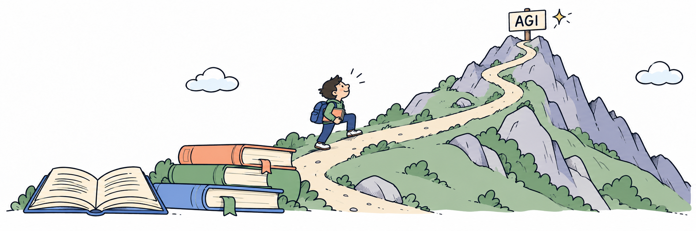

  

<h1>AI 前沿学习笔记</h1>

AI FRONTIER NOTES

<strong>从数学直觉，到训练实践与系统设计</strong>

  
  
  

---

这里记录我学习 AI 前沿技术时的推导、论文精读与思考，围绕 **前沿技术报告、Agentic RL、递归自我改进** 三个方向，把数学基础、前沿方法和工程实践串起来。

## News

- **2026.10.02**：发布 **[Toward Recursive Self-Improvement: How GLM Built Its Own Inference Infrastructure](https://z.ai/blog/glm-built-its-inference-infrastructure)** 的[阅读笔记](TechReport/MiMo/GLM/GLMInferenceInfrastructure.md)。
- **2026.10.01**：发布 **[The Last AI Built by Humans: Toward Genuine Recursive Self-Improvement](Recursive-Self-Improvement/RSI-Survey.md)** 阅读笔记。[原始综述](https://arxiv.org/abs/2609.11873)
- **2026.09.30**：发布并更新 **[DeepSeek Elastic Compute (DSec): A Sandbox Infrastructure for Effective Agentic Training at Scale](TechReport/Deepseek/DeepSeekElasticCompute.md)** 阅读笔记。[原始报告](https://arxiv.org/abs/2609.22978)
- **2026.09.28**：发布 **[MiMo-V2.6: Scaling Reinforcement Learning Towards Self-Improvement](TechReport/MiMo/MiMoV2.6.md)** 阅读笔记。[原始报告](https://huggingface.co/XiaomiMiMo/MiMo-V2.6-Pro-RL/blob/main/MiMo_V2_6_technical_report.pdf)
- **2026.09.14**：发布 **[DeepSeek-V4: Towards Highly Efficient Million-Token Context Intelligence](TechReport/Deepseek/DeepSeekV4.md)**的阅读笔记。
- **2026.09.14**：发布 **[DSpark: Confidence-Scheduled Speculative Decoding with Semi-Autoregressive Generation](TechReport/Deepseek/Dspark.md)**，分析投机解码、半自回归生成与置信度调度。
- **2026.09.14**：发布 **[强化学习基础](AgenticRL/BasicRL.md)** 与 **[RL 训练经验与实践](AgenticRL/RLTrainExp.md)**，覆盖策略梯度、PPO、GAE、GRPO，以及训练稳定性、奖励设计和训推一致性。

## 内容导航

- [前沿技术报告](#tech-reports)
- [Agentic RL](#agentic-rl)
- [递归自我改进](#recursive-self-improvement)

### 01 · 前沿技术报告

拆解模型架构、训练策略、推理系统与 Agent 执行基础设施中的关键设计。

| 笔记 | 核心内容 |
| :--- | :--- |
| **[GLM 推理基础设施解读](TechReport/MiMo/GLM/GLMInferenceInfrastructure.md)** | 密集反馈、数值精度与并发排查、算子优化、工程师职责与 RSI 边界 |
| **[DeepSeek Elastic Compute（DSec）解读](TechReport/Deepseek/DeepSeekElasticCompute.md)** | 环境分层与按需加载、资源超配、长轨迹恢复、奖励可信度与采样偏差 |
| **[MiMo V2.6 解读](TechReport/MiMo/MiMoV2.6.md)** | 大规模混合 RL、质量评价、行为约束、训推一致性与 MOPD2 蒸馏 |
| **[DeepSeek V4 解读](TechReport/Deepseek/DeepSeekV4.md)** | 注意力机制、MoE、Muon、低精度训练与蒸馏 |
| **[DSpark 解读](TechReport/Deepseek/Dspark.md)** | 投机解码、半自回归生成与置信度调度 |

### 02 · Agentic RL

从强化学习基础，到 LLM 与多轮智能体的训练实践。

| 笔记 | 核心内容 |
| :--- | :--- |
| **[强化学习基础](AgenticRL/BasicRL.md)** | 策略梯度、PPO、GAE、KL 与 GRPO |
| **[RL 训练经验与实践](AgenticRL/RLTrainExp.md)** | 训练稳定性、奖励设计、训推一致性与训练框架 |

### 03 · Recursive Self-Improvement

研究 AI 如何利用经验更新权重、工具、记忆和改进方法，并让后继系统继续学习。

| 笔记 | 核心内容 |
| :--- | :--- |
| **[The Last AI Built by Humans: Toward Genuine Recursive Self-Improvement](Recursive-Self-Improvement/RSI-Survey.md)** | 综述解读：RSI 五层自主性、课程与技能积累、改进器和评价器演化；代表方法、18 张原图与证据边界 |

