# RSI 最新进展：自主课程、系统演化与改进机制的继承

## Take Home Message

**RSI 已经能在限定任务中积累能力，也开始修改下一轮的改进方法；长期、稳定地加快自身进步，仍缺少充分证据。** Recursive Self-Improvement（RSI，递归自我改进）指系统利用本轮经验更新自身，再由后继系统继续改进。这篇 survey 的核心主张是把“如何取得经验、选择改法、验证并继承”逐步交给 AI。结合近期研究，值得把握的是以下五项进展。

- **目前容易验证的收益，多来自模型周围的程序、工具和记忆。** 模型权重可以冻结，系统仍能改进。9 月 29 日的 SelfSearch 让后继读取前一代自修改记录，继续完善工具和执行程序；同一个 DeepSeek-V4-Flash 执行模型在 Terminal-Bench 2.1 上的成功率由 **65.2%→73.0%**。它展示了可继承的系统能力，而不是只在当前对话中反思。
- **自主学习已经推进到课程设计和真实后训练，监督质量仍限制收益。** Absolute Zero Reasoner（AZR，Absolute Zero 推理模型）用程序执行验证自生成题目；R-Zero 用多数答案作伪标签，覆盖更开放的题型。最新的 RSI-Master 则让 agent 自主组织数据和训练实验，在七项后训练任务的平均分上达到 **54.49**，超过最强 agent 基线的 **46.53**，仍低于人工开发模型的 **66.47**。
- **最新一批方法开始联动更新能力载体。** COEVO 根据模型当前的探索状态和指令使用情况调整训练上下文；Gödel Forest 让多条数据研究分支共享成功与失败经验，再实际训练模型。它们解决的是“模型变了，原来的学习安排是否还合适”，进一步打通经验获取、学习和研究决策之间的连接。
- **递归的关键证据，是新版改进机制能产生更好的后继。** HyperAgents 在新任务上固定迁移后的元 agent，仍能生成有用的任务 agent；SelfSearch 的“固定改进器”消融也弱于完整系统。但 HyperAgents 的较长实验和 AIDE2 的后续搜索实验没有显著最终优势或效率优势。因此，改进器被更新、改进器更有效、改进持续加速，需要分别测量。
- **评测与长期积累已经成为实质性的研究问题。** 新工作 REUSE（Risk-controlled Evaluation Under Sequential Evolution，序贯演化中的风险控制评估）约束反复使用同一评测集时的误接受风险。另一项机器人研究运行了 **123 轮**，积累了通过局部测试的修改，目标任务仍未成功。局部成绩增长能否转成完整任务能力，是当前前沿必须回答的问题。

文献核查：**2026-10-01**。以 [survey v3][S]（2026-09-22）为主，补充 9 月 23–29 日发布的代表性原始预印本；各项数据的设置与来源见下文。

## 1. 当前前沿已经推进到哪些具体能力

RSI 的最新变化，集中在三个连接上：执行经验开始改变下一轮学习；模型更新开始影响上下文与研究安排；自修改经验开始反过来改进修改程序。survey 用五层自主性描述这些决策由谁承担：执行既定流程、选择改法、选择下一轮经验、适应部署反馈，以及继承改进机制。**层级描述责任范围，不代表所有系统必须沿同一条路线升级。**

### 1.1 六条研究路线的进展与证据

下表按实际获得的能力组织。前四条已有多种任务收益证据，后两条尤其需要单独检查评价条件和长期效果；这不是对整个领域的成熟度评级。

<div align="center">

| 研究路线 | 目前已经展示的能力 | 代表工作 | 仍需补足的证据 |
| :---: | :--- | :--- | :--- |
| 提示词与 agent 程序搜索 | 从失败轨迹选择修改，保留有效指令、工具和控制流程 | GEPA、ADAS、DGM、SelfSearch | 完整搜索成本、未见任务迁移、长程回归 |
| 自主课程 | 当前学习者表现改变下一批题目、环境或探索目标 | AZR、R-Zero、STP、SIMA 2 | 题目与标签可靠性、实际学习收益、课程覆盖 |
| 运行中积累经验 | 将交互转成可检索记忆、技能或可调用工具 | ACE、ReasoningBank、Metis、PANDO | 能否正确激活和执行，库增长后的维护成本 |
| 自主模型研究 | 根据实验组织数据、后训练与后续研究方向 | A-Evolve、Gödel Forest、RSI-Master | 受保护评价、等总成本优势、跨项目重复结果 |
| 改进机制继承 | 修改提案策略、元 agent 或内部评价器，并再次使用 | STOP、HyperAgents、RQGM、SelfSearch | 新机制是否稳定地产生更好后继，而非只刷新当前分数 |
| 长期闭环与验收 | 控制误接受，检查部署经验能否兑现为持续能力 | HDSO、REUSE、Humanlaya、机器人 123 轮研究 | 分布变化、完整任务收益、长期成本与恢复能力 |

</div>

把这些结果放在一起看，我的判断是：**RSI 目前是一组已经能局部工作的闭环，前沿在于如何连接和验证这些闭环。** 一个系统可以自主出题，却依赖固定的训练与验收规则；另一个系统可以改元程序，却仍需要外部基准和人工设定的预算。论文中的“self-improving”应落实到具体继承对象和后继行为。

来源：[S] §§2.2–3.6；新增工作的原始依据见 §§1.2–1.6。

### 1.2 SelfSearch 与 meta-skills 让改进经验本身可复用

早期的 DGM 主要保存 agent 版本、成绩与谱系；HyperAgents 进一步开放元 agent 的代码，并用迁移实验检查“怎样改进”的能力。**SelfSearch（9 月 29 日）把自修改过程也变成后继可用的经验。** 每一代读取前一代的推理、工具调用、修改和本地检查结果，编辑自身仓库；新版负责下一次修改。两条谱系共享记录，各自保留实现，运行十代：能力谱系优先补充可复用的工具和程序，适应谱系优先改善失败后调整策略的方式。

它在搜索过程中不接收下游任务或其评测成绩，仍有工具返回和本地检查反馈；搜索结束后才冻结候选、测下游任务。一个真实案例是：读取旧轨迹时输出被截断，agent 因此加入限定输出长度的搜索工具，后继再完善调用—结果对应关系。这些工具也能用于之后的仓库修复。

<div align="center">

| SelfSearch 的 DeepSeek 配置 | 初始 agent | 十代后的能力谱系 | 十代后的适应谱系 |
| :---: | :---: | :---: | :---: |
| SWE-bench Verified，120 题子集 | 81.7% | 86.7% | 86.7% |
| SWE-bench Multilingual，60 题子集 | 68.3% | 66.7% | 73.3% |
| Terminal-Bench 2.1，全部 89 题 | 65.2% | 73.0% | 71.9% |

</div>

修改使用 DeepSeek-V4-Pro，下游执行使用 DeepSeek-V4-Flash，初始与后继的执行模型和限制相同。上表也保留了退步：能力谱系在 Multilingual 上更差。固定初始改进器、只让它编辑后继代码的消融，在 Verified 上的两谱系平均为 **83.8%**，完整系统为 **86.7%**；这支持该设置下让改进器继承更新的作用，未建立长期加速。两条谱系合计搜索成本为 **\$4.03**；论文另报的 82.0% Terminal-Bench 成绩使用更高推理强度与扩大的执行限制，不能与上表直接混用。

同日的 *Learning Meta-Skills for Agent Harness Design* 将继承内容写成三项：**何时需要支持、提供什么能力、执行器怎样使用**。Builder（构造执行框架的模型）从开发任务的执行结果更新这些原则；测试时冻结原则，为每个新任务构造新的 harness，即包围模型的工具、上下文和控制程序。Gemini-3.6-Flash、Qwen3.8-Flash、GPT-OSS-120B 三种执行模型、两套基准的六设置平均分从无技能 Builder 的 **56.36→65.31**；直接把相同原则交给执行器为 **53.29**。

> **关键 insight：改进经验要能改变执行条件。** meta-skills 的对照说明，一条“验证后再提交”的建议，通过版本追踪和重新验证程序落实，可能比要求模型自行记住更有效。学习对象可以是“如何给执行器配置支持”；该研究的 Builder 框架仍固定，构造成本也未计入执行器预算。

来源：[SelfSearch] §2、§3.1、Tables 1–2、4，pp.3–7；[MetaSkills] §3、§4.1–4.2、Table 3，pp.3–6。

### 1.3 搜索开始同时保留多种方向和跨实验判断

**Mixture of Self-Improving Branches（9 月 29 日）让不同分支发展不同强项。** 每个分支维护自己的开发子集和提案策略：更擅长的题留给它，所有分支都已解决的题退出搜索；此前修改的成败再用于修订分支策略。测试时由 router 根据新输入选择分支，不读取测试结果。它解决的是只按统一平均分选候选时，互补能力容易被淘汰的问题。

**Gödel Forest（9 月 29 日）把多分支结构用于数据和训练研究。** 三个 worker 各自维护持久搜索树，生成数据、用低秩适配（LoRA）做监督微调，再将成功和失败压成共享经验。目标是减少其他分支重复训练同一种无效配方。**每个候选都从同一基础模型重新训练**；跨轮继承的是数据程序、实验判断和经验，不是持续续训上一轮胜者。

**RSI-Master（9 月 28 日）则把实验与研究编排分开。** Experiment OS 保存数据、配置、输入输出检查点和结果之间的关系；Worker 做实验，Reviewer 从原始记录检查结论，Main Agent 根据审阅结果扩展研究图。可追踪的证据使系统有机会推翻早期方向，而不是把剩余预算全部花在局部微调上。

<div align="center">

| 新工作与对照 | 关键结果 | 比较条件 |
| :---: | :--- | :--- |
| Self-Improving Branches vs. Meta-Harness | 数学 46.0%→62.0%；Terminal-Bench 44.8%→50.0%；SWE-bench Lite 63.6%→66.0% | 数学执行模型为 Gemini 3 Flash，后两项为 Claude Sonnet 4.5；均按开发集选择，在留出题评价 |
| Gödel Forest vs. 单 agent 搜索 | 六任务平均增加 10.70 个百分点；Verified 35.0%→54.0% | 同一 Qwen3.5-35B-A3B-Base、三 worker、16 小时和 \$500 Tinker 预算上限；数据生成器固定为 Claude Opus 4.8 |
| RSI-Master vs. 最强 agent 基线 | PostTrainBench 七任务平均 46.53→54.49；人工 Instruct 为 66.47 | 各系统均由 Kimi-K3 驱动，从 Qwen3-4B-Base 开始；12 小时研究预算，平均值混合不同任务指标 |

</div>

Branch 方法的数学收益是 **16 个百分点**，摘要的 34.8% 是相对提升。Gödel Forest 的官方评价复用了搜索阶段的任务身份，属于标准化复核；五项任务耗时更少，费用却未全面下降。RSI-Master 在 35B 设置另有超过人工 Instruct 的代码与科学任务结果，4B 综合成绩仍低于人工参照。它们证明了更有组织的自主研究能产生较好候选，不能把这些表内分数横向当成 RSI 总排名。

来源：[Branches] §§3–4.1、Table 1，pp.3–6；[Forest] §§3–4.2、Table 1，pp.4–7；[RSIMaster] §§2–3.3、Table 2、Appendix A.1，pp.4–7、16。

### 1.4 COEVO 与动态自蒸馏把权重更新接回学习安排

冻结模型之外，近期另一条路线是真正更新模型权重。**COEVO（9 月 27 日）在训练过程中修订上下文。** 模型按当前指令产生经验，强化学习更新权重；每五步尝试一次上下文修改，以行为的探索程度和对指令片段的注意力作为参考，再冻结当前模型验证候选。接受后，新指令改变下一批训练轨迹。

这使同一条要求可以随能力调整：论文案例把早期的“必须调用工具”改成“考虑调用工具”，给已经学到的策略留下选择空间。注意力只是指令使用的代理信号，修改仍须通过实验。4B 数学设置中，统一用三种推理提示词评价，COEVO 最差提示词下的 Average@12 为 **43.06%**，最好的固定上下文训练基线为 **40.28%**；收益因此不只来自测试时换了一条更合适的提示词。

**Dynamic Co-Evolution（DCE，动态共演化，9 月 25 日）更新自蒸馏中的教师。** 学生只看题目并生成解答；同一当前模型的教师分支额外看到已验证解答，为学生实际走过的每个前缀提供下一 token 的学习信号。教师分支停止梯度，学生更新后，下一轮教师也从新检查点初始化。新学到的纠错能力于是可以进入下一轮监督。

Self-Refined Concise Learning（SRCL，自修订精简学习）再让模型重写自己的解答，保留更短、自然结束且答案正确的版本，用来训练学生。重写时不给模型真值，真值只用于验收；教师分支则明确使用真值。因此这项自蒸馏仍依赖外部监督，实验使用 **14,717 道带已验证解答的数学题**。

<div align="center">

| Qwen3-8B，四项竞赛数学平均 | Average@12 | 平均输出 token |
| :---: | :---: | :---: |
| On-policy self-distillation（OPSD，在策略自蒸馏），冻结教师 | 30.35% | 6,009 |
| DCE，动态教师 | 65.76% | 19,046 |
| DCE + SRCL | 65.97% | 17,561 |

</div>

**Average@12 是每题十二次采样的平均正确率，不是十二次中至少一次成功的 pass@12。** 表中采用 non-thinking（非思考模式）、32K 输出上限；DCE 同时改变教师更新和真值在上下文中的位置，全部增益不能只归因于教师刷新。SRCL 相对 DCE 减少 7.80% 输出长度，相对冻结教师的输出仍明显更长。

> **关键 insight：能产生更好的学习信号，也可以是一种被继承的能力。** COEVO 调整生成经验的条件，DCE 将学生的新能力带回教师监督。按 survey 的框架，它们打通了学习反馈的一部分；上下文控制规则和蒸馏算法仍由人规定，不能仅凭“多轮训练”认定改进算法自身已经演化。

来源：[COEVO] §§3–5.1、Tables 1–2，pp.4–8；[DCE] §3、§4.1、Table 1、教师刷新与位置消融，pp.4–8、19–21。

### 1.5 新增诊断证据与可靠验收开始分开设计

执行轨迹只记录系统当时观察到的内容。**Video-RSI（9 月 29 日）允许修改前主动返回原视频，检验失败解释。** 如果错过一个短事件，重看更密集的帧有助于分清观察不足与推理错误，然后再改控制观察的 harness。模型冻结，在 LVBench 的 216 题上调查和修改，用视频互不重叠的另 72 题选择候选；完成 20 次修改尝试后，冻结最终 harness，测其他视频基准。MLVU 相对同模型复现的 VideoSeek，准确率 **68.1%→72.9%**，每题平均视觉帧数 **83.9→61.1**；这是观察开销，未包含离线诊断及全部模型计算。

另一方面，优化器获得越多验收反馈，越可能适应验收集。**REUSE（初版 9 月 27 日）把开发诊断与晋级决定隔离。** 系统可以充分使用独立开发数据；被反复使用的验收集只返回哪项候选通过，统计误差预算还要覆盖可能的决策历史。在验收样本独立、目标分布固定和反馈受限等假设下，论文给出“所有被接受修改均带来总体改善”的高概率保证。

实验证据来自 Covertype 分类器配置搜索：Qwen2.5-7B 提议候选，200 轮、30 个随机种子。验收集为 2,000 个样本时，简单 best-of-K 共误接受 **75 次**，REUSE 为 **0 次**；最终在独立 50,000 样本上的平均改善分别为 **7.04、7.02 个百分点**。这里的误接受以该独立集合估计，0 次是实验观察；理论保证则依赖前述假设，不能直接套到分布持续变化、评价数据已泄漏的真实部署。

> **关键 insight：诊断需要丰富证据，验收需要控制反馈。** Video-RSI 扩大修改者能调查的材料，REUSE 限制受保护评价返回的信息。这两者可以共同启发系统设计：开发侧帮助理解失败，验收侧检查收益；把验收集的错误细节全部回传，会改变后继候选与该集合的依赖关系。

来源：[VideoRSI] §§3–4.2、Table 1，pp.4–7；[REUSE] Assumptions 1–2、Theorem 1、§3、Table 1，pp.3–7。

### 1.6 长期停滞暴露了课程、能力与反馈之间的断点

最新研究也提供了比成功率上涨更有用的失败记录。**AutoDataBench（9 月 28 日）直接检查 agent 能否交付可用训练任务。** 新任务要满足有效、新颖、难度合适和行为覆盖等要求。默认每次 45 分钟，五种作者 agent 的汇总分最高为 **18.4/100**；只有 **14.6%–25.0%** 的产物落在指定难度区间。幸存样本可以有很好的行为覆盖，难度校准却淘汰了多数产物。自主出题的障碍因此可能是验证和校准成本，而不是缺少生成能力。

**机器人 123 轮研究（9 月 23 日）展示了局部积累与完整能力之间的断裂。** 在 RoboCasa 仿真厨房中，系统接受 **57 项技能库修改**，完成 86 次模型服务注册（含修订，覆盖 20 个服务身份），目标任务却在 **486 次任务执行中零成功**。任务要求将调味品放到冰箱顶层。感知模块能找到架子，却不能可靠表达“顶层”关系；长技能链又把大部分失败暴露在第一步，后续步骤很少得到练习；错误诊断与误记失败还会影响以后探索。这是一次长期个案，模型和测试设施期间有人工变更，不能将它当成对 RSI 的普遍否定。

据这些结果，我会用三项判断概括当前前沿：**局部自改进已有可测收益；改进机制继承已有正面但有边界的实验；长期持续加速尚缺充分证据。** 接下来最有区分力的结果，不是再增加编辑权限，而是在可比预算与新任务上证明后继质量提高，并在长程运行中同时记录回归、维护与人工介入成本。

来源：[AutoData] §2、§3.2、Table 2，pp.3–7；[Robot123] §§2–7、Figure 1、§10、Appendix B Table 5，pp.2–10、18；元改进的对照条件见 [S] §3.6.5 与本笔记后文。

## 2. survey 的闭环与自主性框架

作者讨论的是整个 AI 开发过程的负担：基础模型开发需要协调数据、架构、优化和计算系统；后训练需要不断构造经验与监督；部署以后还要处理新需求、工具变化和回归。已有模型可以执行很多操作，但决定改哪里、怎样取得可信反馈、哪些结果值得保留，仍消耗研究者和工程师的时间。

RSI 试图让这些决策逐步进入系统内部。一轮工作除了留下更好的任务系统，还应留下后续能用的代码、技能、失败记录和研究判断。作者用 autonomy、efficiency、innovation 概括目标：扩大 AI 承担的改进责任，降低经验证收益的总成本，并找到人没有逐项规定的改法。

### 2.1 一次修改必须进入后继系统

首先要划定“自我”的边界。编码 agent 修好一个网站，只改变了任务产物；把分页处理写成以后会调用的技能，改变了 agent 的持久能力；继续修改负责提炼和验证这些技能的程序，才改变未来的改进方法。这是解释性例子，三种变化可能使用同一个语言模型，却对应不同的闭环。

survey 将闭环拆成以下角色。这些是功能划分，不要求一项角色对应一个独立模型。

<div align="center">

| 角色 | 在闭环中做什么 | 编码 agent 的实例 |
| :---: | :--- | :--- |
| 系统状态 System state | 保存下一轮真正继承的部分 | 权重、提示词、工具代码、技能库、研究策略 |
| 经验 Experience | 提供更新依据 | 失败测试、执行轨迹、用户纠正、审阅意见 |
| 修改对象 Target | 确定本轮具体改什么 | 文件编辑工具、任务生成器、候选选择策略 |
| 改进器 Improver | 把状态和经验转成候选 | 读失败记录并提出补丁的程序 |
| 策略 Strategy | 决定优先试哪种干预 | 先修工具接口，再检查上下文管理 |
| 验证器 Verifier | 检查候选并执行接受规则 | 测试、回归集、模型评审、人工验收 |
| 后继 Successor | 使用通过检查的更新继续工作 | 用新版工具和技能处理下一批任务的 agent |

</div>

闭环是 **取得经验 → 提出候选 → 验证 → 接受或回滚 → 后继再次运行**。只在当前上下文反思，不能保证独立任务之间有能力积累；保存了新版代码，运行时却仍调用旧版，也没有完成继承。

Harness 指组织模型上下文、工具调用、重试和运行控制的外部程序框架。它与记忆、技能一样，可以承载模型权重之外的能力。后文既有更新模型的研究，也有修改这些外部组件的研究，应分别追踪实际改变的对象。

来源：[S] §2.2，pp.10–12。

### 2.2 五层框架区分被交给 AI 的责任

**层级分析先看谁决定下一步，再看接受了什么修改。** 同一种强化学习或进化搜索技术可以出现在多个层级；同一个产品也可能同时包含不同层级的闭环。

<p align="center">
  <a href="assets/rsi-survey/figure-02-autonomy-loops.png">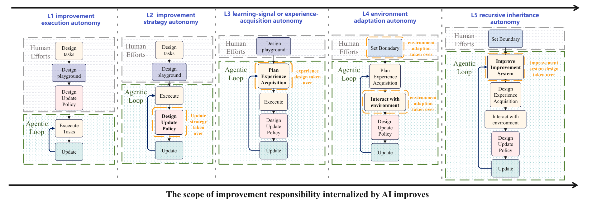</a>
</p>

*Figure 2，p.5。灰色虚线框保留外部控制，橙色框标出新增的自主决策。读图时追踪一项责任怎样进入闭环。*

<div align="center">

| 层级 | AI 新承担的决策 | 跨轮保留的内容 | 代表性研究 |
| :---: | :--- | :--- | :--- |
| B0 任务内修订 | 修订当前答案、重试当前任务 | 不要求跨任务保留 | 仅用于当前输出的 Self-Refine |
| L1 执行自主性 | 执行给定改进流程 | 数据、模型、规则、部署产物等 | FineWeb-Edu、EDIT、REPO |
| L2 策略自主性 | 根据证据选择怎样改、下一个实验做什么 | 提示词、agent、训练程序、算子实现 | GEPA、ADAS、AFlow、AutoKernel |
| L3 经验获取自主性 | 根据学习者状态决定下一轮学什么 | 学习者更新与课程状态 | AZR、R-Zero、STP、Voyager |
| L4 部署适应自主性 | 决定哪些交互经验应持久改变以后行为 | 记忆、技能、工具、harness、可选的权重 | ACE、ReasoningBank、PANDO、Metis |
| L5 递归继承自主性 | 修改并继承产生或评价未来改进的机制 | 改进器、评价器、搜索与研究策略 | STOP、HyperAgents、RQGM、A-Evolve |

</div>

B0→L1 增加持久化；L1→L2 转移干预选择；L2→L3 转移未来课程；L4 把适应放进持续运行的环境；L5 使改进方法本身能够被更新并再用。一个离线程序可以展示局部 L5 机制，同时缺少真实部署的 L4 证据，因此不宜把层级当成每个系统必须逐项通过的认证。

<p align="center">
  <a href="assets/rsi-survey/figure-01-landscape-overview.png">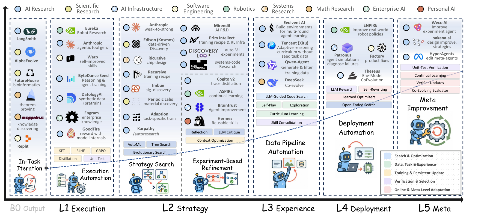</a>
</p>

*Figure 1，p.1。它将研究和产业实践放到同一张路线图上。公司位置包含候选特征、邻近基础设施和未来目标，具体证据须结合 Appendix B 的限定语阅读，不能直接当作已实现等级。点击图片可查看细小标签。*

### 2.3 能力进展不均，是研究完整交互过程的动机

作者先比较了 2023 年至 2026 年 9 月的 **393 条合格模型—基准观测**。不同基准的原始分数难以直接合并，因此使用 Headroom-Closed Index（HCI，已弥合提升空间指数），衡量从起始前沿到满分的剩余空间已经弥合多少：

```math
H_{mbh}=100\times\frac{\bar{s}_{mbh}-F_{b,0}}{100-F_{b,0}}.
```

$`\bar{s}_{mbh}`$ 是模型 $`m`$ 在基准家族 $`b`$、评测协议 $`h`$ 下整合后的分数，$`F_{b,0}`$ 是该基准进入数据集首年模型分数的第 90 百分位。若起始前沿是 60，后来达到 80，HCI 就是 50：弥合了剩余 40 分空间的一半。它不是原始准确率。

<p align="center">
  <a href="assets/rsi-survey/figure-03-capability-headroom.png">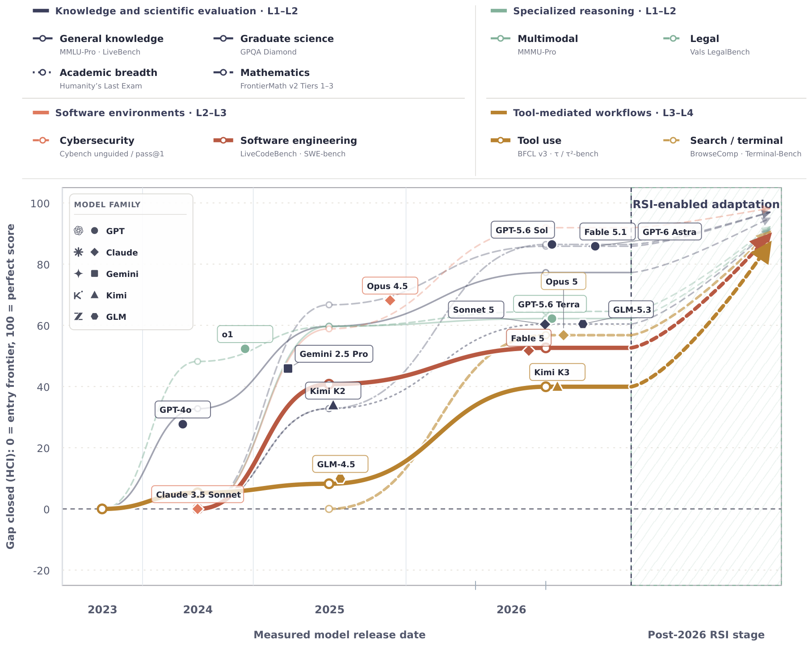</a>
</p>

*Figure 3，p.8。2026 年高等数学的领域轨迹为 86.4，研究生级科学知识 85.8，搜索／终端 agent 56.8，软件工程 52.6，工具 agent 39.9。右侧阴影区是人为设定的示意延伸，并非 RSI 实测结果或拟合预测。*

有明确题目与评测的能力，还没有均匀转移到长流程交互中。长任务需要跟踪状态、选择工具并在错误后恢复，一处早期失败可能影响整条轨迹；这使课程、记忆和 harness 成为值得研究的组件。

这组图没有隔离 RSI 的因果效果。作者要求基准版本和评测框架稳定，或有可辩护的协议连接；最新模型审计的 33 条候选记录只有 17 条进入轨迹。阴影区人为假设再弥合剩余空间的 78%，不能据此推算未来进步速度。

来源：[S] §2.1、Figure 3，pp.7–9。

## 3. L1：把已知流程执行成可复用产物

L1 的实际贡献，是把专家已经写清楚的流程搬到更大的规模。标签、修订过的训练样本、优化代码和部署文件进入后续工作，但质量标准和更新程序仍由人定义。理解这一层，宜沿数据到产品的开发链路看它留下什么。

### 3.1 数据清洗与合成监督承担不同工作

**FineWeb-Edu 把少量昂贵的质量判断扩展为大规模筛选。** 人先规定教育质量标准，由语言模型标注样本，再训练分类器过滤网页语料。这里继承的是筛出的训练数据与分类能力；下一轮该学什么、教育质量应如何重定义，仍没有交给系统。

Google 的高保真标签整理采取另一种分工：语言模型先按人规定的任务边界赋标签，聚类和边界样本选择再挑出少量有信息的样本交专家标注。Phi-4-reasoning 则按研究者指定的难度与推理特征，选择接近模型能力边界的训练材料。这些方法减少逐样本人工工作，但一次性筛选尚未建立“学习后能力变化继续改变筛选”的关系。

合成数据还要交代监督怎么进入训练。Nemotron-4 用 instruction model 生成候选回答，reward model 按预设质量维度评分并过滤，留下的样本再训练后续模型。SynthLLM 从高质量网页参考内容组织概念，生成多样提示词及回答；SynthAgent 进一步生成网页任务和交互轨迹，供 web agent 学习。生成、筛选、训练是三个阶段，不能把生成模型的自评直接称为已验证监督。

<div align="center">

| 工作 | 持久产物 | 关键机制与人定义的部分 |
| :---: | :--- | :--- |
| FineWeb-Edu | 质量标签、过滤器、筛选语料 | 模型标注→训练分类器→批量过滤；教育质量标准由人规定 |
| Google 标签整理 | 校准后的标签集 | 初步标签→聚类与边界选样→专家标注；任务边界由人规定 |
| Phi-4-reasoning | 推理训练样本 | 按指定难度与特征选样；选样标准外部固定 |
| NeMo Curator / Data-Juicer | 经过加工的语料 | 可配置过滤、分类、去重，或组合处理算子；配方由人配置 |
| SynthLLM | 合成提示词—回答 | 参考内容驱动的多阶段生成；目标与流程外部固定 |
| SynthAgent | 网页任务与执行轨迹 | 探索、出题、轨迹修订；生成工作流外部固定 |
| Nemotron-4 | 经过奖励过滤的合成监督 | 指令模型生成、奖励模型筛选；质量维度外部固定 |

</div>

来源：[S] §3.2.1、Table 3，pp.15–16。

### 3.2 EDIT 与 REPO 把诊断和流程要求变成训练信号

**EDIT 改的是需要学习的推理片段。** 研究者先规定诊断信号与修订清单，系统定位有问题的步骤，由语言模型只修订相应部分；修订输出再进入后续强化学习校准。局部修订尽量保留有效推理，避免为了修一处错误重写整条轨迹。survey 没有完整展开所有训练衔接细节，不能据此补出教师数量或损失配置。

**REPO 将标准操作程序的遵守程度转成奖励。** 模型在多轮交互中执行规定步骤，语言模型 judge 按既定标准评价程序合规性，评分再用于策略优化。它让“正确执行流程”成为学习目标，同时把流程本身是否合理留给外部设计者。

> **关键 insight：训练信号也可以成为自动化产物。** EDIT 用局部修订补充“怎样改”，REPO 用流程评分补充“哪些行为应被鼓励”。这比批量产出最终答案多了一层可学习信息；如果诊断或操作规范错了，错误也会进入模型，因此应先检查这些信号是否指向真实问题。

来源：[S] §3.2.2，p.16。

### 3.3 基础设施和交付环节也能留下持久改进

L1 不局限于训练数据。它还覆盖训练故障、性能、评测与部署，这些环节决定一项学习方案能否稳定运行。

<div align="center">

| 环节与代表工作 | 执行流程 | 留给后续系统的内容 |
| :---: | :--- | :--- |
| C/C++ 性能优化 | 按程序记忆进行运行分析、定位热点、改代码、测正确性与性能；失败回滚 | 经验证的实现 |
| Meta NCCL 调试 | 按 runbook 对齐多 rank 证据，追踪 collective 序列及代码路径，找最早可处理的分歧 | 故障诊断与修复产物 |
| HealthBench | 医学专家制定具体对话的评分条目及权重，GPT-4.1 批量应用这些标准 | 可重复的模型评价结果 |
| AIPC | 针对 Qualcomm AI Runtime 执行转换、兼容性修复、量化校准和阶段验证 | 可运行部署文件 |
| LinkedIn CAPT / AWS Agent Toolkit | 按工程 playbook 或技能完成服务创建、接口扩展和模型集成 | 进入代码库的应用组件 |
| OpenAI Harness Engineering | 在既定架构、持续集成与回滚规则下实现和验证产品 | 被接受的工程代码 |

</div>

这层需要检查两件事：流程能否在不同条件下正确执行，执行错误能否在产物进入下一阶段前被拦住。只看本轮任务完成率，会漏掉错误标签、错误修复或不兼容部署文件在后续阶段造成的损失。

来源：[S] §§3.2.3–3.2.7，pp.16–18。

## 4. L2：用实验结果决定下一项干预

L2 承担的是研究判断：读懂失败，推测哪个组件限制了表现，选择一个尚未确定有效的改法，再根据结果继续或换方向。目标、任务边界和接受标准可以保持固定，具体干预由系统决定。

<p align="center">
  <a href="assets/rsi-survey/figure-04-strategy-search.png">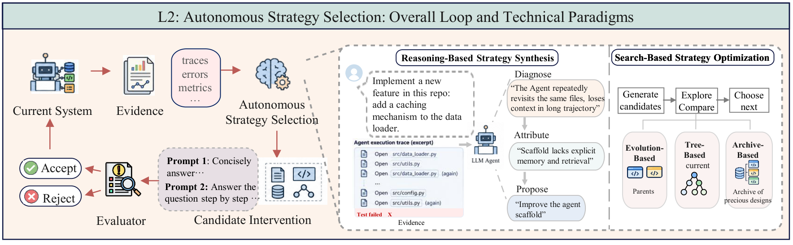</a>
</p>

*Figure 4，p.19。中间是根据轨迹诊断、归因和提出改法；右侧是进化、树搜索和 archive 搜索。二者可以结合：语言模型提出有依据的修改，搜索程序决定哪些分支值得继续。*

### 4.1 GEPA 把失败轨迹用于提示词搜索

GEPA 用模型推理、工具调用和执行结果指导修改。一个“0 分”很难说明应当改哪句话；完整轨迹可能揭示 agent 反复读文件、没有检查工具错误，或误解了停止条件。反思模型据此定位提示词模块，提出候选，再用评测决定是否保留。

它还保留在不同样本上有优势的候选，维护 Pareto 前沿。作为解释性例子，一个提示词擅长处理缺失信息，另一个擅长严格输出格式；只按平均分保留一条分支，可能过早丢掉互补结构。逐样本成绩让后续搜索和重组仍能使用这些材料。

在 Qwen3-8B 的六任务比较中，GEPA 平均分 **54.85**，GRPO 为 **48.91**，增加 **5.94 分**。逐任务结果更能说明收益在哪里：

<div align="center">

| GEPA 原论文 Table 1 | 初始系统 | GRPO 更新权重 | GEPA 改提示词 |
| :---: | :---: | :---: | :---: |
| HotpotQA，多跳问答 | 42.33 | 43.33 | **62.33** |
| IFBench，指令遵循 | 36.90 | 35.88 | **38.61** |
| HoVer，事实核验 | 35.33 | 38.67 | **52.33** |
| PUPA，隐私保护委托 | 80.82 | 86.66 | **91.85** |
| AIME-2025，竞赛数学 | 27.33 | **38.00** | 32.00 |
| LiveBench-Math，数学 | 48.70 | 51.26 | **51.95** |
| 六任务平均 | 45.23 | 48.91 | **54.85** |

</div>

各列沿用对应基准指标的百分制表示，平均分是论文的汇总口径。GEPA 在五项任务上更好，AIME-2025 低于 GRPO；因此“提示词搜索可胜过权重学习”应限于相应系统与反馈条件，不能据此选择所有任务的训练路线。

原文报告，达到最佳表现时相对 GRPO 至多需要 **35 倍更少的 rollout**，即采样执行轨迹。例如 IFBench 的最佳提示词在第 678 条 rollout 时出现，GRPO 使用 24,000 条；GEPA 整次 IFBench 搜索的预算则为 3,593 条。“发现最佳候选时用了多少”与“整次搜索花了多少”是两个口径。

这项成本结果只统计相应 rollout，不能直接换算总成本；反思、搜索和运行框架也有开销。GEPA 多数 rollout 用在候选验证，提示词免训练以后，验证反而可能成为主要成本。它保留的是新提示词，负责反思和选择的程序仍外部固定。

> **关键 insight：详细反馈可以减少无方向的搜索。** 分数告诉系统候选好坏，轨迹帮助它判断应改工具处理、上下文还是指令。GEPA 的价值在于同时使用这两种信息；这也提示，优化器比较应交代各自能看到什么反馈，不能只数候选数量。

原论文还做了跨模型迁移：完全在 Qwen3-8B 上优化的提示词直接用于 GPT-4.1 Mini，六任务平均 **53.03→62.03**。这说明一部分改进可以通过指令迁移，无需重新训练接收模型；具体迁移幅度仍依赖执行模型及任务组合。

来源：[S] §3.3.1；[GEPA] §§3–4、Tables 1–2。

Promptbreeder 在固定任务 fitness 下共同演化任务提示词与用于产生变异的提示词；MPO 将搜索扩到文本和非文本的多模态提示；C-Evolve 将候选生成放进固定进化协议。survey 将这些工作列在 L2 的提示词搜索中。某个局部变异组件可被修改，与整个系统已建立有效 L5 递归，是需要分开检验的结论。

### 4.2 ADAS 搜索整段 agent 程序，AFlow 搜索工作流连接

**Automated Design of Agentic Systems（ADAS，自动设计 agent 系统）把设计空间写成代码。** 人提供调用基础模型、组织提示词等基本函数，meta agent 编写 `forward` 函数：输入任务，输出答案。这个函数可以决定调用几个模型、使用什么角色、如何审阅、何时修订，以及怎样汇总结果。

其 Meta Agent Search 读取已有 agent 的代码和成绩，提出新设计，做自反思，运行验证；代码错误触发修复，随后将代码与指标写入 archive。archive 保存的是可继续组合的设计，外部 meta agent 的搜索程序没有因此被改写。原论文四领域实验独立搜索 30 次，GPT-4 负责设计，GPT-3.5 执行发现的 agent 与基线。

**AFlow 则让搜索围绕完整工作流形成一棵树。** 工作流节点调用语言模型，边决定数据与控制流。Monte Carlo Tree Search（MCTS，蒙特卡洛树搜索）中的每个搜索节点表示一整个候选工作流，不是其中一次模型调用。系统选择父工作流，语言模型改提示词和连接代码，执行并评分，把成功或失败的修改经验返回父节点，以供下一次扩展。

AFlow 用 Claude-3.5-Sonnet 负责优化，下表主实验用 GPT-4o-mini 执行；每次搜索固定执行模型、温度和输出格式，并提供 Generate、Review、Revise、Ensemble、Test 等操作接口来缩小空间。它仍允许从空模板重新出发，避免只在当前最强结构附近修改。每个候选在验证集运行五次，得到均值与标准差；更多验证降低噪声，也增加单轮成本。

<div align="center">

| 原始实验 | 对照 | 自动搜索结果 | 应怎样理解 |
| :---: | :---: | :---: | :--- |
| ADAS：DROP 阅读理解 F1 | 最强手工方法 65.8 | 79.4 | F1 增加 13.6 分；不是准确率 |
| ADAS：MGSM 数学准确率 | 最强手工方法 39.0% | 53.4% | 增加 14.4 个百分点；执行模型为 GPT-3.5 |
| AFlow：六任务指标平均 | 最强手工基线 76.0 | 80.3 | 增加 4.3 分；论文“5.7%”是约 4.3/76.0 的相对提升 |

</div>

ADAS 的表还报告了 MMLU、GPQA，收益比阅读和数学小；论文认为基础模型知识可能限制工作流优化的空间，这是作者的解释。AFlow 的六任务混合 F1、准确率与 pass@1，表中平均值只适用于这套任务汇总。两篇论文使用不同模型、数据和预算，不能据此给 ADAS 与 AFlow 排统一名次。以上分数也没有计入完整搜索成本后建立等总成本优势。

AgentSquare 提供第三种表示：把 agent 拆成可复用模块，通过演化和重组搜索。Microsoft Foundry Agent Optimizer 则从评价失败修改系统指令、技能与本地函数工具描述。它们与 ADAS、AFlow 的共同进展，是让 AI 改执行结构；差异在于可以组合什么，以及如何保留探索经验。

> **关键 insight：搜索表示会影响系统容易发现的改进。** 改提示词擅长表达行为要求；代码能明确加入循环、验证和条件分支；模块重组便于复用已有结构。这是从机制得到的判断。开放整段代码提供更多可能，也带来更贵的错误诊断，未必在所有任务上优于受约束的模块搜索。

来源：[S] §3.3.2、Table 4；补充核查：[ADAS] §3、§4.2、Table 1；[AFLOW] §§3.2–5.2、Tables 1–2。

### 4.3 模型研究分别搜索配置、架构、训练规则和实现

“让 AI 训练模型”包含几种成本和反馈完全不同的工作。调 batch size 不需要改模型结构；改变优化器或数据流程会改变学习过程；改算子实现则应保持计算语义，再测真实速度。

<div align="center">

| 搜索对象 | 代表工作 | AI 怎样决定下一项实验 | 外部固定条件 |
| :---: | :--- | :--- | :--- |
| 配置 | NVIDIA TAO / Cosmos 3 | 解读既有训练结果，选择后续 AutoML 配置 | 模型、任务、数据与验证目标 |
| 架构 | AgentNAS | 生成任务特定的种子架构，再从中导出结构化搜索空间 | 验证指标与任务 |
| 训练规则 | autoresearch | 反复编辑训练程序、训练、比较指标、保留或回滚 | 数据流程、评测函数、指标、单实验预算 |
| 训练程序 | survey 中的 NanoGPT agent 评测 | 定位训练瓶颈，修改训练代码、配置与循环 | 一张 GPU、固定验证目标与受限设置 |
| 算子实现 | AutoKernel | profiling 定位瓶颈，生成 Triton / CUDA 实现，检查数值并测 GPU 速度 | 正确性和性能接受规则 |

</div>

autoresearch 提供了一个容易审计的实验边界：模型配置与训练代码可以变，接受指标及每次计算预算保持固定。AgentNAS 的特殊点是，语言模型参与建立搜索空间，而非只在人工枚举的架构里选项。AutoKernel 则先看哪项操作最影响端到端性能，避免把预算花在无关紧要的快算子上。

> **关键 insight：局部指标必须连接到整体收益。** 算子快了，只有它占足够多执行时间，才会显著影响整轮训练或推理。类似地，训练 dev 提高也可能不改善外部任务。选择实验既需要生成能力，也需要知道哪个瓶颈值得付出验证成本。

来源：[S] §3.3.3、Table 4，pp.20–21。

## 5. L3：让当前能力决定下一轮学习经验

L3 面对固定课程逐渐失效的问题：旧题可能已经没有学习价值，新题可能完全做不出。系统用当前能力、失败与学习历史决定选择、生成或寻求什么经验，学习后的持久状态再影响下一轮选择。已有数据池中的自适应选样也能形成这个机制，并不一定要从零出题。

<p align="center">
  <a href="assets/rsi-survey/figure-05-experience-acquisition.png">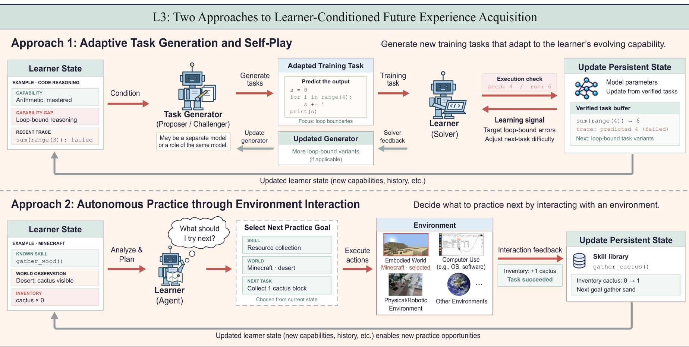</a>
</p>

*Figure 5，p.23。上半部分按当前解题反馈调整训练题，下半部分按技能与环境状态选择练习目标。关键箭头是学习后的状态返回经验获取；图里的代码与 Minecraft 示例是机制示意。*

### 5.1 数据流水线自动化之后，课程决策仍可能由人承担

<p align="center">
  <a href="assets/rsi-survey/figure-06-data-pipeline-automation.png">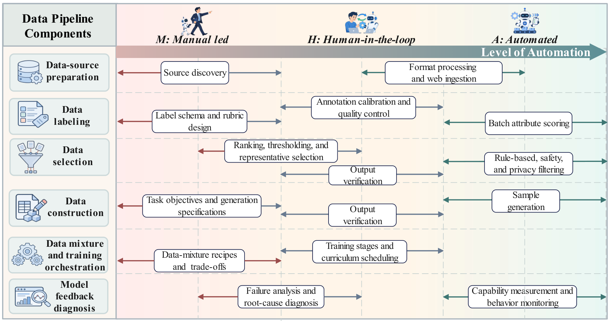</a>
</p>

*Figure 6，p.24。横向是人工主导、人参与、自动执行的定性位置；纵向是六项数据工作。位置与条形长度是作者对公开实践的归纳，不是定量测量或公司评分。*

这张图解释了 L1 与 L3 的距离。批量评分、格式处理、去重和样本生成已经容易自动执行，但发现什么数据源、怎样设计标签、如何混合数据，以及训练失败应归因到哪里，仍常由研究者决定。一个自动生成百万道题的管道，如果出题不依赖正在变化的学习者，就没有解决课程随能力调整的问题。

闭环应能回答：哪项学习者信号改变了下一批经验？这些经验更新了哪个模型或技能库？更新之后，经验获取又怎样变化？下面的方法以不同监督来源连接这三步。

来源：[S] §§3.4.1–3.4.2、Figure 6。

### 5.2 Absolute Zero 用执行器提供任务与答案的外部约束

Absolute Zero Reasoner（AZR，Absolute Zero 推理模型）以已有基础模型为起点，利用程序执行产生这一阶段的训练监督。“零数据”指自博弈训练不依赖外部人工题目和答案；预训练知识、程序任务形式、执行器与学习规则都仍然存在。

它用程序、输入、输出三元组构造互补的推理任务：

<div align="center">

| 推理方式 | 已知部分 | 模型需要补全什么 |
| --- | --- | --- |
| Deduction，演绎 | 程序与输入 | 预测输出 |
| Abduction，溯因 | 程序与目标输出 | 找到能产生该输出的输入 |
| Induction，归纳 | 一组输入—输出示例 | 构造符合这些示例的程序 |

</div>

这里的正确性范围需要区分：演绎可以对照程序实际输出；溯因检查候选输入是否产生目标输出；归纳检查程序是否满足提供的例子，有限例子不自动证明它在全部输入上实现了唯一的目标函数。

训练时，同一个模型承担 proposer（出题者）和 solver（解题者）两种角色。出题参考已生成的三元组与任务类型，执行器过滤并构造有效题目；随后模型采样解题，执行器检查结果，得到解题正确性与出题可学习性信号。两类信号共同用于强化学习更新这个模型，再由更新后的模型进入下一轮。

可学习性奖励不是“模型越做不出来越好”。AZR 原文先对同题采样 $`G`$ 次，得到平均成功率 $`\bar r_{\mathrm{solve}}`$，再设置：

```math
r_{\mathrm{propose}}=
\begin{cases}
0,&\bar r_{\mathrm{solve}}=0,\\[0pt]
1-\bar r_{\mathrm{solve}},&\bar r_{\mathrm{solve}}\gt 0.
\end{cases}
```

这是原文 Eq.(4) 的角色奖励，实际总奖励还包含任务有效性和格式处理。全失败的题得零，全成功的题也得零；在有成功样本的前提下，越难的题奖励越高。**它并不是在 50% 成功率处达到最大值的对称奖励。** 对有限采样而言，“零成功”只是本次没有成功样本，不证明任务数学上不可解；采样数会改变这个判断的分辨率。

执行器与学习者承担不同工作：前者提供有效性和正确性约束，后者提供当前难度信号。二者结合才能构造课程；至于学完是否更会解决新任务，还要通过训练后的迁移评价确认。

来源：[S] §3.4.2，pp.23–25；[AZR] §3.1–3.3，Eq.(4)–(6)，pp.4–9。

### 5.3 R-Zero 扩展了出题范围，也引入伪标签可靠性问题

R-Zero 从同一个基础模型初始化两个独立模型，Challenger（挑战者）负责出题，Solver（解题者）负责解题。它用解题者的答案分布构造难度与伪标签，再交替更新两者。

1. **训练 Challenger 时冻结 Solver。** 对生成题目让 Solver 多次回答，以最常见答案所占比例估计一致性；奖励偏好一致性接近中间值的题，并惩罚批内重复。
2. **冻结更新后的 Challenger，构造 Solver 的训练集。** 它生成候选题；当前 Solver 多次回答，多数投票形成伪标签，再按一致性范围过滤。
3. **训练 Solver。** Solver 的候选回答是否匹配伪标签提供奖励。训练后进入下一轮，新的 Solver 行为改变 Challenger 接收到的难度信号。

原文记 $`\hat p(x;S_\phi)`$ 为题目 $`x`$ 的多次回答中，与多数答案一致的比例，不是经独立真值确认的正确率。不确定性奖励为：

```math
r_{\mathrm{uncertainty}}(x;\phi)
=1-2\left\lvert\hat p(x;S_\phi)-\frac12\right\rvert.
```

它与 AZR 的奖励不同，在一致性为 1/2 时最高。若模型对一个错误答案很一致，$`\hat p`$ 仍可能很高；若题目含糊或本来没有唯一答案，一致性偏低也不代表它有良好的学习价值。

原文从三个训练阶段各抽取 200 道生成题，以 **GPT-4o 作为假定正确的外部标注者**，伪标签与它的一致率依次为 **79%、69%、63%**。在这个审计口径下，课程推进伴随标签可靠性下降。由于标注者本身是模型，这些数字仍是模型间的一致率，而非已证明的真实正确率。

这个取舍很具体：R-Zero 不必为每类题目先建设执行器，可以扩大出题范围；代价是难度估计和训练标签都更依赖解题者自身。如果解题者与多数答案共享一个误区，训练可能提高内部一致性，却没有纠正这个误区。

来源：[S] §3.4.2，pp.23–24；[RZ] §2，pp.2–4；§4.4、Table 5，pp.8–9。

### 5.4 形式证明、代码规格与视觉问答各有不同的课程信号

AZR 和 R-Zero 之外，survey 还收录了几种重要设计。它们试图将“题目有约束”与“题目对当前模型合适”分开处理。

**STP 让猜想生成器与定理证明器一起发展。** 证明奖励往往稀疏：过难的猜想只有失败，过易的猜想缺少挑战。系统选择当前 prover 只能费力证明的猜想来训练 conjecturer，再用检查通过的证明改进 prover；证明器能力变化后，下一轮合适的猜想也变化。证明助手约束形式域内的正确性，难度选择负责定位学习前沿。

**Propose, Solve, Verify（PSV，提出、求解、验证）把题目写成形式规格。** 当前 solver 的表现为示例提供难度标签，标签和示例用于提示生成新规格；系统先检查规格能否编译，再形式验证候选解是否符合规格，之后才用于训练。survey 特别保留了一项结果：目标 easy、medium、hard 的实际难度显著重叠。给出难度条件并不能精确控制课程。

**VisPlay 将自博弈扩到视觉语言推理。** Questioner 根据图像出题，Reasoner 多次回答；多数答案的置信度靠近规定中点时，出题得到更高不确定性奖励，重复问题受到多样性惩罚。这与 R-Zero 的取舍相似：信号容易扩展到图像问答，但低一致性也可能来自问题含糊。

<div align="center">

| 方法 | 经验怎样依赖当前学习者 | 正确性或有效性来自哪里 | 需要额外确认什么 |
| :---: | :--- | :--- | :--- |
| Search Self-Play（SSP） | solver 表现改变 proposer 奖励与后续搜索问题 | 指定搜索任务中的反馈 | proposer 奖励是否带来迁移收益 |
| AZR | 解题成功率影响程序题提案 | 程序执行 | 有限采样的“做不出”及长期学习价值 |
| R-Zero | 答案一致性决定 Challenger 信号 | 多数投票伪标签 | 一致答案是否正确、题目是否明确 |
| STP | prover 前沿决定合适猜想 | 形式证明检查 | 学到的证明能力能否扩到新题 |
| PSV | solver 难度标签指导规格生成 | 编译和相对规格的形式验证 | 规格是否表达有用任务、实际难度是否匹配 |
| VisPlay | Reasoner 一致性和多样性奖励指导视觉提问 | 模型答案分布提供代理信号 | 图像问题歧义与伪监督质量 |

</div>

> **关键 insight：验证器决定可以放心学习的范围，学习者决定这个范围内现在该学什么。** 执行器与证明助手能检查指定性质，却不会自动判断任务的教学价值；多数投票可以覆盖更多题型，却缺少独立真值约束。扩展自主课程时，应同时增加验证覆盖和测量训练后的迁移，而不是只追求题目更难。

来源：[S] §3.4.2、Table 5，pp.23–25。

### 5.5 Voyager 把经验保留在技能库，并由技能变化推动探索

L3 不要求权重训练。Voyager 使用冻结的 GPT-4，通过自动课程、可执行技能库和迭代程序修订在 Minecraft 中探索。

当前库存、环境观察、已学技能与探索历史影响下一个目标；agent 生成并执行行动代码，根据环境结果与错误修订；成功行为进入技能库，后续任务检索并组合这些技能。更丰富的技能改变可尝试的目标，新的探索再产生技能，形成经验获取与持久学习的反馈。

技能在这里有双重作用：直接帮助执行，也让系统能够尝试以前做不到的目标。课程因此随能力改变。**冻结模型与增长系统能力可以同时发生**，但增长依赖技能表示、检索、组合及环境反馈；课程生成的提示与接口仍由人设计。

来源：[S] §3.4.3，pp.25–26；[VOY] §2，Figure 2。

### 5.6 SIMA 2 与 SEAgent 将练习分配连接到能力反馈

Voyager 的能力主要留在代码技能库；另外两种交互系统展示了权重学习和课程记忆怎样接起来。

**SIMA 2 的 full ASKA 设置用评估结果分配练习。** Gemini task setter 根据下游 reward model 对技能的评价，重点安排较弱能力的任务；自生成交互轨迹用于训练 agent，新的能力评价再影响任务设置。仅从固定任务上用自生成轨迹取得提升，不能推出系统已经自主决定下一步练什么，这也是 survey 明确区分两种实验设置的原因。

**SEAgent 用软件 guidebook 承接探索经验。** World State Model 判断轨迹和 GUI 状态变化，Curriculum Generator 据此更新持久的软件操作指南，并生成后续任务；Actor 从收集的经验学习，后续交互再修订指南。这里继承的不只是会操作的模型，还包括关于软件功能与已探索区域的课程信息。

交互式课程必须考虑反馈如何限制探索。错误技能会让 Voyager 选错下一目标，错误 reward 会让 SIMA 2 练错能力，错误 guidebook 会让 SEAgent 误判软件行为。因此有效性、当前难度、学习收益应分别测量；比较自适应与固定课程时，应匹配经验来源和总预算，允许最终样本不同，否则会消掉自适应本身要产生的分布变化。

来源：[S] §§3.4.3–3.4.4，pp.25–26。

## 6. L4：把交互经验转成以后会用的记忆、技能和程序

L4 关注的是持续运行以后怎样适应。部署产生新任务、用户纠正、工具错误和环境变化，系统需要决定保留什么，再让这些更新影响后续执行。经验的形式不同，复用方式和失败原因也不同。

<p align="center">
  <a href="assets/rsi-survey/figure-07-deployment-adaptation.png">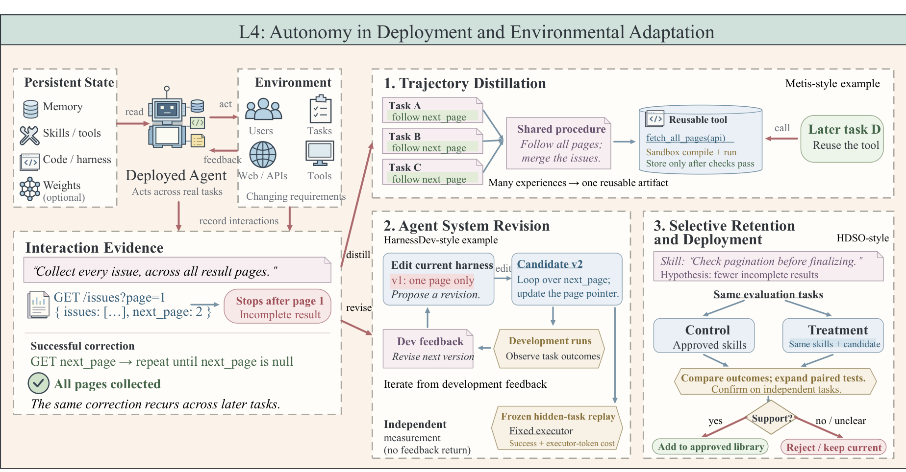</a>
</p>

*Figure 7，p.27。同一分页失败可被提炼成工具、用于修改 harness，或转成需要验证的技能。右侧对照实验检查候选是否真的减少遗漏；隐藏任务用于独立测量。*

survey 将这一层分成轨迹蒸馏、agent 系统修订和选择性保留。Trajectory distillation（轨迹蒸馏）在这里指把完整交互提炼成文本经验、结构化记忆、技能文档或代码，通常不涉及教师—学生的权重蒸馏。

### 6.1 ACE 与 ReasoningBank 分别解决记忆丢失和经验复用

**Dynamic Cheatsheet 维护一份不断变化的经验笔记。** 冻结模型在后续问题中查阅策略、代码片段和常见陷阱，再加入新经验、移除过时内容。它提供了一条简单的跨任务学习路径，但整份笔记反复重写时，细节可能越来越少。

**Agentic Context Engineering（ACE，agent 上下文工程）用局部更新保留这些细节。** 它将上下文写成带 ID、helpful / harmful 计数和内容的条目，而非每轮重新摘要全文。Generator 执行任务并指出哪些条目有用或误导；Reflector 从轨迹和结果提炼教训；Curator 生成小块增量，由非语言模型的合并逻辑写回已有上下文。后续再用去重、局部修订和清理控制冗余。

这一设计针对两种失真：brevity bias 使摘要为了简短丢掉领域细节，context collapse 使反复整体改写逐渐侵蚀已有知识。增量编辑允许“本轮只纠正一个接口前提”，保留其他已经有效的规则。

补读原论文后，可把监督条件和结果分开看。主设置的三个角色都使用 DeepSeek-V3.1 的 non-thinking 模式，避免更强教师向较弱执行器转移知识。AppWorld 的 Average 是 Test-Normal / Test-Challenge 两个 split 上，任务与场景完成指标的四项平均，不能直接称为单一成功率。

<div align="center">

| ACE 原论文 AppWorld 设置 | 适应时是否有真值标签 | 四项指标平均 | 相对 ReAct 的差值 |
| :---: | :---: | :---: | :---: |
| ReAct 基础执行器 | — | 42.4 | — |
| ACE 离线适应 | 有 | 59.4 | +17.0 分 |
| ACE 离线适应 | 无 | 57.2 | +14.8 分 |
| Dynamic Cheatsheet 在线适应 | 无 | 51.9 | +9.5 分 |
| ACE 在线适应 | 无 | 59.5 | +17.1 分 |

</div>

“无真值标签”仍会使用代码执行成败等自然反馈；它不表示没有监督。离线与在线上下文适应都未训练这些角色的基础权重。较长上下文有收益，也会增加执行时输入成本，不能只报告适应阶段省下的 rollout。

**ReasoningBank 则把成功和失败都提炼成可检索策略。** 每条经验有标题、简短描述和策略内容。任务开始时用相似度检索，注入 system instruction；任务结束后，judge 根据任务和轨迹判断成败，不读取真值答案，再按成功或失败采用不同提炼策略。失败记录可留下应避免的路径和替代思路，避免只保存成功例程。

Memory-aware Test-Time Scaling（MaTTS，考虑记忆的测试时扩展）进一步利用同题的多次尝试。并行方式比较多条轨迹的成败差异后汇总记忆；顺序方式保留反复修订中的中间判断。额外尝试因此既影响本题，也为以后的任务提供经验。

<div align="center">

| ReasoningBank 原论文 WebArena 设置 | 总体成功率 | 平均交互步数 |
| :---: | :---: | :---: |
| Gemini-2.5-flash，无记忆 | 40.5% | 9.7 |
| 同模型 + ReasoningBank | 48.8% | 8.3 |
| 同模型 + ReasoningBank + 并行 MaTTS（5 条轨迹） | 51.8% | 7.9 |

</div>

这组实验使用 684 个任务，Table 1 将并行 MaTTS 标为 pass@1；5 条轨迹是学习和扩展设置，不能改写成 pass@5。交互步数下降也不能证明总成本等比例下降，因为记忆提炼、judge 和并行尝试另有开销。其成败信号来自模型判断，误判会影响后续策略。

> **关键 insight：一次推理的产物可以有两种用途。** 答案服务当前任务，多个尝试之间的差异帮助提炼可复用经验。MaTTS 提供了把测试时计算转为后续能力的具体方法；要判断是否值得，应同时测本题收益、后续任务收益和记忆维护成本。

来源：[S] §3.5.1、Table 6；补充核查：[ACE] §§2.2–3.2、§4.2–4.3、Table 1、Appendix A.2；[RB] §§3.1–3.3、Table 1。

### 6.2 结构化记忆记录复用条件，技能库记录操作程序

自由文本适合表达策略，但不容易维护前提与依赖。**APEX** 把任务里程碑及先决关系写成图；每次 episode 的结果沿经过的里程碑回传，另一步增加尚未尝试但有希望的分支。规划时既可沿已知成功路径，也可选择新分支。它通过记忆结构直接影响探索，避免只重复熟悉套路。

按用户组织的记忆解决另一种适用范围问题。PersonaAgent 从 episodic 与 semantic user memory 形成个人 persona prompt；PAHF 遇到缺少相关偏好的含糊请求时询问用户，确认并修订偏好；MemToolAgent 保存失败工具调用的批评，并调整每次检索多少条经验。它们的区别在于记录用户条件、确认偏好，还是改进工具使用。

程序技能更接近以后可以遵循的步骤。survey 给出了离线整理与运行中积累两种路线：

<div align="center">

| 方法 | 从什么经验开始 | 怎样形成后续可用的技能 |
| :---: | :--- | :--- |
| Trace2Skill | 冻结 agent 在领域任务上的轨迹 | error / success 两类分析者提出补丁，分阶段合并成可移植技能目录；后续 agent 直接加载文档 |
| PRACTICE | 示范轨迹、同题不同执行器的成功与失败、技能 learner 自己的编辑分布 | 先学技能生成与维护，再学区分失败，最后在自己的编辑分布上接受更强教师的蒸馏；支持添加、修订、合并、删除 |
| PANDO | web agent 部署中的每条 rollout | 提炼防重复失败的规则及参数化例程；用置信度决定准入与降级 |
| PILOT | 正在进行的长流程任务 | supervisor 根据 live-run 反馈提炼程序与失败模式，供后续会话继承 |

</div>

Trace2Skill 将经验带到其他模型和任务，PRACTICE 则专门训练“怎样维护技能库”的 learner；两者不是同一条训练链。PANDO 的参数化例程还能替代多步浏览器子目标，因此评价包含重复动作、步数开销和 prompt-cache 使用，而不只看最终成功率。

作为解释性例子，一次 API 重试成功，只记录“错误后重试”容易留下错误规则。限流、认证失效和参数错误要采取不同操作。结构化记忆或技能应保存触发条件与错误类型，否则压缩后的经验可能比原轨迹更容易被误用。

来源：[S] §3.5.1、Table 6，pp.28–29。

### 6.3 Metis 将反复使用的文本计划编译为工具

**Metis 使用文本与代码双记忆。** 文本库保存计划、环境事实和陷阱，由 reflector 维护；一个文本计划在多个任务中反复使用后，系统把它改写为可调用工具，经过沙箱编译和运行检查再纳入代码库。检索同时覆盖文本经验与工具描述。

这条链路是 **成功经验 → 文本计划 → 重复复用 → 代码工具 → 后续直接调用**。文本能灵活处理新情况，代码能把已经稳定的多步操作压成一个接口。图中的分页工具就是这类机制的直观例子，但不是 Metis 论文的具体观测记录。

Evo-Harness 把修改范围扩到整个 harness 的跨任务模式和任务特定程序；SHAPER 同时演化文本规划指导和沙箱 Python 上下文选择函数。后者改变的是 planner 看到什么信息，而不仅是给 planner 增加一条建议。

> **关键 insight：知识的载体可以随着证据成熟而变化。** 先在文本中记录条件与不确定性，反复验证后再形成稳定工具，可以减少后续解释和行动成本。这是从 Metis 得到的设计推论；是否编译值得做，取决于调用频率、构建成本及环境变化后的维护成本。

来源：[S] §3.5.1、Table 6，p.29。

### 6.4 系统修订需要分开检验执行器与评价器

**DecoEvo 同时演化 solver skill 与 rubric-generator skill，刻意分开两者的目标。** solver 从逐条 rubric 反馈更新；rubric 生成器接受两项与 solver 总分无关的审计：结构审计检查是否覆盖任务要求，对比审计检查是否能区分接近的答案，并做 Pareto 检验。生成器不读取 solver 的总分，因而不能仅靠放宽标准提升自己的表现。

**HarnessDev 测模型能否从小种子构造并修订完整 harness。** creator 根据少量开发任务迭代代码，候选冻结后在隐藏任务回放；不同候选用同一个 executor 比较成功率与 token 成本。把设计模型与执行模型分开，能减少“换了更强模型”对 harness 效果的干扰。

**ASPIRE（此处为 survey 引用 [109] 的自改进评测）** 给出模糊目标，让 agent 选择数据、更新方式与验证信号，可改权重或 harness；外部 score gate 对未提高验证分数的修改回滚。S3Gym 则限制经验通道，不提供 verifier 结果，比较原始历史、压缩摘要与参数训练三种更新路径。二者分别测自主选择更新，以及缺少直接正确性反馈时怎样从轨迹学习；不要与后文机器人技能发现的同名 ASPIRE 混用。

来源：[S] §3.5.2，pp.29–30。

### 6.5 技能要经过准入、实际使用与生命周期管理

**Hypothesis-Driven Skill Optimization（HDSO，假设驱动的技能优化）要求候选先说明预期效果。** curator 从简化执行轨迹提出更新假设和验证计划，同一批任务运行两遍：control 使用已批准技能库，treatment 加入候选技能。比较分阶段扩大，最后在独立任务确认，通过后才准入。它把一句“经验总结”变成能检查的行为干预。

准入后还可能有三种失败：经验本身不正确；相关技能没有被激活；技能被加载却没有被遵守。*Harness Updating Is Not Harness Benefit* 将更新质量与执行收益分开测量，观察到后两类问题，并发现二者与基础模型能力并非简单单调关系。继续训练一个更强的技能总结器，未必解决调用与执行问题。

**Library Drift** 研究另一项长期损失：库无界增长时，检索可能先变差，随后成绩停滞。其生命周期管理保留追加式证据日志，按实际贡献退休技能，限制活跃集合，并用 meta-skill 指导新技能写法。过度激进的退休比不管理更差，说明删除也应有证据。*Rethinking Skill Evolution* 同样发现，谨慎过滤技能编辑优于每轮按任务结果反复重写。

Tax AI 把这类更新接到实际产品：从业者纠正形成字段级证据，重复失败聚成评价目标，coding agent 修复指定组件，通过针对性与回归检查，以 PR 交工程师审阅后发布。它改变的组件可以包括提取 schema、来源选择、税务映射与 graders，架构与产品决策仍由工程师负责。

> **关键 insight：技能库的有效容量受检索和执行能力限制。** 条目数增加只有在相关技能能被找出、按条件使用时才有价值。长期评价应记录每项技能在哪里被调用、是否照做、对结果有什么贡献，才能区分“没有学会”与“学过但没有用上”。

来源：[S] §§3.5.2–3.5.4、Table 6，pp.29–31。

## 7. L5 直接修改未来如何产生改进

L5 把改进器、候选评价方法或研究策略纳入修改对象，并让新版机制负责后续改进。递归联系发生在它被继承、调用的那一步。

<p align="center">
  <a href="assets/rsi-survey/figure-08-meta-improvement.png">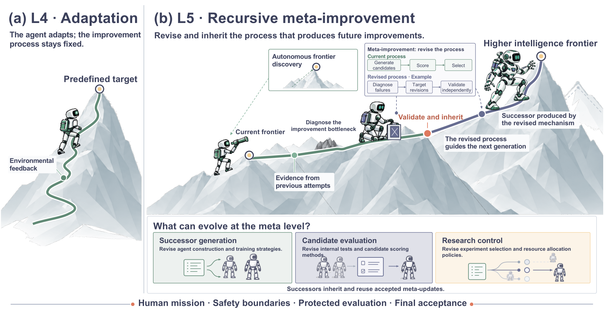</a>
</p>

*原文 Figure 8，p.32。左侧在固定改进程序下适应，右侧修改后续候选生成、评价或研究控制。上升路径是可能的进展示意，不能作为实际加速曲线。底部的人类目标、边界、受保护评价和最终验收仍是外部约束。*

survey 区分两个证据层次：**structural L5（结构性 L5）**证明机制被修改、继承，并控制了后续改进；**effective L5（有效性 L5）**进一步证明新版机制在可比预算与独立评价下产生或选出了更好的后继系统。

### 7.1 STOP 直接把改进器源码交给改进器优化

STOP 的初始改进器是一个简单 Python 程序：读取待改代码与效用函数，调用语言模型生成多个修改，用效用函数评分，返回最好的候选。关键一步，是把“这个程序本身”作为下一次优化目标。

若 $`I`$ 是改进器，$`u`$ 是某项任务的评分函数，$`s`$ 是初始解，$`L`$ 是固定语言模型，则普通程序改进为：

```math
s'=I(u,s,L).
```

改进器的质量通过它产生的下游程序衡量。STOP 将这一点写成元效用：

```math
\hat u(I)=\frac{1}{\lvert D\rvert}
\sum_{(u,s)\in D}u\bigl(I(u,s,L)\bigr),\qquad
I_t=I_{t-1}(\hat u,I_{t-1},L).
```

$`D`$ 是训练阶段的下游任务集合；$`\hat u`$ 衡量改进器产生的程序质量。右式让第 $`t-1`$ 代改进器，用这项元效用改写自身，得到第 $`t`$ 代，再由它承担后续改进。原文存在效用函数噪声和语言模型采样随机性，单次运行不保证每代单调上升。

模型提出过 beam search（束搜索）、遗传搜索、模拟退火等组织方式。它们改变搜索如何使用采样与评价预算，因此收益会体现在后续任务中。

原文在带噪奇偶学习任务上进行自改进，再选择一个第四代改进器迁移到五项未用于自改进的下游任务，五项均优于初始改进器。其中 3SAT 的元效用为 21.2%→75.1%，MaxCut 为 58.7%→74.2%，分别按各任务定义计量。强 GPT-4 设置出现改善，GPT-3.5 与 Mixtral 设置平均退步：改写自身给出了优化路径，能否沿这条路径获得收益仍取决于生成和验证能力。

STOP 作者将冻结基础模型视为其距离完整 RSI 的限制；survey 则采用系统边界，把改进代码的继承视为局部 L5。阅读这类论文时，最好明确说出被改进的组件：这里演化的是程序搜索方法，基础语言模型保持不变。

来源：[S] §3.6.1，p.32；[STOP] §3–5、Algorithm 1、Figure 4、Table 1，pp.4–6。

### 7.2 Gödel Agent 与 DGM 扩大可修改的程序范围

Gödel Agent 把任务策略与递归更新逻辑放在同一 Python 程序中。执行反馈触发重写，新程序进入下次递归调用，包含已经修改的自更新逻辑。survey 引述其 100 次 MGSM 优化试验中有 14 次低于初始表现，无限制设置还可能调用更强模型；因此应分别记录程序改进、权限变化和基础模型变化。

Darwin Gödel Machine（DGM，达尔文哥德尔机器）让编码 agent 修改自身的工具、上下文管理和实现，再在编程任务上评估修改后的 agent。它保留多个版本及父子关系，从历史 archive（候选档案）选择父代，生成后继，不只反复修改最新一个版本。

archive 保留了当前平均分之外的探索价值。一个暂时较弱的版本可能包含有用组件，后代修补后才发挥作用；一次自修改损坏编辑工具，也不必终止所有路径。代价是需要用更多评价预算判断哪些分支值得继续。

必须分开搜索与完整评测口径。原论文的 80 次迭代报告：

<div align="center">

| 评测口径 | 初始 agent | 搜索所得 agent | 解读边界 |
| --- | ---: | ---: | --- |
| SWE-bench Verified 的论文评测子集 | 20.0% | 50.0% | 不是完整 500 题 Verified 榜单成绩 |
| Polyglot 搜索用 50 题子集 | 14.0% | 38.0% | 搜索过程中使用的子集表现 |
| Polyglot 全集额外评测 | 14.2% | 30.7% | 初始与最佳 agent 的全基准比较，每题一次完整运行（pass@1） |

</div>

SWE-bench 的分阶段评价包含小子集与对强候选扩大至 200 题的检查；Polyglot 全集结果采用 pass@1，与允许一次测试反馈的 pass@2 榜单口径不同。基础模型没有更新权重，自修改与任务评测的模型配置也需分别看原文。

DGM 的特殊条件是，执行编程任务与修改自身，都需要编辑和调试能力，所以两者可能受益于同一项更新。这个条件在其他领域未必成立：更会给论文评分，并不直接带来更会写修改程序的能力。父代选择和 archive 管理也仍在自修改之外，因此 survey 把 DGM 视为过渡案例。下一项需要测的，是任务增益是否真的转化为更高的后继质量。

Huxley–Gödel Machine（HGM）进一步根据后代谱系估计 metaproductivity，即产生有效后继的能力，再将评价预算分给更有长期价值的版本。这种选择能关注当前分数以外的价值，但其选择规则本身仍固定。由此看 DGM 与 HGM，任务表现和后继生产力最好单独测量。

来源：[S] §§1.3、3.6.1、Appendix C.3，pp.4、33、76–77；[DGM] §4.1–4.4、Figure 2，pp.5–7。

### 7.3 HyperAgents 直接修改元 agent，并单独测试改进策略迁移

HyperAgents 的动机是解决 DGM 在其他领域中的能力不对齐：更会评价论文的任务 agent，未必更会写 agent 修改程序；更好的机器人奖励函数也未必提高改代码能力。

它把 task agent（执行目标任务的 agent）与 meta agent（修改任务 agent 和自身的元 agent）放在同一个可编辑程序中。候选不仅可以改任务逻辑，还能改后续修改如何提出、记录、诊断和执行。DGM-H 将这个程序与 DGM 式 archive 搜索结合。

原文报告元 agent 自主加入了性能追踪与持久记忆等机制。更重要的证据是迁移实验：把论文审阅、机器人奖励设计中演化出的元 agent 转移到未见过的奥数解答评分任务，**固定迁移后的元 agent**，观察它还能否产生有效的新任务 agent。

- 五次重复运行中，迁移 hyperagent 的初始任务成绩为 0；固定其元 agent 后，进行 50 次后继生成，最佳任务 agent 的测试中位数达到 **0.630**，置信区间为 0.540–0.630。
- 同一元机制测试下，初始元 agent 的改进接近 0。这支持迁移了“产生改进”的能力，而不只是搬过去一个已经会解新任务的 agent。
- 另一项允许继续演化的 **200 次迭代**实验中，迁移初始化的测试中位数为 0.640，从初始版本开始为 0.610；最终差异 **未达到统计显著**。不能从较短的迁移实验直接推出长期复利或持续加速。

固定元 agent 的迁移实验尤其有信息量：新任务系统最初不会做目标任务，改进方法却仍能生成有用后继。这比直接迁移一个高分任务 agent 更能隔离“怎样改进”的能力。主实验仍固定父代选择与评价，并冻结基础模型；附录探索的选择机制修改属于另一项设置。

来源：[S] §3.6.1，p.33；[HYP] §3、§5.2–5.3，pp.5、10–13。

### 7.4 RQGM 允许验证器演化，同时维持每阶段的可比性

如果始终固定一个不完善的验证器，强候选可能不断找到其盲点；如果同时任意修改验证器，分数增长又可能只是标准变宽。Red Queen Gödel Machine（RQGM，红皇后哥德尔机器）把这个取舍转为分阶段控制的评价演化。

它的核心做法是：

1. 在每个 epoch（这里指搜索阶段）内冻结当前评价机制，保证阶段内采用同一标准。
2. 让候选评价器接受独立于被评价 agent 的 ground-truth anchor（真值参照集）检查，该参照可以来自客观标签或人类偏好。
3. 仅在阶段边界选定替代评价器。
4. 替换后丢弃依赖旧评价器的评分记录；旧 agent 被再次访问时，用新评价器重新评分，避免混合不同标准下的分数。

原预印本在其 Polyglot 留出任务设置中报告 pass rate 为 71.7%，对照 HGM-H 为 69.9%，并报告较低搜索 token 用量。它与前文 DGM 的模型和搜索配置不同，数值不构成直接横向排名；理论稳定性论证也限于各阶段内的固定条件。

这项设计给我的启发是：**可以改进内部反馈，但需要保留独立判断“反馈是否改好了”的依据。** 更换评价器后重置不兼容分数，也是在承认旧记录与新记录测量的对象不同。独立 anchor 可以约束替换；若它被反复用于选择评价器，最终泛化仍需新的受保护测试确认。

来源：[S] §3.6.2，p.33；[RQ] §3–4，尤其 §§3.2、4.1，pp.5–9。

### 7.5 A-Evolve-Training 继承研究策略，而不是不断续训上一轮胜者

A-Evolve-Training 把元改进放在真实后训练研究中。原报告以 30B Nemotron 模型进行四轮研究，每轮启动八个同类 worker：一个用于基线噪声参照，其他探索训练配方和数据流程的不同方向。worker 运行训练、评测模型检查点（checkpoint）、调试并汇总结果；collector 聚合本轮证据；meta agent 据此改写下一轮搜索策略。

**各轮 worker 都从同一个人工核查过的基础工作区派生。** 跨轮保留的是研究策略与发现日志，包括当前推荐配方、应继续或退休的方向，以及失败路径清单；新 worker 在固定基础上按这些知识实施变化。胜者不会覆盖基础，也没有形成上一轮胜出模型直接续训的链条。固定的上层规则与评价设施限定可修改范围。

原文 Table 2 的轨迹如下：

<div align="center">

| 轮次 | 内部开发评测（dev）分数 | 外部排行榜分数 | 关键变化 |
| --- | ---: | ---: | --- |
| 0 | 0.79 | 0.80 | 人工建立的固定参照 |
| 1 | 0.82 | 0.82 | 配方稳定化 |
| 2 | 0.84 | 0.84 | 累积改法，开始校准噪声 |
| 3 | 0.93 | 0.85 | 内部代理显著改善，外部收益很小 |
| 4 | 0.89 | 0.86 | 调整数据域权重和 checkpoint 选择，外部继续改善 |

</div>

最有信息的变化发生在第 3 到第 4 轮：系统不再把“继续提高内部 dev”当成当然正确的方向，而把降低某些内部代理、同时提高外部目标的干预纳入搜索。最终分数为 **0.86**，当时最高人工提交为 **0.87**。这支持研究策略层面的结构性 L5 与一次有证据记录的策略修订。

这是一轮尚未重复验证的研究 campaign。排行榜分数被多次查询并用于指导策略，已经构成选择信号，**不能视为从未参与优化的最终测试**。120B、550B 的额外实验缺少相应人工基线，主要提供运行闭环的基础设施证据。

来源：[S] §§1.2、3.6.3，pp.4、34；[AE] §3–6、Appendix A Table 2，pp.5–10、12。

> **关键 insight：研究策略需要知道什么时候停止优化旧代理。** A-Evolve 留下了一条具体研究知识：当前 dev 已不能可靠代表外部收益。继承它会改变实验优先级和 checkpoint 选择；继续增加实验次数则可能只把失真的代理优化得更好。这个案例支持一次策略修订，跨设置稳定性仍待验证。

### 7.6 自改进研究助手仍需检验后续搜索效率

Weco 的 AIDE2 把 research agent 用于修改 research-agent harness，在私有评分与固定成本预算下保留新版。survey 引述公司报告：100 个无人值守步骤接受了七次改进，并测试外部任务迁移。另一项更强的实验把演化后的 harness 安装为外层改进器，检查它是否更快完成后续搜索，结果没有显著效率优势。

Meta AIRA2 的异步实验与隐藏一致评价、Anthropic Automated Alignment Researchers 的对齐实验自动化，为研究提供了基础设施。公开结果主要是研究产出，尚未建立研究程序自身被修改并跨轮继承的证据。

<div align="center">

| 工作 | 继承的关键修改 | 下一轮因此改变什么 |
| --- | --- | --- |
| STOP | 程序改进器源码 | 如何生成、搜索与筛选候选程序 |
| DGM | 编程 agent 实现与候选谱系 | 用哪些工具与实现继续修改；外层选择仍固定 |
| HyperAgents | 元 agent 的诊断、记忆与修改逻辑 | 如何组织后继生成，且可在新任务上测试迁移 |
| RQGM | 候选评价器 | 哪些后继被认可，旧分数如何重新解释 |
| A-Evolve-Training | 研究策略与发现日志 | 哪些方向值得继续，哪些代理值得信任 |

</div>

从这些机制可以归纳，L5 的共同对象是**未来的改进决策**。实现可以是代码、评价器或研究策略，收益则都应落到后继质量与总成本上。课程选择程序如果被修订并持续控制后续课程，也可以出现 L5 联系；自主出题本身则主要回答 L3 的问题。可编辑对象的名字，远不如修改后的实际调用关系有用。

来源：[S] §3.6、Table 7，pp.32–35；实验细节见各原始研究。

### 7.7 经验式验收保留了哪些理论目标

原始 Gödel Machine 只在找到“自改写有助于既定效用”的证明时执行修改，证明搜索器也可修改。它要求效用、硬件和初始程序有可用的公理描述，并能承担证明搜索成本。STOP、DGM 等改用运行候选、评测、留出的经验式验收，使开放任务中的修改可实施，却没有继承原理论的全局保证。

形式验证适合检查明确规格，经验评价适合检查开放任务收益；规格满足以后，还要确认规格表达了真正需要的能力。名称里的 Gödel 无法替代这一步。

来源：[GM] Abstract、§1；[DGM] §1；[S] §3.6。

## 8. 四个应用领域用不同证据确认更新

科学、具身、软件与医疗都能保留经验，但反馈的速度、可归因程度和试错成本差别很大。软件修改可以重放和回滚；实验失败未必能归因到假设；机器人和诊疗行为还有无法通过恢复代码撤销的后果。survey 因此按“改哪个组件，用什么证据接受”组织各领域。

<p align="center">
  <a href="assets/rsi-survey/figure-09-application-regimes.png">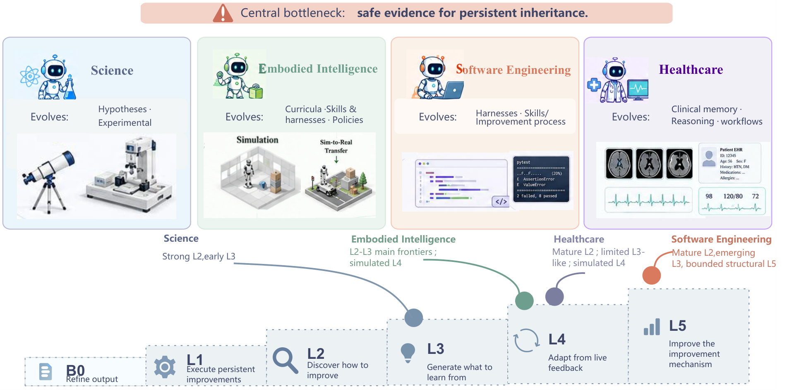</a>
</p>

*Figure 9，p.36。上方列出各领域可演化的组件，下方归纳当前研究前沿。这是对综述所收录闭环的定性判断，图中位置不是领域能力评分。*

### 8.1 科学研究分别积累假设生成、实验执行与证据判断能力

找到一个更好的分子、方程或控制器，是本轮发现。科学 agent 的持久改进，则要改变下次如何生成假设、设计实验或解释失败。两类收益应分别评价。

**HypoForge 对生成与实验使用不同反馈。** 缺少直接实证时，从 discriminator 的批评更新假设生成技能；真实执行有结果后，再据结果和归因失败更新实验技能。EvoScientist 把有希望和失败的研究方向写入 ideation memory，后续检索以调整提案。前者留下操作程序，后者留下方向与条件，基础模型与记忆更新程序仍可以固定。

**工具演化把研究经验变成新的行动。** Test-Time Tool Evolution 在推理时合成、验证、复用科学工具，其 SciEvo 有 **1,590 个任务与 925 个演化工具**；这些是基准规模，不是收益指标。CASCADE 创建、修复、积累化学与材料技能；SkillFoundry 从论文、代码库、文档和 API 提取候选，编译为可执行技能包，再按执行与下游效用验证、合并、剪枝。工具增长需要与实际迁移分开测量。

DrugSAGE 提供了更直接的迁移证据：从 **16 项任务**积累经验证的建模程序、训练策略和反复错误的修复方法，提升了 **17 项留出任务**的表现。survey 在此强调的不是记忆条目更多，而是继承经验改变了新任务行为。

<div align="center">

| 被更新的部分 | 代表方法 | 更新怎样影响以后研究 |
| :---: | :--- | :--- |
| 假设生成 | HypoForge、EvoScientist | 从批评、执行与失败方向形成技能或 ideation memory |
| 生成模型权重 | TTT-Discover、polymer discovery framework | 用测试时 RL 或模拟评估候选再训练生成器；更新规则仍固定 |
| 实验工具与程序 | Test-Time Tool Evolution、CASCADE、SkillFoundry | 创建并验证可重复调用的科学工具 |
| 跨任务实验策略 | DrugSAGE、STELLA、EarthLink、OriGene | 保留建模程序、推理模板、工具组合或分析流程 |
| 多组件修改 | SIA | Feedback-Agent 据任务结果选择改 scaffold、工具、重试／搜索逻辑或 LoRA 权重 |
| 研究探索与具体目标 | CORAL、SAGA | 前者维护共享尝试、笔记与技能；后者诊断候选群体失败，修订可执行目标函数 |

</div>

SAGA 在固定高层科学目标下重加权具体目标，并不表示系统自主改变科学使命。SIA 的多个可编辑组件也只是扩大修改范围；要证明其改进器越来越好，还需把新版诊断与干预机制固定，在新任务上比较后继质量。

> **关键 insight：负面结果要继承条件，不能只继承结论。** 实验失败可能来自假设、模型、协议或仪器。把“这条路线无效”带到下轮，可能挡住本来有效的方向；留下条件、代码、原始结果和归因依据，后继才能决定该换假设还是修实验。

来源：[S] §4.1、Appendix C.1，pp.36、72–74；代表原文：[HypoForge](https://arxiv.org/abs/2608.25770)、[Tool Evolution](https://arxiv.org/abs/2601.07641)、[DrugSAGE](https://arxiv.org/abs/2605.15461)、[SIA](https://arxiv.org/abs/2605.27276)。本节机制和任务规模按 survey 整理。

### 8.2 具身智能同时更新环境、策略与对后果的预测

具身学习的经验由当前策略产生：机器人到不了某个状态，就无法观察那里的失败。策略改变后，可到达状态也改变，课程与世界模型需要跟着更新。这使经验生成成为系统的一部分。

**POET 共演化环境—agent 配对种群。** 它变异环境，用“既不太简单、也不完全做不出”的最小条件接纳新挑战，优化对应策略，再周期性地把策略移到其他环境。迁移允许一个环境里学到的行为成为另一条路线的中间能力，避免每个任务从头学习。

EnvGen 用语言模型设计模拟器配置，小型 RL agent 在其中训练，再将技能级表现返回生成器，以针对剩余弱项生成新环境。GenEnv 将模拟器参数化为可训练课程策略，用 α-Curriculum Reward 偏好学习者能力边界附近的任务；学习者用 GRPO 更新，模拟器用 reward-weighted regression 更新。二者分别把课程设计放在语言模型和可训练生成策略中。

**World-VLA-Loop 让策略失败用于修世界模型，再在修好的模型里训练策略。** VLA 是 Vision-Language-Action（视觉—语言—动作）模型，从观察与指令产生动作。若世界模型对失败附近的动态预测不准，合成练习可能训练错误行为；把真实或策略交互反馈返回模型，试图改善下一轮训练环境。

<div align="center">

| 环节 | 代表工作 | 持久更新与反馈路径 |
| :---: | :--- | :--- |
| 环境与课程 | POET、EnvGen、GenEnv | 学习进展指导挑战生成，再更新策略 |
| 新环境代码 | OMNI-EPIC、SimWorld Studio | 从 archive 与学习进展生成环境／奖励代码；后者用编译、物理检查和视觉批评修订 3D 世界 |
| 技能与 harness | Voyager、LRLL、EmbodiSkill、SHAPER | 积累、组合和维护程序技能，或改 planner 的上下文选择 |
| 真实机器人修订 | 机器人 ASPIRE、ENPIRE | 前者诊断并验证技能修复；后者允许 coding agent 改策略、训练程序及基础设施 |
| 策略与复位 | Self-Improving Embodied Foundation Models、MEDAL++ | 前者从预训练模型取得奖励／成功信号；后者同时学完成和撤销任务，减少人工复位 |
| 价值与动作模型 | Q-Planning、SERP | 前者冻结大型行为克隆策略，训练小价值函数；后者据导航失败修动作模型再规划 |
| 世界模型与策略 | VLAW、World-VLA-Loop、Motus2、SAIL | 从执行后果更新动态、价值或视频规划，再生成新的训练依据 |

</div>

EmbodiSkill 特别区分技能错误与 agent 没有遵守有效技能，只在轨迹提供相应证据时修技能。这个区分与 L4 的“更新质量—实际使用”相同，在机器人中还能避免把控制失败错误归因到规划指导。

这些方法分别打通了闭环的一部分。模拟可降低成本，现实复位、硬件限制和感知—规划—控制归因仍约束完整实验；策略与世界模型一起在模拟中变好，也需检查是否共同适应了模拟误差。

来源：[S] §4.2、Appendix C.2，pp.36–37、74–76；代表原文：[POET](https://arxiv.org/abs/1901.01753)、[EnvGen](https://arxiv.org/abs/2403.12014)、[GenEnv](https://arxiv.org/abs/2512.19682)、[World-VLA-Loop](https://arxiv.org/abs/2602.06508)、[ENPIRE](https://arxiv.org/abs/2606.19980)。

### 8.3 软件工程把自修改变成可执行、可追踪的版本

软件的有利条件是：任务产物和开发 agent 都能表示为代码，修改可重跑、版本化和回滚。因此，同一个文件编辑或上下文改进，可能同时帮助普通修复任务与后续自修改。

**SICA（Self-Improving Coding Agent，自改进编码 agent）** 读取先前版本与基准成绩，修改自身 Python 代码库，将被选版本用于下一轮。Self-Harness 则缩小范围：从轨迹定位反复弱点，要求同一个基础模型提出小幅 harness 修改，通过回归后保留。Agentic Harness Engineering 将组件写成独立可编辑、可回退文件，把长轨迹整理为证据，并检查修改有没有实现预测效果；Ouroboros 将经审阅的工具、上下文、提示词和核心实现更新用于后续部署。

<div align="center">

| 研究路线 | 代表方法 | 它在 DGM 之外增加了什么 |
| :---: | :--- | :--- |
| 经验复用 | SWE-Exp、CODESKILL | 保存成功和失败经验；后者管理多层程序技能的提取、更新与删除 |
| 协作结构 | EvoMAC | 用测试反馈和文本反向传播改角色提示词与通信连接；报告更新发生在每项任务测试时 |
| 后继生产力 | HGM | 从后代谱系估计长期改进潜力，分配评价预算；选择规则仍固定 |
| 分支间共享 | Group-Evolving Agents | 多父代共享有效修改与失败经验，供新群体生成 |
| 保持旧任务覆盖 | DarwinX | 演化冻结模型周围的完整 harness，以扩展覆盖且不回归已解决任务为准入条件 |
| 模型—harness 共演化 | HELIX | 先演化 harness、生成经验证轨迹，更新模型后再为新模型重建 harness |
| 自适应软件经验 | Self-play SWE-RL、Socratic-SWE | 让经验获取依赖当前学习者，推进软件领域的 L3 |

</div>

EvoMAC 的工作流修改是否跨独立任务保留，需要另查，不能因多 agent 或“evolution”名称直接算持久改进。HELIX 则提出一个具体的耦合：模型更强后，原来为弱模型设计的反思和冗余调用可能不再合算，因此不宜把旧 harness 永久固定。这是框架动机，实际最佳重建频率仍需实验。

软件闭环依然受规格和测试覆盖限制。通过仓库测试能检查已表达的需求；安全性、可维护性和未覆盖行为还要靠其他评价。更多测试访问也会把开发集逐渐变成优化对象。

来源：[S] §4.3、Appendix C.3，pp.37、76–78；代表原文：[SICA](https://arxiv.org/abs/2504.15228)、[HELIX](https://arxiv.org/abs/2608.13951)。DGM、HyperAgents 和 RQGM 的原始实验见第 7 节。

### 8.4 医疗经验分别改变知识、证据获取策略和行动空间

医疗自改进并非只有“记住更多病例”。一条经验可以改变检索什么病例、先问什么问题、怎样加权专科意见，或将已验证流程组合成新工具。这些更新的验证条件不同。

**MedAgent-Zero 在 Agent Hospital 中保存成功治疗案例，从失败中总结诊断规则。** 冻结模型在后续模拟就诊中检索它们。DxEvolve 进一步提炼诊断认知单元，记录可复用的信息获取和推理模式；GSEM 用双层图存经验，根据新反馈校准节点质量与经验之间的关系；Evo-MedAgent 将临床经历、程序启发和工具可靠性分开保存。

**EvoClinician 将诊断拆成 Diagnose–Grade–Evolve。** Actor 逐步问问题、安排检查；Process Grader 按临床信息收益与资源成本评价每步行动；Evolver 在下一病例前修订 prompt 和 memory。被继承的是如何获取与整合证据的策略，不能仅用最终诊断准确率解释其全部行为变化。

**MACRO 改变可调用动作的粒度。** 它从经验证的医学影像执行轨迹中发现反复出现的多步工具组合，合成为 composite tools，再注册为后续高层动作。相比回忆旧案例，agent 可以直接调用新的复合操作。

<div align="center">

| 更新对象 | 其他代表方法 | 怎样影响后续案例 |
| :---: | :--- | :--- |
| 诊断记忆 | Agent Mental Clinic、MedAgentSim | 用监督诊断或医疗记录与经验记录更新持久记忆 |
| 多学科协调 | EvoMDT | 根据专家与结果信号改提示词、共识权重及检索范围 |
| 心理咨询技能 | PsychAgent | 从咨询轨迹提炼技能，再用 rejection fine-tuning 内化选定技能 |
| 技能生命周期 | SkeMex | 提炼通用、任务与动作技能，按上下文效用晋升、合并、修订或删除 |
| 医学分析工作流 | TissueLab、HealthFlow | 前者由专家纠正指导主动学习与分类器更新；后者保留 EHR 分析的检查规则、工作流、数据集条件与代码 |
| 模拟环境适应 | EvoPatient | 共演化模拟患者与医生；真实性和评价仍外部规定 |

</div>

EHR 是 Electronic Health Record（电子健康记录）。HealthFlow 先由 evaluator 指出执行或方法缺陷，再由 reflector 验证、更新或退休经验，后续分析才检索。这里的技术成功不能直接推出跨患者群体安全。

survey 的主要证据仍来自模拟或回顾性设置。真实病人结局受医生干预、病程和人群条件影响，反馈难以直接归因；一个机构验证的规则也可能不适用于另一个机构。因此继承内容需要绑定来源、适用人群和条件，真实长期效果需要前瞻性验证。

来源：[S] §4.4、Appendix C.4，pp.37、78–79；代表原文：[EvoClinician](https://arxiv.org/abs/2601.22964)、[MACRO](https://arxiv.org/abs/2603.05860)。

## 9. 八个产业案例把继承对象落实到实际工作

产业系统的改进常常落在企业知识、用户状态、数据检查器、工程经验和研究记录，而非基础模型权重。以下数字主要由产业方提供、经 survey 整理，尚未在本笔记中独立复现。应把已测组件收益与拟构建的完整循环分开阅读。

### 9.1 Theseus 先区分环境问题与模型能力问题

<p align="center">
  <a href="assets/rsi-survey/figure-10-theseus-coevolution.png">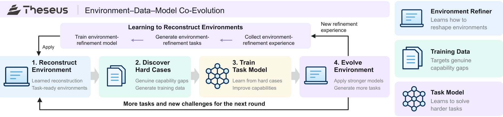</a>
</p>

*原文 Figure 10，p.38。下方循环依次重构环境、发现困难案例、训练任务模型、继续改进环境；上方学习如何重构环境。该图描述拟构建的完整循环，Table 9 的实验证据主要位于环境阶段。*

Theseus 将工作环境纳入优化对象。agent 失败可能来自能力不足，也可能来自线索缺失、资料组织混乱或噪声过多。先改善输入环境，可以帮助分清哪些失败还需要模型学习。

survey 分别测量噪声影响与环境重构：

- **干净与含噪环境试验：** 八组模型—harness 配置、30 项工作区任务、1,280 条 rubric（评分标准）。干净环境相对含噪环境的通过率高 21.7–51.6 个百分点。
- **原始与重构环境试验：** 五组固定模型—harness 配置、30 项任务、547 条 rubric。重构环境增加 Collection Map（资料组织地图）与 Event Log（事件日志），聚合 rubric 分数改善 **18.65–39.67 个百分点**。

<div align="center">

| 固定 harness / model（Table 9b） | 原工作区 | 重构工作区 | 差值（百分点） | 任务胜／平／负 |
| :---: | :---: | :---: | :---: | :---: |
| Codex CLI / GPT-5.6-Sol | 60.51% | 92.50% | +31.99 | 24 / 3 / 3 |
| Codex CLI / DeepSeek-V4-Flash | 54.30% | 84.83% | +30.53 | 24 / 3 / 3 |
| Claude Code / DeepSeek-V4-Flash | 61.06% | 79.71% | +18.65 | 23 / 2 / 5 |
| PI / DeepSeek-V4-Flash | 62.52% | 89.03% | +26.51 | 22 / 6 / 2 |
| PI / GPT-5.6-Sol | 50.27% | 89.95% | +39.67 | 23 / 2 / 5 |

</div>

模型与 harness 固定，因此这些收益属于环境组件。少量任务也因修改范围扩大而退步，说明增加资料仍有干扰和额外编辑的代价。完整环境—数据—模型共演化尚未由这两个试验验证。

> **关键 insight：先修环境，有助于分清哪些失败需要模型学习。** 从设计推论，若输入已经充分而任务仍失败，失败更可能暴露模型或执行机制的问题；若输入不足，就直接把失败当成训练样本，可能让模型反复补偿环境缺陷。先分清这一点，有助于把训练预算投向真实能力缺口，其独立收益仍需完整循环实验确认。

来源：[S] §5.1、Figure 10、Table 9，pp.37–39。

### 9.2 Lark 把企业数据与失败归因作为改进基础

<p align="center">
  <a href="assets/rsi-survey/figure-11-lark-data-foundation.png">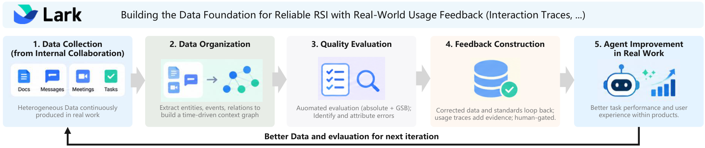</a>
</p>

*Figure 11，p.39。文档、消息、会议和任务进入时间关系图，经过质量判断与纠错，供 agent 使用；真实使用再提供下一轮证据。*

Lark 将分散资料连接为实体、事件、人物和时间关系，便于跨来源回答。批量图构建与授权检查解决数据规模和权限问题，query-time filtering 避免回答某个时点的问题时引用未来信息。

评价分两步：先用绝对判断发现明显不可用的输出，再比较两种系统版本；失败还要归因到时间不一致、查询失真或源数据质量差。低质量合成查询会被改写后重新评价，避免把坏题误当作系统能力问题。

内部结果中，图检索相对 RAG 基线的人评可用性从 **52%→65%**，自动评价从 **47%→56%**；初始自动评价器与人判断约 **84%** 一致，主要分歧来自自动标准更严。RAG 是 Retrieval-Augmented Generation（检索增强生成），即先检索资料再生成答案。这些指标测的是资料与回答流程，并未建立全自动评价标准演化；重要标准、样本审核和变更仍由人负责。

来源：[S] §5.2，p.39。

### 9.3 小红书用快记忆与慢后训练适应不同变化

<p align="center">
  <a href="assets/rsi-survey/figure-12-ima-dual-timescale.png">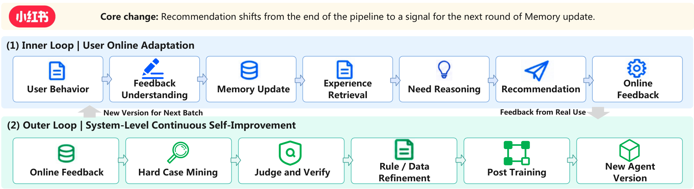</a>
</p>

*Figure 12，p.40。上层即时纠正用户记忆，下层从困难案例形成经检查的数据，再后训练并部署新版 agent。两条链的更新频率和监督来源不同。*

Intent-Memory Agent（IMA，意图记忆 agent）解释点击、停留、收藏、搜索与负反馈，决定记忆应添加、增强、替换、衰减，还是忽略本次证据。Content 记录内容主题，Who 表示用户状态，Need 表示推断需求；三者分别组织检索，反馈可以只纠正某个状态，而不用重写整个用户描述。

即时循环改变外部用户记忆。慢循环从在线交互挖掘困难案例，经过自动 judge、人工抽查、规则纠正和数据重构，才用于 IMA 后训练；模型更新后返回推荐。长期经验可先通过记忆使用，再将反复确认的模式转入参数。

<div align="center">

| 模块与指标 | 在线基线 | RSI model | 原文报告的相对提升 |
| :---: | :---: | :---: | :---: |
| Discovery Feed，`score_mean@16` | 2.211 | 2.366 | 7.0% |
| Discovery Feed，`score_median@16` | 1.587 | 1.663 | 4.8% |
| In-video Feed，`score_mean@16` | 1.537（470 样本） | 1.739（447 样本） | 约 13.1% |

</div>

这些是初步排名分数；视频内结果来自较小离线评价，两组样本数不同。材料没有建立相应点击率或转化率提升。

> **关键 insight：经验的稳定程度可以决定写入哪里。** 临时兴趣先进入容易撤回的记忆，经过多次验证的共性再考虑进入权重，是从该设计得到的取舍。全部写入权重可能扩大局部偏差，全部留在记忆又增加检索负担；表中的分数没有单独隔离两条路径的贡献。

来源：[S] §5.3、Table 10，pp.40–41。

### 9.4 Humanlaya 用交付缺陷更新以后的检查器

<p align="center">
  <a href="assets/rsi-survey/figure-13-humanlaya-quality-loops.png">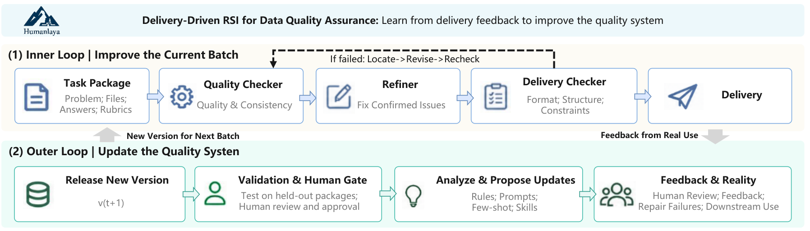</a>
</p>

*Figure 13，p.41。内循环修当前任务包，外循环改下一批会用的质量系统。候选在未参与产生修改的任务包上验证，经人审阅后进入新版本。*

内循环按 Quality Checker → Refiner → Delivery Checker 检查内容、跨文件一致性和交付格式。外循环汇总客户反馈、人工复核与修复失败，分析反复原因，改质量检查规则、提示词、few-shot 示例与技能。

原文给出一个三页扫描 PDF 案例：文本提取失败后，检查器判文件不可用；人工确认图像清晰，问题在于检查器混淆了“工具无法解析”与“文件质量差”。外循环更新判断规则和示例，以便未来任务区分这两种情况。

相同基础模型、工具和处理预算下，V0 与四轮更新后的 V4 在 **600 个未参与更新的任务包**上比较：自动修复后仍有关键缺陷的比例从 **9.0%→3.7%**，平均人工处理时间从 **48→27 分钟**。整体变化没有隔离各规则的贡献，但同时报告了质量与人工成本。

这个案例说明，错误诊断本身会制造无效工作。误报正常输入会触发不必要的修复和审阅；更新检查器的区分规则后，预算才能更多用于真正缺陷。扫描 PDF 解释了一项机制，不能把全部指标收益归到这一条修订。

来源：[S] §5.4，pp.41–42。

### 9.5 ModelBest 将项目优化与跨项目工程经验分开积累

<p align="center">
  <a href="assets/rsi-survey/figure-14-forge-engineering.png">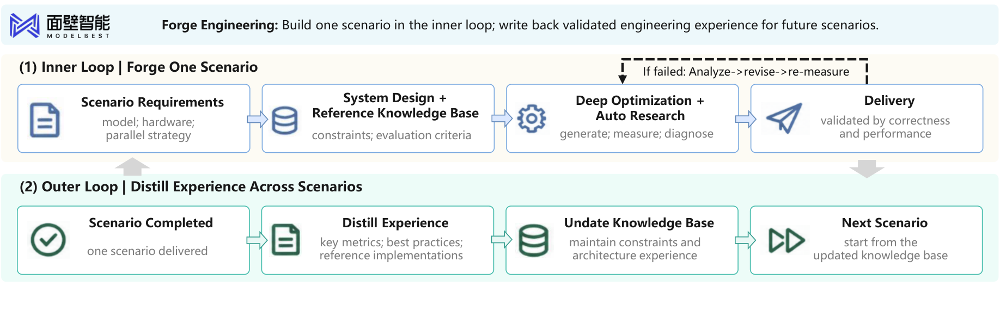</a>
</p>

*Figure 14，p.42。内循环在固定模型、硬件与并行需求下生成、测量、修实现；外循环把经验证的工程经验写回知识库。*

Forge Engineering 的出发点是，AI 工程比开放研究更容易获得便宜、客观的执行反馈。系统从目标模型、硬件、并行需求与参考知识建立高层架构，再用 AutoResearch 循环实现并优化 GEMM、FlashAttention 等组件。整体约束稳定，底层实现可以密集搜索。

一次项目结束后，性能测量、有效优化、参考实现和失败规则进入共享知识库，成为下一模型、硬件或工作负载的起点。这里只继承“这个优化更快”还不够：硬件、张量形状和运行条件也要保留，否则跨项目复用可能选错实现。

<div align="center">

| 公司提供的工程结果 | 原文口径 |
| :---: | :--- |
| ForgeTrain 框架开发 | 从空目录、参考脚本与模型规格开始，约 8 小时达到 Megatron-LM v0.15 表现，1.5–2.5 天后报告超过它 |
| MiniCPM4-0.5B 的模型 FLOPs 利用率 | 40.1%→44.1% |
| 8B 模型的模型 FLOPs 利用率 | 47.0%→50.9% |
| ForgeStencil | 对公共先进实现报告 1.15–1.9× 加速，端到端中位加速 1.41× |

</div>

FLOPs 利用率衡量计算设备在模型计算上的使用程度，表中的变化是相应配置下的测量，不能直接换算所有训练任务的成本下降。原文还以 3–5 位工程师工作 6–12 个月估计同类人工开发量；这是公司估算，没有构成受控的人力成本实验。

来源：[S] §5.5，pp.42–43；报告提供的项目：[ForgeTrain](https://github.com/OpenBMB/ForgeTrain)、[ForgeStencil](https://github.com/OpenBMB/ForgeStencil)。

### 9.6 Hyra 保留可执行经验，并允许修订内部评价

<p align="center">
  <a href="assets/rsi-survey/figure-15-hyra-experience-search.png">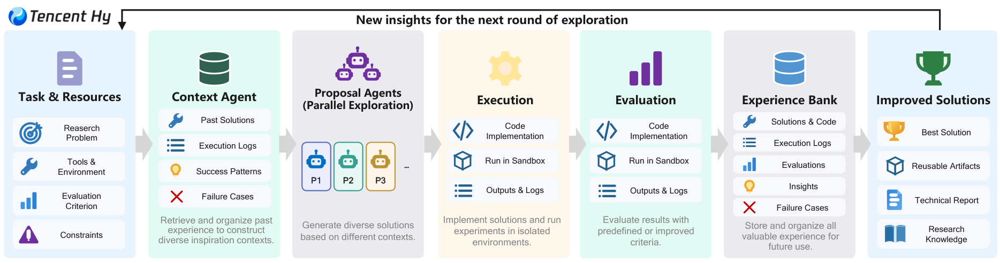</a>
</p>

*Figure 15，p.43。Context Agent 组织以往方案、日志、成功和失败，多个 Proposal Agents 据不同上下文并行尝试；执行证据回到 Experience Bank。*

Hyra（Hunyuan Research Agent，混元研究 agent）的经验库保存代码、生成产物、执行日志、指标与 evaluator 反馈。Context Agent 重组这些材料，形成不同探索上下文；proposal agents 在新的隔离沙箱运行，成果和失败返回库，供以后复用、组合或避免。

开放任务的初始 evaluator 可能不完整或被利用，系统也会从搜索经验修订它，例如增加评分粒度、加强对照或封堵漏洞，再继续搜索。评价规则一变，旧分数是否仍可比较就需要处理；RQGM 的阶段冻结与重新评分提供了一种研究上的参照，不能把二者结果混为同一实验。

<div align="center">

| survey Table 11 的任务 | 指标 | Recursive | hyra-1.0 |
| :---: | :---: | :---: | :---: |
| NanoChat Autoresearch | Validation BPB，越低越好 | 0.9109 | 0.9015 |
| NanoGPT Speedrun | 达到 3.28 loss 的时间 | 77.5 秒 | 76.4 秒 |
| SOL-ExecBench | Mean SOL，越高越好 | 0.754 | 0.771 |

</div>

BPB 是 Bits Per Byte（每字节比特数），用于衡量验证文本的预测损失；它与达到目标损失的时间、算子性能指标是三个不同目标。结果支持这些设置下的研究产出改善，没有单独建立 evaluator 修订的收益或跨代加速。

来源：[S] §5.6、Table 11，pp.43–44。

### 9.7 Agent-Native Research Lab 保存能够重放的研究过程

<p align="center">
  <a href="assets/rsi-survey/figure-16-agent-native-research.png">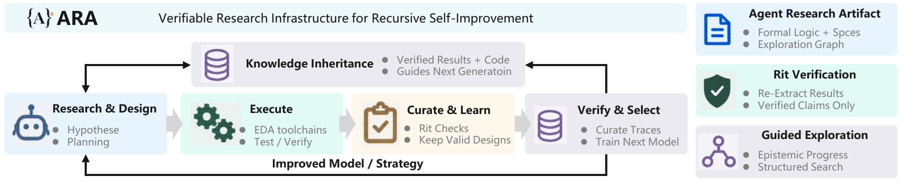</a>
</p>

*Figure 16，p.44。研究产物保留代码、规格、成功与失败的探索图；rit 从日志重提结果或检查形式论证，再将通过检查的证据用于继承和训练。*

Agent-Native Research Artifact（ARA，agent 原生研究产物）针对普通论文丢失操作状态的问题：论文往往只保留最终叙事，后继还需要知道失败实验、实际参数、可执行规格与中间证据。ARA 将这些内容与形式逻辑、代码和原始数据一起保存。

rit 核验直接从执行日志重新提取实证结果，形式性质可通过 Lean 4 检查；通过后才进入共享研究状态。它能检查“报告的数是否来自运行”“证明是否满足规格”，实验设计及规格是否表达目标能力仍需另外判断。

公司提供的比较中，使用 ARA 的既有研究问答准确率为 **93.7%**，传统论文为 **72.4%**；RE-Bench 复现成功率从 **57.4%→64.4%**。硅设计实例使用 EDA 工具做综合、布局布线、时序和等价检查，报告设计比同模型标准 agent 基线 **快 2.7%、面积小 21.5%**，通过 97 个定向测试与 350 个随机差分程序。

> **关键 insight：研究继承需要保留因果链条。** 最优 checkpoint 告诉后继选择了谁，代码、规格、失败分支和原始指标才告诉它为什么选择、在哪些条件下成立。ARA 的问答与复现结果支持更丰富材料的使用价值，长期是否减少重复研究成本仍需跨轮实验。

来源：[S] §5.7，pp.44–45。

### 9.8 Frontis 分开评价专家能力与改进效率

<p align="center">
  <a href="assets/rsi-survey/figure-17-frontis-meta-evolution.png">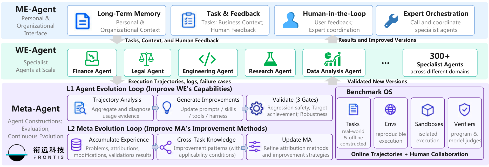</a>
</p>

*Figure 17，p.45。ME 承接用户、组织记忆与批准，WE 执行业务，MA 改专家及改进方法。图内的“L1 Agent Evolution / L2 Meta Evolution”是两条内部循环的命名，不对应 survey 的 L1 / L2 自主性定义。*

Frontis Horizon 将 300 多个专家 agent 接到共享 Benchmark OS，组织业务任务、可重现环境、隔离沙箱与评价器。MA 根据反馈区分路由、执行机制和专家能力问题，提出有边界的修改；候选经过回归、目标完成和异常鲁棒性三项检查，再由人确认发布。

跨任务继承保存问题条件、诊断、修改、验证结果及适用范围。专家经验服务下个版本，通用经验则改 MA 在新任务中的归因和干预策略。接收任务仍需重新确认条件：一条“优先用实时证据”的经验，必须在新任务中找到权威来源并检查时间有效性。

两个月内，公司报告发起 **216 项改进任务、涉及 117 个专家 agent**，其中 63 个完成至少一次完整循环。76 个同 evaluator 的可比任务平均分 **5.25→5.87**，每个完成周期的机器处理时间中位数 **27.8 分钟**。另一个试验在累计 100 多任务元经验后，对相同初始 agent 版本测迭代、时间、token 与回归，报告未见内部任务上改进约快 **20%**。

Frontis-MA1 另将改进能力训练进 35B 模型：固定 harness 的 MLE-Bench Lite 成绩 **39.39%→60.61%**，增加搜索后为 **71.21%**。后一个数包含额外搜索，不能全部归因于权重训练；直接使用企业平台演化轨迹学习仍属未来工作。

来源：[S] §5.8，pp.45–46。

## 10. 当前证据支持哪些进展，还缺哪些实验

survey 收录的研究已经展示大规模流程执行、自主策略搜索、随学习者变化的课程，以及可继承的技能和元程序。证据最薄的地方，是这些机制能否在长期运行中稳定互相支持，持续提高产生后继的能力，并抵消自身搜索与验证成本。

### 10.1 文献分布显示当前工作的集中位置

<p align="center">
  <a href="assets/rsi-survey/figure-18-literature-targets.png">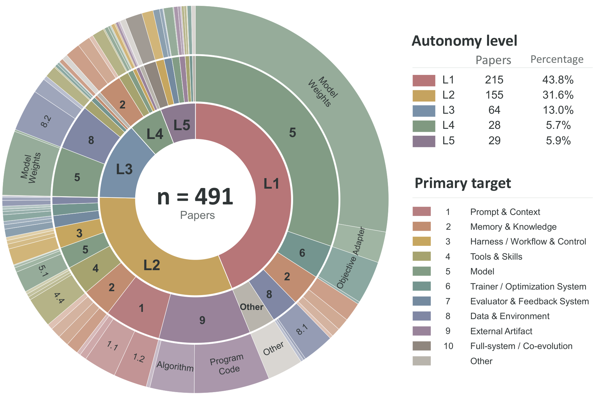</a>
</p>

*Figure 18，p.63。内环是自主性层级，中环是主要改进对象，外环是子对象。跨多个对象的论文按分数权重计入目标类别，层级比例按篇数计算。*

<div align="center">

| survey 文献归类 | L1 | L2 | L3 | L4 | L5 |
| :---: | :---: | :---: | :---: | :---: | :---: |
| 篇数 | 215 | 155 | 64 | 28 | 29 |
| 比例 | 43.8% | 31.6% | 13.0% | 5.7% | 5.9% |

</div>

491 篇中 L1 与 L2 合计约 **75.4%**，由篇数计算。图中 L1 的模型权重占比较大，L2 覆盖提示词、程序和其他产物，L3 增加数据与环境，L4–L5 更多涉及记忆、harness 和改进机制。这反映综述的收录与归类，不是整个生态的成熟度或有效系统占比。

技术方法是另一个维度。Table 2 的重要信息是，同一种技术可以承担完全不同的责任：

<div align="center">

| 技术家族 | 典型做法 | 在本笔记中的跨层联系 |
| :---: | :--- | :--- |
| 搜索与优化 | 进化、树搜索、反思、代码搜索 | GEPA 搜指令，AFlow 搜工作流，STOP 搜改进器 |
| 数据与经验构建 | 离线合成、自博弈、课程、探索 | Nemotron-4 执行合成流程；AZR、SIMA 2 用学习者状态安排后续经验 |
| 训练与持久更新 | 监督学习、偏好优化、RL、上下文与技能整理 | 同样是学习，产物可能在权重，也可能在外部记忆 |
| 验证与选择 | 执行测试、形式验证、judge、回归 | STP 验证明，HDSO 验技能干预，RQGM 验评价器替换 |
| 在线与元适应 | 经验回放、持续记忆、自修改、评价器共演化 | ACE、Metis 积累经验；HyperAgents 改产生未来修改的机制 |

</div>

因此强化学习、AutoML（Automated Machine Learning，自动化机器学习）和多 agent 都不是层级标签。持续学习主要研究新经验如何进入能力及避免遗忘；AutoML 主要研究配置与结构搜索；RSI 进一步追踪是谁控制经验和干预，以及搜索方法是否被更新、继承。Table 2 的空白只是未列代表例子，不能读成技术与层级不兼容。

来源：[S] Table 1–2、Figure 18、Table 12，pp.11–13、63–65。

### 10.2 八项研究问题都能落实为可区分的实验

作者的未来方向不是简单开放更多编辑权限，而是让各项更新有可解释、可迁移的收益。按具体障碍整理如下。

<div align="center">

| 尚未解决的问题 | 已有设计给出的线索 | 下一项有区分力的验证 |
| :---: | :--- | :--- |
| 失败应该改哪个组件 | Humanlaya 区分提取工具失败与质量规则错误；Theseus 固定模型检查环境 | 分别冻结数据、环境、模型或 harness，测试干预预测及交互效应 |
| 当前难度是否代表学习价值 | AZR 有执行约束，R-Zero 用一致性代理 | 独立审计题目，比较实际难度、训练后迁移与多轮稳定性 |
| 保存的技能能否兑现收益 | HDSO 检查准入，Harness Benefit 分开更新与执行 | 分别测技能正确、相关技能激活、忠实执行和旧任务回归 |
| 领域证据怎样支持继承 | 科学需归因，具身需现实后果，医疗需长期与人群条件 | 从沙箱／模拟筛选推进到目标条件下分阶段观测 |
| 内部评价能否可靠演化 | RQGM 阶段冻结、独立 anchor 和重新评分 | 分别更新 agent 与 evaluator，再用受保护参照比较 |
| 新版机制是否更会产生后继 | STOP 迁移下游任务，HyperAgents 固定元机制迁移 | 匹配初始系统与总预算，在新任务重复比较原、新改进器 |
| 何时继续研究才划算 | GEPA 验证占主要 rollout，产业系统记录人工投入 | 测达到能力目标的总成本，并比较自主停止与固定耗尽预算 |
| 后继能否重放原来的研究 | ARA 保存代码、规格、探索图与原始证据 | 测跨轮重放、失败方向复用及维护成本，不只测材料数量 |

</div>

经验覆盖尤其容易被内部指标掩盖：课程反复选容易取得进展的区域，记忆反复返回相似策略，judge 又偏好同类答案，系统可能收集更多经验却见到更少问题。需要保留旧能力与稀少场景的检查。

补充研究 *The Curse of Recursion* 表明，在其历代生成数据训练设置中，抽样和拟合误差可以使原始分布的低概率内容逐渐丢失，形成 model collapse（模型坍塌）。它支持检查继代数据覆盖，没有证明所有合成数据、自博弈或 RSI 必然失败；真实数据保留、混合方式与外部执行反馈都会改变条件。

来源：[S] §6，pp.46–49；补充：[MC] Abstract、§§2–5。

### 10.3 元改进要测后继质量，效率要算完整成本

一个直接的实验是：固定原改进器与新版改进器，让它们从相同或可比的任务系统和证据出发，以相同预算生成后继，再在不回传给搜索的任务上测量。用笔记自拟记号表示：

```math
\Delta_{\mathrm{meta}}(B)
=\mathbb{E}\!\left[P_{\mathrm{test}}(I_1(S;B))\right]
-\mathbb{E}\!\left[P_{\mathrm{test}}(I_0(S;B))\right].
```

$`S`$ 是初始任务系统，$`I_0`$ 与 $`I_1`$ 是原、新机制，$`B`$ 是后继生成及评价预算，$`P_{\mathrm{test}}`$ 是受保护测试成绩。期望覆盖多次随机运行。正的 $`\Delta_{\mathrm{meta}}`$ 支持这套任务与预算下的元改进效果；获得新版机制的开发成本还要另列，评价端到端效率时再计入。

总成本至少包括经验获取、候选搜索、训练、验证、运行维护和人工审阅。元机制比普通 agent 更贵：先让它产生后继，再运行后继，通常还需要多个任务和重复试验。比较“轮次”容易失真，一轮八个训练作业与一轮提示词修订消耗不同。

历史最佳曲线还会隐藏失败和噪声。更多尝试可能刷新有噪内部分数的最大值，即使候选质量没有变化；需要报告拒绝、回归、恢复和新测试结果。排行榜或 anchor 一旦反复用于选择，就是优化信号，最终泛化仍需受保护评价。

> **关键 insight：持续改善、改进方法变好、改进速度加快需要三种证据。** 任务分数随轮次提高只支持第一项；相同预算下新版机制产生更好后继支持第二项；计入机制开发与验证后，到新能力目标的总时间或成本持续下降才支持第三项。HyperAgents 和 AIDE2 的长程结果正说明这些测量不能互相替代。

来源：[S] §3.6.5、Table 8、§6；[HYP] §5.3。

## 11. 原始材料与继续阅读

主报告为 Yi Duan 等的 **The Last AI Built by Humans: Toward Genuine Recursive Self-Improvement**，本文以 **arXiv:2609.11873v3，2026-09-22，79 页**为依据，初版为 2026-09-10。标题表达研究愿景；报告结论是自主性框架与有边界的自改进证据。

以下原始研究用于补充核查方法、阶段连接与实验口径。应用和产业部分主要依据 survey 及其引文整理，未在本笔记中重跑实验。

<div align="center">

| 原始材料 | 阅读重点 |
| :---: | :--- |
| [Survey][S] | §2.2 的闭环；Tables 2–7 的技术与方法；§6 的研究问题；Appendix C 的领域方法 |
| [GEPA][GEPA] | 轨迹反思、逐样本 Pareto 选择、与 GRPO 的成本口径 |
| [ADAS][ADAS] / [AFlow][AFLOW] | 代码设计空间与工作流树；设计模型、执行模型及验证如何分开 |
| [Absolute Zero][AZR] / [R-Zero][RZ] | 执行监督与多数投票监督，两种奖励怎样塑造课程 |
| [Voyager][VOY] | 技能库如何改变下一轮可探索的目标 |
| [ACE][ACE] / [ReasoningBank][RB] | 局部上下文更新、成功／失败经验，以及多次尝试怎样形成记忆 |
| [STOP][STOP] / [Gödel Machines][GM] | 下游元效用驱动程序自改进，与证明式验收的区别 |
| [DGM][DGM] / [HyperAgents][HYP] | 多条代码谱系、任务 agent 与元 agent，以及固定元机制迁移 |
| [RQGM][RQ] | 评价器演化、阶段可比性与 anchor 的信息边界 |
| [A-Evolve-Training][AE] | 固定 worker 基础上的策略继承，以及 dev 与外部目标分离 |
| [The Curse of Recursion][MC] | 历代生成数据的分布覆盖损失及适用条件 |

</div>

本轮补读的近期原始研究如下，日期为 arXiv 初次提交日期。前部第 1 节据这些论文归纳进展，未将各自实验成绩拼成统一排名。

<div align="center">

| 日期（2026 年） | 新增原始研究 | 它补充了哪项进展 |
| :---: | :---: | :--- |
| 09-29 | [SelfSearch][SelfSearch] | 自修改记录、后继改进器与无下游奖励搜索 |
| 09-29 | [Learning Meta-Skills][MetaSkills] | 将改进原则落实为任务特定的执行支持 |
| 09-29 | [Mixture of Self-Improving Branches][Branches] | 自适应开发子集、分支提案策略与可部署路由 |
| 09-29 | [Gödel Forest][Forest] | 数据研究搜索树、跨分支经验与实际参数训练 |
| 09-29 | [Video-RSI][VideoRSI] | 修改前主动调查新证据，按准确率与视觉成本验收 |
| 09-28 | [RSI-Master][RSIMaster] | 结构化实验、Reviewer 审阅与自主后训练 |
| 09-28 | [AutoDataBench][AutoData] | 训练任务的交付质量与难度校准瓶颈 |
| 09-27 | [COEVO][COEVO] | 训练上下文与模型参数联动 |
| 09-27 | [REUSE][REUSE]（本笔记读 v2） | 反复使用验收集时的统计保证与反馈限制 |
| 09-25 | [On-Policy Distillation for Reasoning][DCE] | 动态教师与经验证的精简解答学习 |
| 09-23 | [Robotics: 123 Rounds][Robot123] | 局部修改无法累积为完整任务成功的长期个案 |

</div>

建议先读 GEPA 与 Voyager，理解“新指令”和“新技能”怎样影响后续任务；再读 AZR 与 R-Zero，比较经验获取与监督；最后读 STOP、HyperAgents、RQGM 与 A-Evolve，分别理解改进器、评价器和研究策略的继承。

18 张配图均从主报告 v3 提取，未改绘；图号、页码、边界和许可见 [图片来源与提取记录](assets/rsi-survey/README.md)。

[S]: https://arxiv.org/pdf/2609.11873v3
[GM]: https://arxiv.org/abs/cs/0309048v5
[STOP]: https://arxiv.org/abs/2310.02304v3
[GEPA]: https://arxiv.org/abs/2507.19457v2
[ADAS]: https://arxiv.org/abs/2408.08435v2
[AFLOW]: https://arxiv.org/abs/2410.10762v4
[AZR]: https://arxiv.org/abs/2505.03335v3
[RZ]: https://arxiv.org/abs/2508.05004v4
[VOY]: https://arxiv.org/abs/2305.16291v2
[ACE]: https://arxiv.org/abs/2510.04618v3
[RB]: https://arxiv.org/abs/2509.25140v2
[DGM]: https://arxiv.org/abs/2505.22954v3
[HYP]: https://arxiv.org/abs/2603.19461v1
[RQ]: https://arxiv.org/abs/2606.26294v2
[AE]: https://arxiv.org/abs/2606.20657v3
[MC]: https://arxiv.org/abs/2305.17493v3

[SelfSearch]: https://arxiv.org/abs/2609.37968v1
[MetaSkills]: https://arxiv.org/abs/2609.38143v1
[Branches]: https://arxiv.org/abs/2609.37834v1
[Forest]: https://arxiv.org/abs/2609.36675v1
[RSIMaster]: https://arxiv.org/abs/2609.35561v1
[COEVO]: https://arxiv.org/abs/2609.33398v1
[DCE]: https://arxiv.org/abs/2609.30652v1
[VideoRSI]: https://arxiv.org/abs/2609.37950v1
[REUSE]: https://arxiv.org/abs/2609.33180v2
[AutoData]: https://arxiv.org/abs/2609.35025v1
[Robot123]: https://arxiv.org/abs/2609.31760v1
