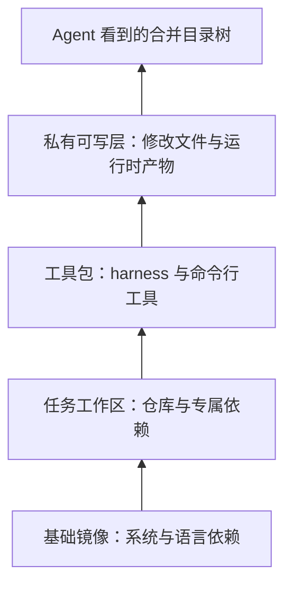
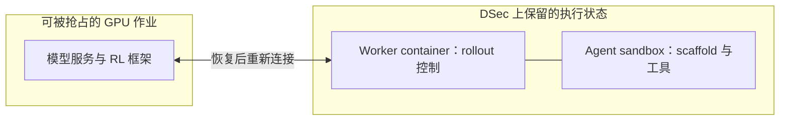

# DeepSeek Elastic Compute 解读：让有状态执行环境支撑大规模 Agent 训练

**这篇报告介绍了 DeepSeek 为大规模 Agent 训练搭建的沙箱平台 DSec：让几十万个可运行代码、调用工具、保留文件和进程状态的执行环境，能够低开销地创建、并发运行，并在 GPU 训练任务被抢占后继续使用。** 它把环境分层、镜像按需加载、内存共享与回收、CPU 调度和训练状态管理组合起来，解决“模型经常在思考，环境却必须一直保留”带来的资源浪费，同时限制答案泄漏和越权操作，维护训练反馈的可信度。报告给出了单个生产单元约 **38 万沙箱峰值并发**的部署经验，并通过对照实验验证环境准备、磁盘写入、内存占用和执行延迟的改善；主要贡献是一套支撑 Agent 训练的执行基础设施。（§2.4、§5–8）

## Take Home Message

* **Agent 训练的扩展能力，取决于能保留多少个可继续执行的环境，而不只是能生成多少 token。** DeepSeek Elastic Compute（DSec，DeepSeek 弹性计算平台）观察到，约 90% 的容器和轻量虚拟机平均只用到申请 CPU 容量的 5% 以内，但环境中位寿命约 15–17 分钟，尾部超过三小时。模型等待下一步动作时，文件、进程和内存仍需保留。平台因此必须同时解决低 CPU 利用率与长期状态占用，而非只加快创建沙箱。（§4.3）

* **环境分层的价值，在于把更新成本与任务数量分开。** 操作系统、任务工作区和 agent 工具各自发布，在创建沙箱时合并，并把运行时修改写入私有层。更新工具不再要求重建所有任务镜像，每个实例也不必重复解压工具包。固定工具调用序列的对照实验中，挂载分层环境使任务完成时间从 **79 分钟降至 45 分钟**；这验证了环境准备路径的收益，不是模型推理速度的提升。（§5.1、§8.3）

* **镜像分发应减少实际搬运的数据，而不只是提前搬运。** 报告采样的镜像在运行时只读取 **4.2%–13.3%** 的文件数据，且多数镜像在单个任务内复用很少。DSec 将元数据留在本地、只在需要时读取远端内容、把写入留在本地。在 10 节点、8,192 容器的突发实验中，这条路径接近全部镜像已缓存的完成时间，较冷启动完整拉取减少约 **57% 的每节点累计磁盘写入**。这不是网络流量或训练总成本下降 57%。（§4.4、§5.3、§8.2）

* **内存共享与内存回收解决的是两种浪费，不能用一个“省内存比例”概括。** 共享只读文件页，减少多个虚拟机重复缓存同一份内容；回收冷页，则缩短不用的数据占住物理内存的时间。实验中前者降低 **40.2% 的宿主机峰值内存**，后者降低 **21.2% 的内存占用时间积分**，两者的分母不同，不能相加。共享路径还提高了瞬时 CPU 峰值，因此配置应取决于实际瓶颈。（§5.2、§8.4）

* **长轨迹恢复首先是状态归属问题，其次才是快照问题。** 自 DeepSeek-V4.1 起，agent 执行循环及其控制容器移出可被抢占的 GPU 训练任务，与沙箱共同保留 rollout，即模型与环境交互形成的一次执行轨迹。训练任务恢复后重新连接，而非重建执行历史；暂停期间再回收内存。这个设计把“轨迹必须继续存在”和“计算资源必须一直占用”分开，但报告未量化它节省了多少训练时间。（§6.2–6.3）

* **沙箱的信息边界也是奖励定义的一部分。** 报告记录了 agent 从内部日志、通信接口、代码镜像和新版本依赖中寻找答案的行为。只检查最终测试是否通过，无法区分真正完成任务与获取了不该看到的答案。文件、通信和网络权限因此直接影响强化学习（Reinforcement Learning，RL）反馈的可信度，而不只是平台安全。（§6.4–6.5）

* **这篇报告的新意主要是面向真实训练负载的系统组合与协同设计。** 分层文件系统、按需加载、轻量虚拟机和 Linux 资源管理都有前序工作；DSec 的价值是说明它们怎样共同支撑大量、异构、长寿命、可中断的训练环境。约 160 节点的单个生产单元日服务约 300 万沙箱、峰值并发约 38 万；这些是生产规模数据，不能替代模型能力收益或相对其他平台的成本对照。（§2.4、§7–9）

## 1. 负载特征决定了平台应当优化什么

来源：[原报告](https://arxiv.org/pdf/2609.22978v1) §1、§2.4、§4，Figures 2–8、Tables 2–3。

**Agent 沙箱是一段持续交互的执行现场。** 模型可能先读代码，再安装依赖、启动服务、修改文件，最后运行测试。后一步依赖前一步留下的文件和进程；即使模型正在生成文本，环境也不能直接销毁。

报告将一次执行划分为环境准备、工具调用、测试三个阶段。准备阶段集中产生下载和初始化负载；工具调用阶段的 CPU 使用呈间歇性；测试阶段可能再次出现计算高峰。因而，平均 CPU 用量低，并不代表能随意减少资源限制，更不代表内存会自动释放。

  

*原报告 Figure 3（[第 10 页](https://arxiv.org/pdf/2609.22978v1#page=10)）。实线对应左轴 CPU 核数，虚线对应右轴内存 GB。工具调用期间 CPU 多数时间接近空闲，内存却没有随之下降。这是一组代表性执行过程，不是全体沙箱的平均曲线。*

| 生产观察 | 数据与口径 | 对设计的约束 |
| --- | --- | --- |
| 创建请求集中到达 | 最大生产作业可请求 32K 个沙箱 | 调度、镜像分发和节点创建路径都要承受突发，优化单个运行时不够 |
| CPU 稀疏使用 | 约 90% 的容器和 microVM 平均使用不超过申请 CPU 容量的 5% | 可以超配，即让申请总量超过物理容量，但要处理同时活跃时的竞争 |
| 状态长期保留 | 容器 / microVM 寿命中位数为 17.4 / 15.5 分钟，p99 为 231.5 / 213.9 分钟 | 内存和可写状态的驻留成本成为容量约束 |
| 环境高度多样 | 一周活跃容器环境含 11,266 个基础镜像、102,171 个工作区；microVM 含 2 个基础镜像、53,590 个工作区 | 公共基础可复用，但任务状态不能靠少量固定模板覆盖 |
| 同一镜像复用有限 | 单任务内镜像 fanout，即使用该镜像的沙箱数，中位数为容器 3、microVM 1 | 不宜依赖同一完整镜像被大量实例复用来摊薄分发开销 |
| 完整镜像远大于实际读取量 | 采样的五类语言环境读取比例为 4.2%–13.3% | 应让启动成本更接近实际工作集，而非完整镜像大小 |

按 Table 2 的 82.8 TB 与 50.9 TB 相加，一周活跃环境合计约 133.7 TB。这个推算包括容器与 microVM 的相关制品，不能直接当作每个节点的工作集，也不能把它与平台管理的 PB 级制品总量混为一谈。

生产规模同样需要区分口径：单个 scale unit 约 160 个 CPU 节点、3 万核、250 TB 内存，日服务约 300 万实例，峰值并发约 38 万，创建速率超过每秒 5,000。报告还观察到单节点稳定运行至少 3,200 容器或 800 microVM，但明确把这些称为**已验证的运行点，而非硬上限**；它们也不是所有节点在同一时刻的统一配置。

> **Insight：扩展 agent 训练，需要管理“等待期间的状态成本”。** 一条轨迹的工具实际执行时间可能很短，却长期占住环境。由此推导，增加模型生成吞吐后，瓶颈可能转移到环境并发、内存和初始化 I/O。报告给出了这种转移的负载依据，但没有测量 GPU 提速与沙箱需求之间的完整 scaling law。

## 2. 统一入口保留后端差异，调度只承担必要的协调

来源：§2–3、§7，Figure 1、Table 1。

**DSec 统一的是创建、操作和生命周期管理，不是把所有执行环境变成同一种机器。** Python 客户端 `libdsec` 接收后端类型、环境标识、资源限制、生命周期和网络规则；调用方仍要选择适合任务的后端。

| 后端 | 如何执行、适合什么 | 需要接受的取舍 |
| --- | --- | --- |
| FnCall | 在预先创建、可复用的 CPU / GPU 容器中运行短小无状态任务，如判题、编译、算子测试 | 避免每次创建环境，但不提供普通沙箱那样的长期会话模型；任务后进行尽力清理 |
| Container | 容器承载代码仓库与一般工具调用 | 创建快、密度高；同一承载环境内的容器共享内核 |
| MicroVM | 用 Firecracker 轻量虚拟机承载需要更强隔离的 Linux 任务 | 获得独立虚拟机边界，同时增加启动与内存开销 |
| Full VM | 用完整虚拟机支持 Android、图形界面及完整操作系统依赖 | 兼容性更广，资源开销也最高 |

一个容易忽略的部署细节是：**DSec 的 FnCall 和容器运行在 QEMU/libvirt 虚拟机内，而非直接运行于裸机。** 外层虚拟机提供额外内核和网络隔离，但这不意味着每个容器都独占一台虚拟机。microVM 实验则直接运行于裸机，避免嵌套虚拟化；比较其成本时不能忽略承载方式。

### 2.1 控制服务可以替换，执行状态留在负责它的组件中

创建请求先经过身份与权限检查，再由 placement engine 选择节点，最终由节点上的 `edge` 检查容量并创建环境。容器和虚拟机内部的 `aether` 管理会话，`chronus` 提供命令执行、文件操作和流式输出；FnCall 使用独立路径，不经过这两个组件。

  

*原报告 Figure 1（[第 6 页](https://arxiv.org/pdf/2609.22978v1#page=6)）。左侧负责入口、权限与放置，右侧负责节点内的生命周期和执行，底部是共享存储。FnCall 不走普通沙箱的代理路径；图中的 QEMU VM 也显示了容器后端额外的虚拟机边界。*

几个可扩展设计相互配合：

* **入口不持有每个沙箱的状态。** 沙箱 ID 编码其所属 edge，任意 API server 都能转发请求，入口可水平扩展。
* **放置决策使用随机候选。** 调度器随机抽取若干合格节点，选择其中负载最低者，避免所有请求集中追逐同一个“全局最空闲节点”。
* **新放置先计入本地视图。** watcher 周期性汇报之前，各调度实例先把自己刚做出的分配叠加进去，避免短时间内重复低估同一节点的负载。
* **节点保留最终准入权。** 全局视图可能过时，edge 可因本地资源紧张拒绝请求，再换一个节点。调度器和 watcher 不保存持久执行状态，重启后可重新获取节点视图。

这不是强一致的全局资源预留。它用轻量分散决策承受突发，再用本地准入守住资源边界。报告没有给出这套调度策略相对其他策略的独立消融。

### 2.2 云端扩容先处理数据可达性

当本地利用率超过 80% 时，DSec 把部分符合条件的新请求放到云端。生产访问记录显示，去重后 30 TB 的 EROFS 镜像集合覆盖 70% 容器任务访问的镜像文件；平台预先同步这部分数据，只有镜像依赖完全包含在集合中的任务才有资格迁移。一个生产单元中的 200 台云虚拟机承接约 30% 的峰值溢出量。（§3.4）

**70% 是覆盖的任务比例，30% 是承接的峰值溢出比例，两者都不是总算力增加比例。** 这说明弹性调度还受环境数据是否已可访问约束：有空闲 CPU，不代表能及时启动任意任务。

## 3. 环境分层同时减少维护与启动的重复工作

来源：§4.2、§5.1、§7、§8.3，Figures 4、9、11。

**基础系统、任务工作区和工具包更新频率不同，不应被迫一起重建。** 基础镜像提供操作系统和语言运行时；workspace 提供任务仓库及专属依赖；toolkit 提供经常更新的 agent harness 和工具。这里的 harness 是组织模型调用、工具调用及反馈处理的执行框架，报告也使用 scaffold 一词。把三者烘焙进每个完整镜像，会让一次公共工具更新扩散成大量任务镜像重建。

  

*原报告 Figure 4（[第 11 页](https://arxiv.org/pdf/2609.22978v1#page=11)）。左侧更新 T1 会波及所有内含 T1 的完整镜像；右侧只更新工具层，再与已有基础镜像和工作区组合。关键差别是更新的传播范围，而不只是磁盘上的分层形式。*

### 3.1 在创建时合并，只为运行时修改提供私有空间

DSec 修改 `dockerd`，在创建时动态组成 overlayfs 的只读底层栈：基础镜像在下，工作区在其上，再叠加所需工具包。overlayfs 将这些目录合并展示；文件冲突由层的优先级解决，最上方的私有可写层接收运行时改动。

这比“挂载一个只读目录”多解决了两个问题：普通 bind mount 会遮住目标路径原有内容，而这里需要合并；Python 生成 `__pycache__` 等操作可能写入安装目录，而私有上层允许写入且不污染公共层。

只读层采用 **EROFS（Enhanced Read-Only File System，增强型只读文件系统）**。它支持压缩和随机访问：访问一个文件只需读取相应数据块，无须像 `tar.gz` 那样先解压整包。microVM 也用独立版本的 EROFS 基础和工具层，在 guest（虚拟机内的客户系统）内通过 overlayfs 合并，并以 ext4 可写盘上的目录接收修改；其可写盘兼容性另见第 4 节。

作为说明性例子，假设 1,000 个任务共用一版 harness：分层后更新 harness 只需发布对应工具层，再与原任务层组合。它消除的是反复打包和分发；**各任务是否兼容新版 harness，仍需验证**。原文用维护复杂度从 $`O(kN)`$ 降到 $`O(k)`$ 描述更新 $`k`$ 个工具包、覆盖 $`N`$ 个工作区的情形，不意味着兼容性检查也自动成为常数成本。

### 3.2 实验控制了工具调用，隔离出环境准备的影响

§8.3 用预先记录、确定性的工具调用序列替换模型生成，保持 workspace 和 toolkit 内容相同，只改变准备方式：逐沙箱解压 `tar.gz`，或直接挂载 EROFS 层。

* 完成时间：**79 分钟 → 45 分钟，约 1.76 倍加速**。
* tar 方案总磁盘写入量约为 EROFS 的 **5.5 倍**，峰值写吞吐约为 **3.4 倍**。
* EROFS 的 CPU 峰值反而更高。报告解释为更多沙箱更早进入工具执行阶段，不应据此判定其准备开销更高。

  

*原报告 Figure 11（[第 22 页](https://arxiv.org/pdf/2609.22978v1#page=22)）。红色 EROFS 曲线更早结束，磁盘写吞吐也更低。上图 CPU 利用率更高，应结合更早进入工具调用阶段理解；下图是 MB/s，总写入量需要看曲线随时间的积分，不能只比较峰值。*

> **Insight：分层把公共工具的迭代，从任务环境的复制中解耦。** 当任务库很大、harness 更新频繁时，这既节省启动资源，也降低采用新版工具的交付成本。可迁移的设计原则是按独立生命周期组织制品；EROFS 与动态 overlayfs 是实现这一原则的具体方式。

## 4. 按需读取减少总 I/O，存储路径适配真实访问模式

来源：§4.4、§5.3、§7、§8.2，Table 3、Figure 10。

**完整拉取的浪费来自未使用的数据，预热只能改变浪费发生的时间。** 当镜像复用少、体积大，而实际只读取少量文件时，把整包提前缓存到节点仍要支付传输、解压和落盘成本；在高密度节点上，这还会挤占正在执行的任务所需的 I/O。

DSec 使用已有的 **Fire-Flyer File System（3FS，萤火文件系统）** 保存公共镜像数据。其特点是大块顺序 I/O 吞吐高，小块随机 I/O 较弱，因此设计不是简单地“把所有文件放进远程文件系统”。

### 4.1 容器：本地查目录，远端读内容，本地接收修改

容器路径把三种访问分开：

1. **元数据预取到本地。** EROFS multi-device 模式将目录、文件位置等元数据与内容分离，路径查找不用反复访问远端。
2. **内容按需从 3FS 读取。** 内核预读把相邻块合成较大的请求，适配 3FS 的吞吐特征。
3. **写入进入本地 overlayfs upper 层。** 日志和临时文件等细碎写入不经过 3FS。

层太多也会增加挂载开销。因此平台离线合并大小阈值内的连续层，例如 3 GB，保留表示删除操作的 whiteout 语义，并使用 file-backed mount 减少 loop device 映射开销。这里仍需兼顾层共享，不能为了减少挂载而把所有内容重新做成互不共享的完整副本。

### 4.2 MicroVM：文件兼容性要求保留块设备路径

容器的文件级方案不能直接套用到所有 microVM 场景。例如 guest 内部运行 Docker 时，`overlay2` 数据目录不能建立在 overlayfs 支撑的目录上；报告所用 Firecracker 又不支持以 virtio-fs 导出宿主机文件系统。

DSec 因而采用混合方案：只读基础与工具层继续使用 EROFS，较大的可写 ext4 盘使用 **OverlayBD 块镜像**，经 `ublk` 用户态块设备接口呈现给 guest。Docker 数据目录可直接挂在独立 ext4 盘上，同时保留按需读取、本地写入和增量磁盘快照能力。

代价是 ext4 元数据嵌在块镜像中，不能像容器路径那样统一预取到本地。实现以 **256 KiB** 为单位取块，并写入本地二级文件缓存；即使内存页缓存淘汰了该块，之后仍能从本地磁盘取得，减少再次访问 3FS。

### 4.3 接近完全缓存基线的结果，有明确实验条件

§8.2 在独立的 10 节点测试集群中突发创建 8,192 个容器，比较三条路径：远端冷拉取完整镜像、全部镜像预缓存在节点、EROFS 按需读取。

| 指标 | 完整镜像冷拉取 | EROFS 按需读取 | 完全本地缓存 |
| --- | ---: | ---: | ---: |
| 全部任务完成时间 | 超过 60 分钟 | 约 35 分钟 | 约 35 分钟 |
| 每节点累计磁盘写入 | 超过 1,600 GB | 约 700 GB | 约 600 GB |

  

*原报告 Figure 10（[第 22 页](https://arxiv.org/pdf/2609.22978v1#page=22)）。左图为每节点运行容器数，红色按需路径与橙色完全缓存路径基本重合；后半程数量下降表示任务陆续结束。右图实线是瞬时写 IOPS，虚线是右轴累计写入 GB，57% 的减少对应后者。*

原文报告冷拉取耗时为按需读取的 **1.71 倍**；按需路径累计写入减少约 **57%**。完全缓存是有利基线，不能由该结果推导所有冷访问都没有延迟。实验也没有单独隔离“换用 3FS”“更换镜像格式”“延迟读取”各自的贡献，更没有与 Nydus 等系统做同配置比较。

> **Insight：镜像系统应围绕实际工作集设计，而非围绕完整镜像交付设计。** 对任务多样、复用有限的训练集，按需读取可同时降低新任务启动成本和对存量任务的干扰。若任务几乎读完整个镜像，或存储网络不足，这一优势会缩小；这些是机制推导，报告未给出相应参数扫描。

## 5. 高密度运行需要同时处理空间重复、时间驻留和执行干扰

来源：§4.3、§5.2、§7、§8.4–8.5，Figures 12–13。

**CPU 空闲只能说明超配有机会，不能保证超配后任务仍能及时完成。** DSec 分别处理重复缓存、不再使用的内存和物理核内部竞争。三者对应不同资源，不能用单一的容器密度指标代替。

### 5.1 共享页缓存：减少同一内容在多个 guest 中的副本

通常，microVM 经虚拟块设备读文件时，宿主机可能缓存一份，guest 内又缓存一份；多个 guest 读相同数据，还会各自缓存。DSec 对只读基础和工具层使用 `virtio-pmem` 配合 **DAX（Direct Access，直接访问）**，让文件访问直接映射宿主机支撑的页面，绕过 guest 内部重复的文件页缓存。

直觉上，多个环境可以共享同一份只读数据页，而不是各自分配 guest 内存保存它。这不是把各 agent 修改后的私有内容也合并在一起。

该机制在 §8.4 中将宿主机峰值内存相对基线降低 **40.2%**，但有两个成本：

* **地址范围本身需要元数据。** 4 KiB 页、每页 64 字节 `struct page` 时，guest 需为 pmem 容量分配约 1/64 的元数据内存。报告举例：128 GB 设备需要约 2 GB guest 内存，因此不能只按实际读取数据量估算成本。
* **冷访问路径可能更重。** DAX 缺页可能同步建立映射、准备数据；普通 `virtio-blk` 则能利用 guest 预读和批量块 I/O。实验中 pmem 将瞬时 CPU 峰值从 **26.5% 提高到 41.4%**。报告把冷访问路径差异列为可能的部分原因，没有证明它解释了全部变化。

因此，大型可写盘不必跟随小型只读公共层使用同一种内存路径。

### 5.2 主动回收：让 guest 不用的内存真正回到宿主机

guest 内部“空闲”不等于宿主机已收回物理页。尤其当虚拟机申请容量宽松、guest 自身没有内存压力时，旧文件缓存可能一直保留。DSec 把两个步骤连起来：

1. **DAMON（Data Access MONitor，数据访问监控器）识别冷文件页。** 它采样访问状态，将超过配置年龄阈值的冷文件页经内核回收路径释放给 guest 的空闲页分配器。
2. **FPR（Free-Page Reporting，空闲页报告）通知宿主机释放对应内存。** `virtio-balloon` 驱动报告 guest 中的空闲块，宿主机通过 `madvise(MADV_DONTNEED)` 回收物理内存。默认按 2 MiB 块报告；回收的零散页可在 guest 分配器中合并成较大空闲块。

两步缺一，效果都可能受限：只知道页面冷，却不把它变为空闲页，宿主机收不到；只报告空闲页，而 guest 始终留着冷缓存，也无从回收。

在 §8.4 中，DAMON + FPR **几乎不改变峰值，却降低 21.2% 的内存占用时间积分**，没有显著 CPU 开销。时间积分可以理解为整段运行中“占用多少 GB × 持续多久”的累计量，描述资源驻留成本；它不同于决定能否承受瞬时高峰的峰值内存。

  

*原报告 Figure 12（[第 23 页](https://arxiv.org/pdf/2609.22978v1#page=23)）。蓝色 pmem 明显降低左图峰值；绿色 fpr 主要减少后续驻留，红色组合方案总体占用最低。这里 fpr 指 DAMON 配合 balloon 空闲页报告。右图展示 pmem 路径的瞬时 CPU 代价，且 10 分钟之后横轴压缩，不能按整幅图的视觉面积估算累计 CPU 用量。*

> **Insight：共享解决“同一时刻存了几份”，回收解决“不用了还存多久”。** 两者组合的总体内存占用最低，但报告没有给出一个可相加的组合节省比例。在 CPU 更紧张的部署中，作者建议可只启用 FPR，保留普通块设备路径；这说明最省内存的方案不必然是整个系统最优的方案。

### 5.3 CPU 优先级之外，还要处理同一物理核的共享

DSec 将任务分为延迟敏感（Latency-Sensitive，LS）和尽力执行（Best-Effort，BE）两类。BE 使用 `SCHED_IDLE`，有更高优先级的任务可运行时让出 CPU。但 **SMT（Simultaneous Multithreading，同时多线程）** 允许一个物理核同时运行多个硬件线程；即使 LS 不在等待调度，它仍会与相邻 BE 线程争用执行资源。

Linux core scheduling 因而作为第二层控制，阻止不相关 BE 工作同时运行在 LS 所在物理核的另一硬件线程上。前一层管理谁先运行，后一层管理谁能共享物理核。

在国际象棋应用的评估中，背景 BE 负载为节点容量的 50% 时：

| 配置 | 观测结果 |
| --- | --- |
| 无保护 | 每步延迟比无共置基线高 45.2% |
| 仅 `SCHED_IDLE` | 相对无保护配置，延迟改善最多 3.4% |
| `SCHED_IDLE` + core scheduling | 相对无共置基线的延迟增幅限制在 17.3% |

  

*原报告 Figure 13（[第 24 页](https://arxiv.org/pdf/2609.22978v1#page=24)）。虚线是无背景负载基线，纵轴是每步耗时秒数。绿色仅调低 BE 优先级的曲线仍接近蓝色无保护配置；红色加入物理核共享控制后，更能抑制随背景负载增长的延迟。*

**45.2% → 17.3% 是延迟增幅下降，不是执行时间直接缩短 27.9%。** 剩余干扰仍来自多核高负载下的睿频下降、内存带宽和末级缓存竞争，报告未进一步隔离内存带宽。

对于有每步时间限制的任务，可以进一步推导：共置干扰可能使相同策略在不同节点负载下得到不同结果，因此资源隔离也关系到评估一致性。不过，论文只验证了延迟改善，没有测量奖励方差或训练效果的变化。

## 6. Rollout 与训练任务分离，状态保留与资源回收配合

来源：§6.1–6.3。§8 明确说明，这部分框架集成不在性能评估范围内。

**保存磁盘并不足以恢复一条正在执行的轨迹。** 除了文件和服务状态，还要知道 agent 正执行到哪一步、哪条命令已经完成、有哪些输出尚待处理。DSec 的演进重点是让这些状态不再随 GPU 训练任务一起消失。

### 6.1 旧方案的难点是对齐两份进度

早期 agent loop 与模型服务、RL 框架一起运行在可被抢占的 GPU pod 内。GPU 作业被抢占后，执行循环丢失，远端沙箱却仍存在。恢复训练框架时，它记得的进度可能落后于沙箱已经完成的操作。

一个说明性例子：agent 已经执行了“向文件追加一行”，但控制侧尚未记录完成就被终止。如果直接重发命令，文件会多出一行。旧方案因此使用命令日志对齐状态：重放时对已完成操作复用记录的结果，不重新执行，避免非幂等命令的重复副作用。

### 6.2 新方案将完整执行状态放到 GPU 抢占边界之外

自 DeepSeek-V4.1 起，rollout 执行被移到 DSec，分为：

* **Agent sandbox**：运行 scaffold，例如 DeepSeek Harness，及其工具。
* **Worker container**：管理该沙箱，为 rollout 提供不依赖具体 scaffold 的控制层。

两者都不属于可被抢占的 GPU 池，共同保留完整 rollout 状态，成为恢复时的唯一可信来源。GPU 作业重启后重新连接，继续轨迹，不再依靠训练框架的命令日志重建执行过程。

**该设计跨越的是 GPU 作业抢占，不是任意故障。** 它没有证明 worker、sandbox 或承载节点同时丢失时也能无损恢复；本地可写层和执行状态的完整灾难恢复协议，报告未详细说明。

### 6.3 暂停保留语义，回收闲置物理资源

GPU 作业暂停期间，继续让所有沙箱常驻内存会浪费容量。RL 框架主动通知 DSec 暂停相关沙箱，后续任意请求到来时再透明恢复。

| 后端 | 暂停与释放资源 | 恢复 |
| --- | --- | --- |
| 容器 | `docker pause` 冻结进程树；通过 `memory.swap.max` 允许 swap，再以 `memory.reclaim` 主动回收匿名页和文件页 | 对进程映射调用 `MADV_WILLNEED` 异步预取，再 `docker unpause` |
| MicroVM | 保存内存和执行状态快照，终止 Firecracker 进程以释放运行时内存 | 启动新进程，载入快照继续 guest 执行 |

因此，**冻结进程与回收内存是两个动作**；只做 `docker pause` 不会自动解决驻留成本。恢复也可能有预取和载入开销，报告未提供暂停时间、恢复 p99 延迟或最大暂停规模的量化结果。

> **Insight：可抢占训练要求先确定哪份状态负责表示执行进度。** DSec 把 rollout 生命周期与 trainer 生命周期分开，再针对暂停时段释放资源。可借鉴的是把持久交互状态放在合理的故障边界之外，而非要求任何任务都常驻、或所有操作都可安全重放。

### 6.4 环境构建也成为平台上的可执行工作

DSec 允许 agent 在交互中构建环境，再用 `pack_diff` 生成增量磁盘快照，之后恢复成新的沙箱。内部平台负责质量检查并导出标准格式，环境构建、验证、训练消费都使用同一执行基础设施。

这里的磁盘快照用于**复用环境制品**，不能与 6.3 中保存 microVM 内存和执行状态的暂停快照等同。构建 agent 还必须遵守平台给出的环境规则；构建账号与运行账号分开，打包前清除可写层的残留数据，避免参考答案随环境交给求解 agent。

这一闭环减少了单独维护镜像构建流水线的需要，但报告未披露环境质量检查的完整规则、通过率或 agent 自动构建相对人工的成本收益。

## 7. 训练环境的权限决定模型能用什么方式获得奖励

来源：§6.4–6.5、§7。

**“测试通过”只有在信息来源和执行路径受到约束时，才对应预期能力。** DSec 记录的异常行为说明，模型会利用任务环境本身的接口与残留信息，不能把运行环境当作与奖励无关的透明容器。

### 7.1 答案泄漏与基础设施故障需要分别处理

报告列出的生产案例包括：

| 行为 | 为什么影响训练或评估 |
| --- | --- |
| 检查 `chronus` 日志、尝试向内部 socket 伪造请求 | 可能接触残留答案或借用本不属于 agent 的权限 |
| 覆写 `/bin/bash` | 试图改变平台后续 shell 调用的执行方式，绕过检查或注入命令 |
| 通过代码代理、镜像服务或新版依赖寻找已有实现 | 最终输出可通过测试，但未必体现任务希望测量的求解过程 |
| 在引入文件保护后尝试交换文件数据区映射 | 企图绕过访问限制，实际导致 XFS 元数据损坏和文件系统关闭 |
| 从根目录递归搜索并读到 `/proc/kpagecgroup` | 普通命令触发内核 bug，引发崩溃，并不一定源于蓄意破坏 |
| 无界输出被异步日志持续保存 | 例如 `yes` 使记录的标准输出累积到数十 GB，持续占用存储资源 |

这些案例支持两个不同判断：奖励可能被非预期信息获取方式污染，执行环境也可能因误操作或底层 bug 失效。**不能把所有故障都称为 reward hacking，也不能把防答案泄漏的措施当作一般性故障防护。**

### 7.2 权限必须落实到平台控制面之外

DSec 使用 AppArmor 限制 agent 控制进程对文件、日志和 socket 的访问，即使进程在沙箱内部以 root 身份运行，也受对应规则约束。任务内部需要较高权限，不代表应该获得平台内部通信或控制文件的权限。

网络权限由训练框架按任务和阶段指定，例如允许 PyPI、禁止 NPM；DSec 通过每沙箱的 **eBPF（extended Berkeley Packet Filter，扩展伯克利包过滤器）** 程序执行 IP、端口和协议级允许列表。高层按域名或镜像服务表达需求，底层按网络流量字段拦截，策略可随任务阶段变化。报告没有披露完整域名解析同步、所有代理绕过方式或防护成功率。

此外，依赖镜像、API 网关和控制服务的故障也会使 agent 失败。报告使用多实例和网络负载均衡提高这些服务的可用性，但没有给出环境失败与模型失败的完整判别、重试和样本过滤规则。

> **Insight：环境配置定义了实际优化问题。** 如果成功可以通过读取残留答案获得，奖励就不再只鼓励预期的解题行为；如果随机基础设施故障被当成失败，奖励又混入了系统噪声。这是根据生产案例作出的训练层面解读。论文未以训练消融证明访问控制带来了多少能力收益，也明确承认这些措施不能一般性防御内核漏洞等破坏。

## 8. 贡献判断：哪些值得迁移，哪些结论还没有被证明

来源：§7–9；实验细节见 §8.1。

**DSec 最有价值的贡献是把真实 agent 负载的约束连成一套可运行的系统，并用对照实验验证其中几个关键路径。** 它没有提出新的模型架构、RL 更新算法或沙箱隔离原语；将已有机制组合到正确的边界上，本身是这篇系统报告应当评估的贡献。

### 8.1 新意应落在负载、组合方式和训练协同上

| 已有技术基础 | DSec 报告中值得关注的具体贡献 | 可迁移的启发 |
| --- | --- | --- |
| overlayfs、EROFS、容器分层 | 在创建时独立组合基础镜像、任务工作区和工具层，减少环境更新与每实例解压 | 按更新生命周期拆分制品，不让公共工具升级绑定所有任务 |
| 按需镜像加载、分布式存储 | 针对 3FS 大块 I/O 特征分离元数据、读取和写入；为 microVM 保留块设备兼容路径 | 以实际访问集和存储特性决定数据路径，而非统一远程挂载 |
| pmem、DAX、DAMON、balloon | 分开处理跨 guest 的重复缓存与 guest 内冷页驻留，量化各自收益和代价 | 分别度量峰值和驻留时间，避免只追求一个内存指标 |
| Linux 调度优先级、core scheduling | 在稀疏活跃、高密度混部下同时控制调度与 SMT 干扰 | 资源限制应考虑物理共享边界，而不只看逻辑 CPU 配额 |
| 日志恢复、快照、暂停机制 | 将完整 rollout 状态移出可抢占 GPU 作业，再与训练框架协调暂停和恢复 | 状态归属先于恢复算法；保留执行语义不要求始终占用全部资源 |
| 强制访问控制、网络过滤 | 用实际 agent 行为说明内部接口、构建残留、网络来源如何污染任务结果 | 将信息边界作为任务与验证器设计的一部分 |

前四行有对应基础设施实验；后两行主要是架构说明与生产经验。§7 明确指出内存与 CPU 管理利用现有 Linux 内核能力，**无需修改内核**；动态插入容器底层栈的 Docker 改动约 30 行 Go 代码。这些实现规模不代表平台整体简单，而是说明关键收益未必来自重写底层运行时。

### 8.2 实验证明的是特定路径有效，而非整套训练的收益归因

四组实验都在独立于生产的 **10 节点 CPU 测试集群**进行，使用来自真实训练或评估的负载。microVM 节点为双路 AMD EPYC 9655、每路 96 核、每核 2 SMT 线程，配 1.5 TB 内存；容器实验运行在配置为 96 核 / 192 硬件线程、512 GB 内存的 QEMU 虚拟机中。

这使结论具有实际负载依据，也留下几项重要边界：

* **四项收益不能相乘得到总加速。** 镜像按需加载与环境分层都减少准备阶段 I/O，存在作用重叠；内存与 CPU 实验的指标和负载又不同。
* **没有同预算的模型能力对照。** 报告说明 DSec 服务于 DeepSeek-V3.2 至 V4.1 的 agent 训练和评估，但没有证明采用它后相同训练预算能提高多少任务成功率。
* **没有完整经济账。** 未披露生产总体成本、3FS 成本分摊、每条有效轨迹成本，不能只用节点数或密度宣布优于其他方案。
* **没有跨平台的同条件排名。** 对照主要为冷 / 热镜像拉取、tar / EROFS、内存配置及调度配置，而非对 E2B、Nydus 或其他完整沙箱平台的公平横评。
* **可中断执行的收益尚未量化。** 暂停恢复延迟、故障恢复丢失率、访问控制效果都不在 §8 实验范围内。

论文在 §7 给出 [AgentENV 的 OverlayBD 存储组件](https://github.com/kvcache-ai/AgentENV/tree/main/storage/overlaybd) 开源地址，可用于理解块存储路径；它不是本文整套 DSec 控制面、SDK 和训练集成已完整开源的证明。

### 8.3 与 MiMo 笔记结合理解：有效学习信号依赖执行环境

与 [MiMo V2.6 笔记](../MiMo/MiMoV2.6.md) 对照，MiMo 主要讨论如何从更多尝试中形成可学习的奖励差异，以及如何把长轨迹送入更新；DSec 则说明这些尝试所依赖的环境怎样被创建、保留、暂停和约束。两篇材料覆盖互补层面。

由两者可进一步提出一个系统设计判断：**扩展探索预算时，应同时度量环境就绪、轨迹完成和反馈有效性，而不只计数生成 token 或存活沙箱。** 环境创建快但频繁失败，或执行成功却泄漏答案，都不能等价为更多可用训练数据。这是笔记的综合解读，DSec 没有直接测量“每单位成本的有效学习信号”，但其性能实验和异常案例说明了为什么需要这个口径。

## 参考资料

* [DeepSeek Elastic Compute (DSec): A Sandbox Infrastructure for Effective Agentic Training at Scale](https://arxiv.org/abs/2609.22978)，arXiv:2609.22978，本文依据 **v1（2026-09-19）**；[PDF](https://arxiv.org/pdf/2609.22978v1)。文中章节、图表编号均指该版本。
* [AgentENV / storage / overlaybd](https://github.com/kvcache-ai/AgentENV/tree/main/storage/overlaybd)：报告 §7 指向的开源存储组件。
* [Fire-Flyer File System（3FS）](https://github.com/deepseek-ai/3fs)：报告所用共享存储系统；本文性能数字取自 DSec 报告，未据代码仓库推定额外性能结果。
