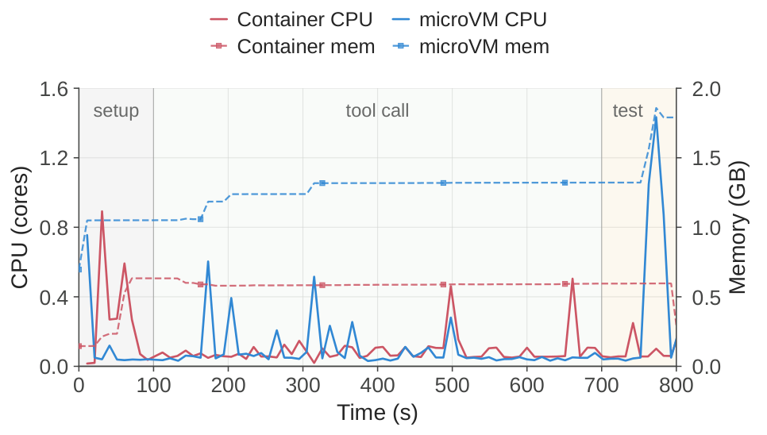
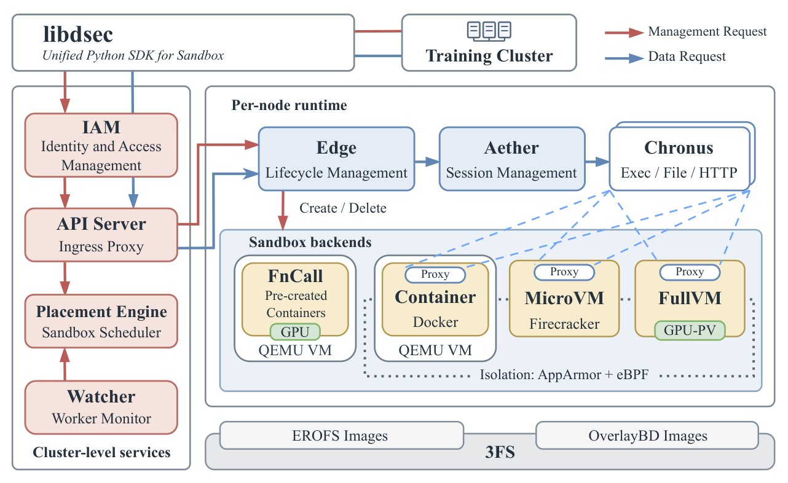
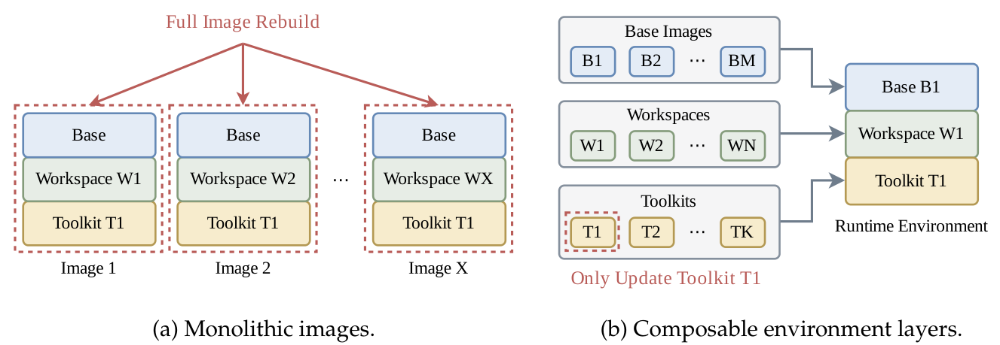
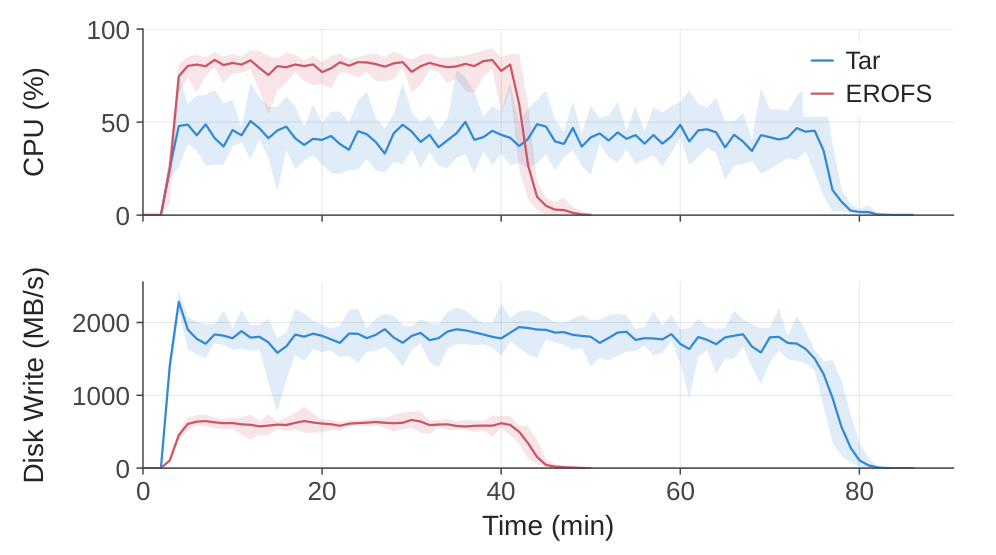
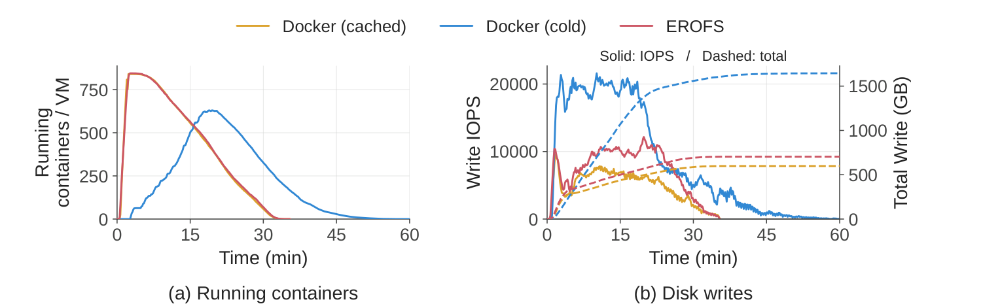
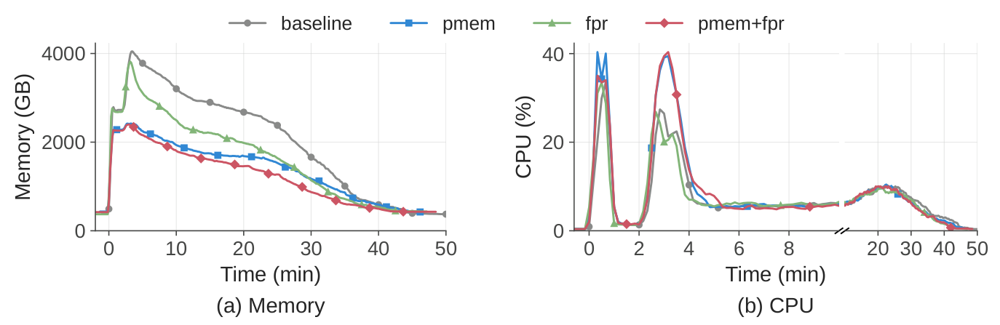
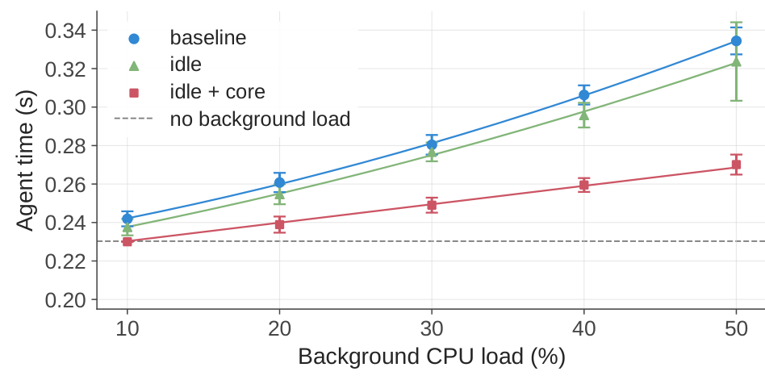

# DeepSeek Elastic Compute 解读：让有状态执行环境支撑大规模 Agent 训练

**这篇报告把 Agent 训练所需的执行环境，做成了可独立扩容、保留状态和暂停恢复的沙箱平台。** 模型生成“改代码、装依赖、跑测试”等动作后，需要真实环境执行并返回结果。DeepSeek Elastic Compute（DSec，DeepSeek 弹性计算平台）解决的就是这些环境如何大规模、低开销地运行，并让执行反馈保持可信。

## Take Home Message

* **Agent 训练要同时扩展模型计算和环境容量。** 模型生成下一步动作时，沙箱 CPU 可以空闲，文件与进程却必须保留。DSec 观察到约 90% 的容器和轻量虚拟机平均 CPU 用量不超过申请量的 5%，环境中位寿命却约 15–17 分钟。关键是降低等待期间的状态成本，而不只是加快创建。（§4.3）
* **分层减少重复构建，按需读取减少无用搬运。** 系统、任务和工具分别发布，运行时只读取实际需要的内容。固定工具调用序列的实验将任务完成时间从 **79 分钟降至 45 分钟**；另一组镜像加载实验将每节点累计磁盘写入减少约 **57%**。这是两组系统实验，不能相乘为训练加速比。（§8.2–8.3）
* **超配的前提是识别哪些资源能共享、哪些干扰必须隔离。** 共享只读文件页降低了 **40.2% 的峰值内存**；主动回收降低了 **21.2% 的内存占用时间积分**，两者不可相加。保护延迟敏感任务还要限制同一物理核上的竞争，不能只降低后台任务优先级。（§5.2、§8.4–8.5）
* **长任务的进度应独立于可被抢占的 GPU 作业。** DSec 把 agent 执行循环及其控制状态移到独立的执行平台，恢复时重新连接，暂停期间回收内存。这让计算资源可以暂时让出，而已完成工作仍被保留；跨模型更新的轨迹如何用于学习，则由训练算法另行处理。（§1、§6.2–6.3）
* **环境控制影响训练信号的真实性，也可能影响覆盖面。** 读取内部答案会让测试通过失去原意；若慢任务或故障任务更容易被丢弃，实际训练样本还可能偏向容易完成的任务。前者有生产案例，后者是条件性推导。沙箱因此关系到强化学习（Reinforcement Learning，RL）能收到什么反馈，而不只是执行速度。（§6.4–6.5、§7）

## 1. 环境寿命与计算活跃时间不同，必须分别管理

来源：原报告 §1–4，Figures 1、3、7–8。

**训练闭环是“模型生成动作 → 环境执行并返回观察 → 轨迹评分 → 参数更新”。** 前两步反复交替，形成一次交互轨迹（rollout）；异步训练还会让轨迹生成与参数更新重叠。DSec 提供执行条件和原始反馈，奖励规则与模型更新仍由训练框架负责。

以修复代码为例，读仓库、改文件、启动服务和运行测试发生在不同时刻，却依赖同一份累积状态。容器与轻量虚拟机的寿命中位数分别为 **17.4 / 15.5 分钟**，p99 超过三小时；CPU 则主要在工具执行时短暂活跃。

  

*Figure 3（[p.10](https://arxiv.org/pdf/2609.22978v1#page=10)）：实线为 CPU 核数，虚线为内存 GB。代表性执行中，CPU 间歇活跃，内存持续驻留。*

> **Insight：长轨迹会把压力从算力转向状态容量。** 在到达率稳定、系统可持续处理的条件下，平均在途环境数随平均寿命增长；这意味着工具执行并未变慢，模型思考或外部等待变长也会增加环境占用。这是容量规划推导，不能拿生产峰值并发与日均创建量直接相除来估算寿命。

### 多种后端共享管理入口，保留各自的隔离边界

DSec 提供四种后端：**FnCall** 用预建容器执行短小无状态任务；**Container** 承载一般代码仓库与工具调用；**MicroVM** 用 Firecracker 提供更强的虚拟机隔离；**Full VM** 支持 Android、图形界面等完整系统需求。调用者通过统一 Python 客户端选择后端，而非由平台抹平它们的差异。

  

*Figure 1（[p.6](https://arxiv.org/pdf/2609.22978v1#page=6)）：左侧负责权限和调度，右侧负责生命周期、会话与执行，底部为共享存储。FnCall 不走普通沙箱的代理路径。*

调度器随机抽取若干合格节点、选择低负载者；节点上的 `edge` 保留最终准入权，弥补全局负载视图的滞后。容器与 FnCall 还运行在 QEMU 虚拟机内，获得额外隔离；这不代表每个容器独占一台虚拟机。

**低平均 CPU 用量支持超配，却不能直接决定超配倍数。** 报告中单个作业可突发申请 32K 个沙箱，初始化会集中消耗资源；平均值掩盖了这种峰值。由此可推导，容量规划还需看同时活跃的比例、工具调用的尾延迟和节点拒绝率，不能把“平均不到 5%”直接换成“可安全超配 20 倍”。（§4.1、§4.3、§7）

单个生产单元约 **160 个 CPU 节点，日服务 300 万沙箱，峰值并发约 38 万，创建速率超过每秒 5,000**。单节点 3,200 容器或 800 microVM 是已验证运行点，非硬上限。这些规模说明平台可用，不能单独证明其成本最优。（§2.4、§4.3）

## 2. 环境准备要同时减少重复构建与无用搬运

来源：§4.2、§4.4、§5.1、§5.3、§8.2–8.3，Figures 4、10–11。

### 独立分层让工具升级不再牵动所有任务镜像

**基础系统、任务工作区和工具包有不同的更新周期。** DSec 在创建时用 overlayfs 将三者合并成目录树，并让私有可写层接收修改。公共层可以复用，agent 改文件、生成缓存也不会污染其他任务。工具包包含 harness，即组织模型调用、工具调用与反馈处理的执行框架。

  

*Figure 4（[p.11](https://arxiv.org/pdf/2609.22978v1#page=11)）：整体打包会让一次工具升级触发多个镜像重建；独立分层只需更新对应工具层，再重新组合。*

只读层采用 **EROFS（Enhanced Read-Only File System，增强型只读文件系统）**，支持压缩和随机读取，免去每个沙箱完整解压 `tar.gz`。固定工具调用序列的实验中，任务完成时间从 **79 → 45 分钟**；tar 方案总磁盘写入量为 EROFS 的约 **5.5 倍**。（§8.3）

实验图：EROFS 与逐沙箱解压的对照

  

*Figure 11（[p.22](https://arxiv.org/pdf/2609.22978v1#page=22)）：EROFS 更早完成。CPU 利用率更高是更多沙箱更早执行工具，不能解读为准备开销更高。*

### 按需读取让传输量接近实际工作集

多数任务不会读完整个镜像：报告采样的五类语言环境只访问 **4.2%–13.3%** 的文件数据；单任务内，一个镜像被使用的沙箱数中位数仅为容器 3、microVM 1。完整拉取难以靠反复复用摊薄成本。

DSec 把公共数据放在 **Fire-Flyer File System（3FS，萤火文件系统）**，但不把所有访问直接交给远端：

* **元数据放本地**，避免路径查找触发大量远端小读。
* **内容按需读、尽量成块读**，利用 3FS 的大块 I/O 吞吐。
* **运行时写入留在本地**，避免日志等细碎写入冲击共享存储。

MicroVM 为兼容内部 Docker 等软件，还用 OverlayBD 提供可写 ext4 块设备，以 **256 KiB** 取块并在本地缓存；只读基础与工具层仍使用 EROFS。统一平台不等于强制统一存储路径。

  

*Figure 10（[p.22](https://arxiv.org/pdf/2609.22978v1#page=22)）：10 节点突发创建 8,192 容器。左图为每节点运行容器数；右图实线为写 IOPS，虚线为累计写入 GB。*

按需路径约 **35 分钟**完成，接近全部镜像已缓存的基线；完整冷拉取超过 **60 分钟**。每节点累计写入从超过 **1,600 GB** 降至约 **700 GB**，减少约 **57%**。这是特定实验的磁盘写入收益，非训练总成本降幅。（§8.2）

> **Insight：可迁移的是访问模式设计，不是照搬 3FS。** [Nydus 官方资料](https://github.com/dragonflyoss/nydus#key-features) 已列出按需加载、块去重和预取；DSec 的具体价值在于将这些思路接入已有训练存储，并分开处理元数据、读和写。结合 [3FS 的 SSD 与 RDMA 共享存储前提](https://github.com/deepseek-ai/3fs#fire-flyer-file-system)，可以推导：换成高延迟或带宽不足的存储，首次读块可能变成工具执行的等待。复用方案前应测工作集与冷读延迟，不能只看完整镜像大小。

**环境组合还应被当作训练数据版本的一部分。** 按机制推导，同一仓库若更换工具、依赖或允许访问的信息，成功率也可能改变。因此比较模型进步时，应固定或记录层版本与权限配置，避免把环境变化归因于模型能力。

## 3. 高密度运行优化的是资源取舍，不是单一利用率

来源：§5.2、§8.4–8.5，Figures 12–13。

### 内存共享减少副本，主动回收缩短驻留

**虚拟机内“没有使用”，不等于宿主机已经收回内存。** DSec 用两条互补路径处理浪费：

| 机制 | 怎样节省 | 实验结果 |
| --- | --- | --- |
| `virtio-pmem` + DAX（Direct Access，直接访问） | 将只读文件访问映射到宿主机页面，减少多个 guest（客户系统）各缓存一份 | 宿主机峰值内存下降 **40.2%** |
| DAMON（Data Access MONitor，数据访问监控器）+ FPR（Free-Page Reporting，空闲页报告） | 先识别并回收 guest 冷文件页，再通知宿主机释放对应内存 | 峰值基本不变，内存占用时间积分下降 **21.2%** |

时间积分可理解为累计的“占用 GB × 持续时间”，与峰值衡量不同成本，两个百分比不能相加。只报告空闲页而不回收冷缓存，或只在 guest 内回收而不通知宿主机，都可能限制效果。

  

*Figure 12（[p.23](https://arxiv.org/pdf/2609.22978v1#page=23)）：蓝色 pmem 降峰值，绿色 fpr 减少后续驻留，红色组合方案整体最低。右图 10 分钟后横轴压缩。*

共享也有代价：pmem 将瞬时 CPU 峰值从 **26.5% 提高到 41.4%**，报告认为冷访问路径差异可能是部分原因；guest 还要为 pmem 地址范围分配元数据。CPU 紧张时，作者建议可只启用 FPR。**省内存的配置，应由节点实际瓶颈决定。**

### 延迟保护可能需要放弃一部分并行执行

DSec 先把尽力执行的后台任务设为 `SCHED_IDLE`，让它们向延迟敏感任务让出 CPU。但 **SMT（Simultaneous Multithreading，同时多线程）** 允许不同硬件线程共享同一物理核，仅调优先级仍会竞争执行资源。因此还启用 core scheduling，限制不相关任务同时占据同一物理核。

在国际象棋应用、背景负载为节点容量 50% 的实验中，每步延迟相对无共置基线的增幅从 **45.2% 降至 17.3%**。剩余干扰包括睿频、内存带宽和末级缓存竞争。（§8.5）

实验图：优先级与物理核隔离的效果差异

  

*Figure 13（[p.24](https://arxiv.org/pdf/2609.22978v1#page=24)）：仅降低后台任务优先级的绿色曲线仍接近无保护配置；红色加入 core scheduling 后，延迟随负载上升更慢。*

> **Insight：更高利用率不一定产生更多有效执行。** [Linux 官方文档](https://docs.kernel.org/admin-guide/hw-vuln/core-scheduling.html#forced-idling-of-hyperthreads) 说明，找不到可共同运行的任务时，core scheduling 会强制部分硬件线程空闲。保护单步延迟可能牺牲后台吞吐；对有超时限制的任务，这种取舍仍可能值得。DSec 测了延迟，却未同时给出总吞吐或奖励稳定性的收益，不能据此认定所有负载都应启用同一配置。

## 4. 长轨迹恢复需要执行状态与训练框架共同配合

来源：§6.1–6.3。

**GPU 作业被抢占时，既有操作不应跟着失效。** 抢占是调度器收回资源；模型服务暂时不可用，但 agent 改过的文件、运行中的进程、已完成命令的输出仍有价值。

早期 agent 执行循环与训练作业绑定：训练作业中断后，沙箱仍在，控制侧进度却可能丢失。旧方案靠命令日志对齐，并复用已完成操作的结果，避免重放产生重复副作用。例如“追加一行”执行两次，就改变了任务状态。

自 DeepSeek-V4.1 起，**运行执行框架与工具的 agent sandbox，以及管理轨迹的 worker container，都移到可抢占 GPU 池之外**，共同保存执行进度。GPU 作业恢复后重新连接，不再由训练框架重建整段操作历史。

暂停期间，容器先冻结进程，再通过 swap 和主动回收释放内存；microVM 保存内存与执行状态快照，终止 Firecracker 进程。后续请求触发恢复。**冻结、保留状态、回收资源是三个不同目标，只暂停进程不会自动省下内存。**

**结合其他系统资料，恢复还应分清三个条件：**

| 条件 | 关键机制与边界 |
| --- | --- |
| 执行进度连续 | DSec 的 worker 与沙箱共同保存进度，支持 GPU 作业重连；worker 或沙箱节点自身丢失后的完整恢复协议未披露 |
| 工具操作不重复生效 | 已完成命令可复用结果，但外部服务可能已成功、响应却丢失；此时需要查询结果或请求去重，内存快照本身不能解决 |
| 轨迹适合当前模型更新 | 动作可能由较旧模型生成；训练框架需记录生成版本，并决定接纳、校正或丢弃，保存执行状态不能代替这一步 |

外部资料分别解释后两项：[Firecracker 快照文档](https://github.com/firecracker-microvm/firecracker/blob/main/docs/snapshotting/snapshot-support.md#overview) 不保证连接状态保留，磁盘文件也需调用方管理；[AWS 的幂等重试设计](https://aws.amazon.com/builders-library/making-retries-safe-with-idempotent-APIs/) 处理“操作成功但未收到响应”的重复副作用。[IMPALA](https://proceedings.mlr.press/v80/espeholt18a.html) 则用 V-trace 校正轨迹生成模型与更新模型的差异。它说明异步训练存在这个独立问题，**不代表 DSec 使用该算法**。

> **Insight：把任务进度留在 GPU 作业之外，可以保住已完成工作；要把它转成有效学习，还需管理外部结果和模型版本。** DSec 披露的是执行层的连续性，跨模型更新的数据处理方式未说明。（§1、§6.2–6.3）

环境构建也复用同一平台：agent 配好环境后，用 `pack_diff` 生成增量磁盘快照，验证后供后续任务使用。构建与求解账号分开，打包前清除参考答案等残留。这里复用的是环境制品，不等同于保存正在执行的轨迹。（§6.1）

## 5. 环境控制保护奖励含义，也影响样本覆盖

来源：§6.4–6.5、§7。

**能执行任意工具，不等于应当能访问平台的内部信息。** 报告记录了 agent 检查 `chronus` 日志寻找答案、向内部 socket 伪造请求，以及借代码代理或新版依赖寻找已有实现的行为。还出现过试图绕过文件保护却损坏文件系统的案例。

DSec 用 AppArmor 限制文件和 socket 访问，即使 agent 在沙箱内以 root 运行也受约束；用 eBPF 网络过滤按任务限定可访问的地址、端口和协议，权限可随任务阶段调整。允许哪些外部资料由任务决定，不能把所有检索都视为作弊。

> **Insight：验证器判断结果，环境权限限定得到结果的途径，两者共同定义任务。** 自行修复与读取不允许访问的答案可能通过同一测试；只提高判分精度无法补救信息泄漏。这是从生产案例得出的训练层面解读，报告未量化访问控制带来的模型收益。

另一类问题是系统噪声：普通递归搜索触发内核 bug，无界命令输出占用数十 GB 存储，依赖服务故障也可能造成失败。它们不能都归为奖励投机，访问控制也不是通用故障防护。把依赖服务不可用等平台故障直接当成模型错误，会让奖励混入环境质量差异。

> **Insight：丢弃故障轨迹，也可能改变训练分布。** 如果训练只接收截止时间前完成的轨迹，而长任务或依赖较多的任务更容易超时，它们就会被系统性地少采到；请求时的任务配比不再等于实际用于更新的配比。这是条件性推导，报告没有测量该偏差。由此得到的实践建议是：分别统计模型失败、平台故障和超时丢弃，并按任务类型检查轨迹回收率。

## 6. 如何判断这篇报告的贡献

**DSec 的新意主要是围绕真实训练负载组织已有系统能力，并把沙箱生命周期与训练框架接起来。** 它公开了异构、长寿命、低 CPU 活跃度环境的生产特征，并验证分层、按需读取、内存管理与 CPU 隔离怎样应对这些约束。单个 Linux 机制不是新的，组合方式和适用条件才值得迁移。

**本文认为，评价这类平台应在固定任务配比下，比较单位总预算内可用于更新的轨迹数、回收延迟，以及各类任务的回收率。** “可用于更新”包括执行正常但任务失败的轨迹，它们同样可以提供学习信号。预算要计入 GPU 等待、CPU 与内存占用、存储 I/O；峰值并发只说明能容纳多少环境，还不能说明能提供多少有效训练数据。

使用论文结果时，还需保留三条边界：

* **系统实验不等于学习收益。** 四组性能实验在独立的 10 节点测试集群进行；暂停恢复与权限控制主要是架构和生产经验，没有同训练预算的模型能力对照。
* **收益不能简单叠加。** 环境分层与按需加载都作用于准备阶段，内存与 CPU 实验又使用不同指标；论文也没有给出完整成本核算或跨平台同配置排名。
* **迁移方案要保留前提。** 任务读取比例、状态寿命、共享存储性能与延迟约束不同，最优配置就会不同。可借鉴的是先测负载，再确定共享、回收和隔离边界。

论文给出的 [AgentENV / OverlayBD](https://github.com/kvcache-ai/AgentENV/tree/main/storage/overlaybd) 是开源存储组件；不能由此认定整套 DSec 控制面与训练集成都已开源。

## 参考资料

* [DSec 原报告](https://arxiv.org/abs/2609.22978)，v1，2026-09-19。正文 §、Figure 与性能数字均对应此版本。
* [Nydus：Key features](https://github.com/dragonflyoss/nydus#key-features)：用于区分已有按需加载能力与 DSec 的具体设计。
* [3FS 官方介绍](https://github.com/deepseek-ai/3fs#fire-flyer-file-system)：补充共享存储的硬件与架构前提。
* [Linux Core Scheduling](https://docs.kernel.org/admin-guide/hw-vuln/core-scheduling.html)：补充强制空闲与调度开销的取舍。
* [IMPALA，ICML 2018](https://proceedings.mlr.press/v80/espeholt18a.html)，§1、§3–4：说明执行与学习解耦后的模型版本差异；不作为 DSec 算法的证据。
* [Firecracker Snapshotting](https://github.com/firecracker-microvm/firecracker/blob/main/docs/snapshotting/snapshot-support.md)：补充快照与连接、磁盘状态的边界。
* [AWS Builders’ Library：Making retries safe with idempotent APIs](https://aws.amazon.com/builders-library/making-retries-safe-with-idempotent-APIs/)：补充外部操作的重试与去重语义。
