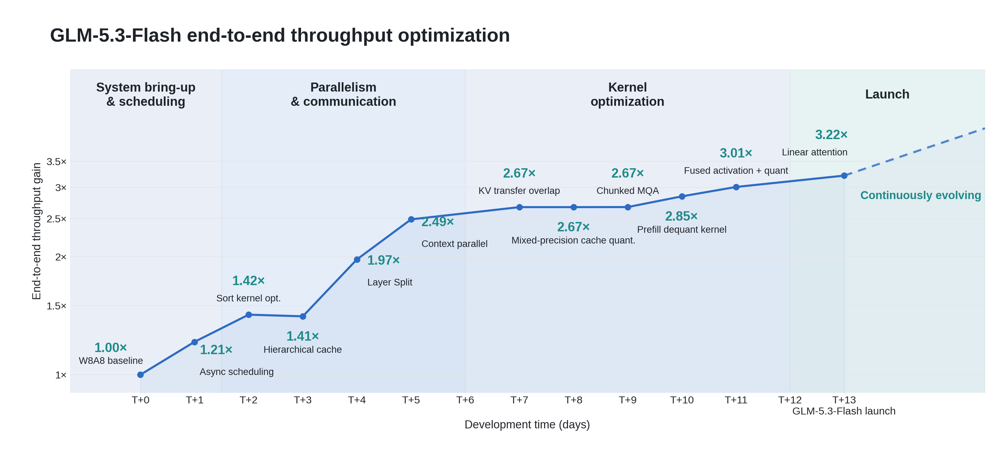
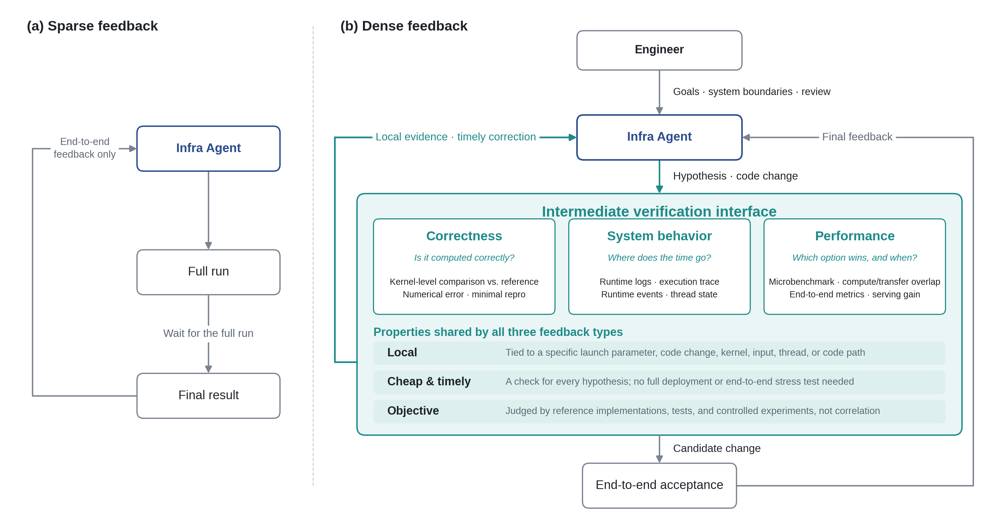
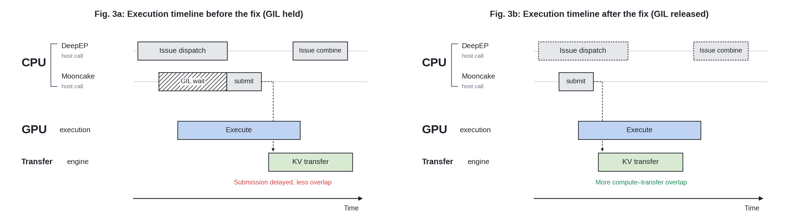
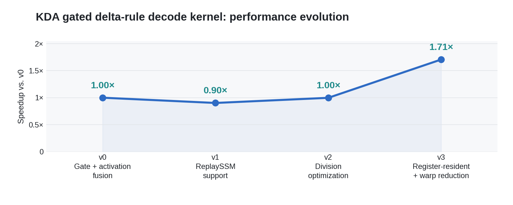

# GLM 推理基础设施解读：用可验证的反馈驱动 Infra Agent 优化

> **按博客自己的定义，这还没有实现完整的 RSI（Recursive Self-Improvement，递归自我改进），作者也明确承认尚未达到。** 本篇展示了模型参与优化推理系统，未展示模型自主设计、训练后继模型，再由后继模型继续改进下一代的过程。
>
> **人负责设定目标、搭建反馈环境和审查关键改动。** 工程师确定优化方向、系统边界与验收标准，提供可重复的数值测试、性能分析和对照实验，并审查涉及数值计算、异步并发、系统架构及生产风险的关键变更。agent 在这个框架内分析问题、提出假设、改代码和做实验。
>
> **这篇博客最想传达的是：模型已开始参与建设和优化 AI 的运行基础设施，可定位、可验证的反馈让它的编码能力转成了可靠的工程进展。**
>
> GLM-5.3 驱动的 agent 与工程师协作，在不到两周内将 GLM-5.3-Flash 的推理吞吐提升到初始基线的约 3 倍。作者将这种“模型改进系统，系统运行模型”的循环视为走向 RSI 的早期迹象。

## Take Home Message

* **代码能力要配合可归因的反馈，才能持续推进系统优化。** GLM-5.3 驱动的 **Infra Agent（基础设施智能体）** 负责分析、改代码和做实验。博客将测试、日志和性能分析接入它的迭代流程，称为 **Dense Feedback（密集反馈）**：把“吞吐下降了”进一步定位到具体算子、输入或线程，让 agent 能用局部实验检验原因，再决定下一步。密集指的是验证机会足够及时、具体，而非日志数量多。

* **工程师与 agent 协作，13 天将端到端吞吐提高到初版的 3.22 倍。** 被部署的 GLM-5.3-Flash 需要在超过 10 万张国产 AI 加速器组成的集群上支持长上下文和多模态请求。初始基线的权重与激活已采用 8 位量化，后续收益来自调度、并行、通信和算子优化的组合；博客未单独量化 agent 的贡献。

* **正确性测试必须覆盖部署实际执行的计算路径。** 长上下文切分到不同设备后，新增的状态合并计算可能引入误差。这个案例中，输入虽然保存为 32 位浮点数，矩阵乘法仍默认采用更低精度；切分与未切分路径的对照暴露了累积误差，agent 随后调整运算精度。只测试未切分的算子，会漏掉并行部署新增的问题。

* **异步传输的瓶颈也可能发生在任务提交之前。** DeepEP 的部分 C++ 调用未释放 **Global Interpreter Lock（全局解释器锁，GIL）**，使负责缓存传输的 Python 线程无法及时推进任务。修复后，同一测试负载下，“处理输入并传输缓存”与“仅处理输入”的性能差距，从部分场景的 **超过 20% 降到不足 1%**。这个差距衡量的是传输带来的额外影响。

* **优化经验需要连同适用条件一起复用。** agent 从已有手写算子中提炼“优化骨架”，记录变换方式、资源约束和验证证据，再针对新算子做实验。一个线性注意力解码算子重复执行了四次相同的归一化与门控计算；合并分块并复用中间结果后，相对上一版加速 **1.71 倍**。它牺牲了部分并行度，服务收益仍需回到实际负载中验证。

* **工程师的职责集中在目标、反馈环境与关键审查。** 人定义优化目标和系统约束，搭建 agent 可直接使用的测试与观测接口，并审查关键修改；agent 在其中反复提出、验证和修正方案。作者把这视为走向 **Recursive Self-Improvement（递归自我改进，RSI）** 的早期实践，但按博客的定义，完整 RSI 要求系统自主设计并训练后继模型，本篇尚未展示这一过程。

## 1. 长上下文与有限显存要求优化整条推理流程

GLM-5.3-Flash 的部署难点，是在显存容量、带宽和软件生态受限的新硬件上，支持 **1M-token 上下文和多模态请求**。博客称，其全部生产推理运行在**超过 10 万张国产 AI 加速器**组成的集群上。这是服务的集群规模，不代表单个模型副本跨 10 万张卡运行。

来源：[原博客](https://z.ai/blog/glm-built-its-inference-infrastructure)，「Driving Infra Agent Optimization of Inference Systems with Dense Feedback」、Figure 1。

### 1.1 分开组织编码、输入处理与生成

博客采用 **Encode-Prefill-Decode（编码—预填充—解码，EPD）分离架构**：先编码图像等输入，再由 Prefill 处理整段提示词、建立历史状态，最后由 Decode 读取状态并逐 token 生成。原文未展开部署拓扑与资源配比。

标准注意力会缓存 **Key / Value（键和值，KV）**，避免生成时重复计算历史表示。输入处理与生成分开运行后，需要 **KV Transfer（KV 缓存传输）**，将这些状态送到生成侧。线性注意力还维护递推状态，不能将所有缓存都视为同一种 KV 张量。

长上下文增加状态存储与搬运压力。因此，显存容量、阶段调度、计算与通信的重叠，都需要纳入优化目标。博客使用的主要方法如下：

<div align="center">

| 优化 | 作用与披露范围 |
| :---: | :--- |
| 节点内张量并行 | 将线性注意力与语言模型输出层（LM Head）的计算分到多张卡；未给出并行度 |
| ReplaySSM | 用额外计算换显存空间；未展开具体算法 |
| W8A8 量化 | 权重（Weight）和激活（Activation）均采用 8 位表示；初始基线已使用 |
| 混合精度缓存量化 | 使用 8 位整数（INT8）、8 位浮点（FP8）和 16 位浮点（BF16）；未说明各自对应的缓存 |
| Layer Split | 部署与并行优化；未说明具体切分方式 |
| EPD 分离 | 分开组织编码、预填充和解码，仍需协调状态传输与调度 |

</div>

### 1.2 3.22 倍来自累计优化，起点已经量化

<p align="center">
  <a href="assets/glm-inference-infrastructure/figure-01-throughput-evolution.png"></a>
</p>

*Figure 1，来源：原博客。横轴为开发天数，纵轴为相对 W8A8 基线的吞吐倍数。上线后的虚线表示继续优化；点击图片可查看原图。*

图中从异步调度、并行与通信改造，逐步推进到算子优化，在 T+13 达到 **3.22 倍吞吐**。相邻节点中，较大的增幅出现在 **Layer Split（T+4，1.97 倍）** 与 **上下文并行（T+5，2.49 倍）**。这些是当时系统的累计吞吐，不能当成独立消融收益相乘；博客也未展开 Layer Split 的具体实现。

有些节点的吞吐暂未上涨，但减少显存需求或修复数值问题，仍可能是上线的必要条件。这个过程既要提高速度，也要让模型在目标硬件和长上下文条件下正确、稳定地运行。

博客还称硬件利用效率和每 token 成本接近主流 NVIDIA GPU，但没有给出具体芯片、成本模型和压测条件，跨硬件比较尚无法复现。原文也没有纯人工团队对照、无密集反馈对照或完整独立消融，无法将两周上线和全部收益单独归因于 agent 或某项方法。

## 2. 将端到端异常转成可验证的局部问题

端到端指标能发现异常，局部反馈才能帮助判断下一步。一次改动后“吞吐下降”，可能是算子变慢、设备空闲，也可能是通信没能及时推进。代码提供的是静态实现，实际问题还取决于输入、并行配置、线程调度和组件之间的执行关系。

来源：原博客「From End-to-End Metrics to Attributable Feedback」、Figure 2。

传统工程流程已经有测试、日志和性能分析工具，但往往由工程师决定先看哪条时间线、再测哪个算子，并把不同工具的结果联系起来。GLM 团队把这些方法整理成 **agent 可直接调用、可重复执行的验证流程**，让它根据当前假设选择测试，而不必每次改动都等待完整部署和压测。

有效反馈有三项要求：

* **定位到局部。** 将异常关联到输入形状、并行配置、线程或代码路径。例如，某个请求在融合前后的输出差异，可以帮助构造最小复现。
* **验证及时、成本低。** 算子测试或 microbenchmark（微基准测试）能回答的问题，就不必每次部署完整服务并压测。
* **有客观参照。** 用参考实现检查数值，用可比实验判断性能。时间线中的相关现象可以提示原因，修改对应路径后的对照实验才能检验这个判断。

<p align="center">
  <a href="assets/glm-inference-infrastructure/figure-02-dense-feedback-loop.png"></a>
</p>

*Figure 2，来源：原博客。局部验证帮助筛选改动，候选方案再进入端到端验收；三类反馈按假设选择，没有固定顺序。*

<div align="center">

| 反馈 | 要判断的问题 | 主要证据 |
| :---: | :--- | :--- |
| 正确性 | 当前路径是否按预期计算 | 参考实现、切分与未切分输出比较、最小复现 |
| 系统行为 | 时间花在计算、等待还是通信上 | 执行 trace、运行时事件、线程状态 |
| 性能 | 哪种方案在当前条件下更快 | 微基准、计算与传输重叠、服务指标 |

</div>

**反馈类型随当前假设选择，没有固定的先后顺序。** 局部测试尽早排除错误或无效的改动，agent 根据结果保留、修正或否决方案。候选实现再进入完整服务测试，检查准确性、稳定性，以及局部收益能否保留到实际负载中。

> **关键 insight：把验证方法接入 agent 的工作流程，会影响它能探索多少方向。** 按本篇机制推导，若每个假设都有低成本的验证入口，agent 就能更快排除无效方向，把完整压测留给值得继续的方案。博客未提供等预算对照，尚不能量化这一设计的独立收益。

## 3. 正确性案例：上下文切分后，状态合并误差开始累积

并行部署会改变输入如何切分、计算走哪条路径，以及结果如何合并。这个案例先把部署配置转换成算子测试，再比较切分与未切分的结果，将长上下文误差定位到新增的状态合并计算。数值修复未必立即提高吞吐，却是可靠上线的前提。

来源：原博客「Correctness Feedback」、[Flash Linear Attention PR #1180](https://github.com/fla-org/flash-linear-attention/pull/1180)、[Triton `tl.dot` 文档](https://triton-lang.org/main/python-api/generated/triton.language.dot.html)。

### 3.1 将并行配置对应到具体测试路径

**KDA（Kimi Delta Attention，Kimi Delta 注意力）** 是带门控的线性注意力，通过递推状态保留历史信息，名称可由 [Flash Linear Attention 的介绍](https://github.com/fla-org/flash-linear-attention#readme)核对。

**CP（Context Parallelism，上下文并行）** 将长序列切成分片处理，但后一个分片仍需要前面历史留下的状态，因此要合并各分片的状态变换。团队建立了“并行配置 → kernel（计算算子）→ 输入切分与输出位置”的映射，让 agent 在相同输入、计算语义和输出位置下比较 CP 与非 CP 路径。

这种映射先确定了要测试哪些路径；对相同输入的数值比较，再将 CP 路径的偏差定位到状态传播与合并。agent 因而可以沿对应路径继续排查，无须从整个模型重新寻找原因。博客将关键计算简化为：

```python
M = tl.dot(M_chunk, M)     # 合并分片的状态变换
S_next = tl.dot(M, S) + H  # 为下一分片更新初始状态
```

`M_chunk` 是当前部分的状态变换，`M` 是合并后的变换，`S` 是传入状态，`H` 是新增状态贡献。关键在于：这两类矩阵乘法会沿合并链反复执行，误差可能逐步积累。

### 3.2 检查矩阵乘法实际采用的精度

在博客描述的路径中，输入虽然保存为 **FP32（32 位浮点数）**，`tl.dot` 却默认采用 **TF32（TensorFloat-32）**，利用 Tensor Core 加速。TF32 的有效尾数精度低于 FP32，反复合并状态变换时，长上下文下的误差更加明显。

agent 将两处点积改为显式使用 `tf32x3`：

```python
M = tl.dot(M_chunk, M, input_precision="tf32x3")
S_next = tl.dot(M, S, input_precision="tf32x3") + H
```

按博客解释，`tf32x3` 组合三次 TF32 Tensor Core 运算，提高结果精度并尽量保留加速收益，但不能保证对所有输入都与 IEEE FP32 完全等价。

上游 PR #1180 已于 **2026-08-27** 合并，核查后有两项实施条件：

* **需要显式启用。** 跨卡 CP 由 `FLACPContext.use_tf32x3_affine_chain` 控制，默认值为 `False`；PR 将其定位为可选的精度修复。
* **取决于硬件支持。** 不支持 TF32 的平台选择 `ieee`；请求启用 `tf32x3` 时会提示回退。博客未说明该示例与各生产硬件的对应关系，不能将 TF32 路径直接推广到整个国产集群。

新增的三个测试覆盖跨设备序列切分、单条长序列和状态布局变化，需要 2 或 4 张 GPU，单 GPU 环境会跳过。它们的总序列长度均为 **10,240 tokens**，并非 1M 上下文验收；回归测试用于持续检查这条计算路径，候选实现仍需在目标部署中验收全模型精度与服务性能。

> **关键 insight：重复运行能检查稳定性，数值正确性还需要参照。** 比较切分与未切分路径对相同输入的结果，能暴露并行改造新增的误差。由此推导，新增并行配置时，测试也应覆盖新增的状态传播与合并路径。

## 4. 并发案例：GIL 延迟了 KV 传输的提交

这里的瓶颈发生在传输开始之前。负责提交任务的 Python 线程被阻塞，底层传输支持异步也无法充分与计算重叠。

来源：原博客「System Behavior Feedback」、Figure 3；[DeepEP v1.2.1 源码](https://github.com/deepseek-ai/DeepEP/blob/v1.2.1/csrc/deep_ep.cpp)。

### 4.1 分阶段测试将问题缩小到通信并发

工程师定义了“仅 Prefill”“Prefill + KV Transfer”“仅 Decode”等场景，要求：**相同负载下，加入 KV 传输后的性能差距不超过 5%**。部分场景实际超过 20%。

这个对照先将调查范围缩小到加入 KV 传输后的额外开销与并发交互。agent 检查时间线后发现，在这些异常场景中，Python 侧 KV Transfer 从未与 DeepEP 的 dispatch / combine 调用区间重叠。**DeepEP** 负责专家通信中的 token 分发与结果合并，**Mooncake Transfer** 负责这里的缓存传输。这一现象使调查转向两者在同一进程中的线程并发，随后沿调用链检查 Python / C++ 边界。

### 4.2 释放 GIL 后，传输线程能更早推进

在 **DeepEP v1.2.1** 中，`intranode_dispatch` 和 `intranode_combine` 没有显式释放 GIL；dispatch 在需要接收 token 数量时，还会由 CPU 等待 GPU 返回信息。

GIL 限制常规 CPython 进程中多个线程同时执行 Python 代码，**进入 C++ 扩展并不会自动释放它**。DeepEP 持锁等待时，Mooncake Transfer 的 Python 线程无法及时获得锁，任务提交随之延迟，留给计算与传输重叠的时间就更少。

同版本源码提供了对照：`internode_dispatch` 已在 [L664 附近](https://github.com/deepseek-ai/DeepEP/blob/v1.2.1/csrc/deep_ep.cpp#L664)使用 `pybind11::gil_scoped_release`，注释明确说明要避免 CPU 等待期间阻塞其他线程的 KV Transfer；节点内路径没有对应释放。

修复在相关 C++ 执行区间释放 GIL，让 Mooncake 的任务提交不再等待 DeepEP 的主机侧调用结束。验证也分成两部分：时间线检查传输是否更早提交、重叠机会是否增加；原来的负载对照检查性能差距是否实际缩小。只有观测现象与对照结果相互支持，才能确认这处修改解决了当前问题。

<p align="center">
  <a href="assets/glm-inference-infrastructure/figure-03-kv-transfer-concurrency.png"></a>
</p>

*Figure 3，来源：原博客。执行关系示意，没有真实时间刻度；左图提交延迟，右图传输更早开始。*

相同测试条件下，性能差距降到 **不足 1%**。这个数字对应“Prefill + KV Transfer”与“仅 Prefill”的比较；博客未给出具体指标口径和原始值，不能换算为全服务吞吐提升。

> **关键 insight：通信性能也取决于任务何时提交。** 本例的等待发生在传输之前，只提高底层带宽仍可能留下瓶颈。按这一机制推导，排查时需要把主机调用、线程等待、设备计算和传输事件放在同一时间线上。

## 5. 算子案例：合并分块以减少重复计算

KDA Decode 原本通过更多分块增加并行度，却重复执行了共享计算。agent 合并分块、复用中间结果，以较少的并行度换来了更短的执行时间。

来源：原博客「Performance Feedback」、Figure 4。

### 5.1 从已有实现提炼可复用的优化经验

优化方向来自已有实现，是否有效则由目标系统的实验判断。agent 阅读 SGLang、Flash Linear Attention、DeepGEMM 等项目的手写算子，通过逐项改动和消融实验，整理出 **optimization skeletons（优化骨架）**。骨架记录一种优化在什么条件下适用、如何变换计算、受哪些资源限制，以及哪些实验支持它。

面对新算子，agent 从骨架中选择候选方案，再用 profiling（性能分析）和分层测试调整分块、访存与资源分配。验证有效的改动及其条件写回骨架库，供后续优化继续使用。这里积累的是经实验检验的外部经验；博客未公开骨架库的格式、规模或检索方法。

### 5.2 先接受显存与计算的取舍，再减少冗余

<p align="center">
  <a href="assets/glm-inference-infrastructure/figure-04-kda-kernel-evolution.png"></a>
</p>

*Figure 4，来源：原博客。纵轴以 v0 为基准，v2 约为 1.00 倍；正文将最后的 1.71 倍写为相对 v2。两种基准近似对齐，但并非已证明精确相等。*

v0 已融合门控与激活。v1 加入 ReplaySSM，用计算换显存空间，速度降到约 **0.90 倍**。这一步增加了算子耗时，同时服务于显存约束，评价时需要同时看它节省的空间。随后，v2 的除法优化让执行时间相对 v1 **减少 9.6%**，基本回到 v0 水平；具体变换未披露。

性能分析随后指出瓶颈主要在计算。原实现沿 **V（value，值向量）维度**分成四个 tile（分块），每块都执行相同的 FP32 归一化与门控计算。

agent 将四块合并到一个 **thread block（线程块）**，把共享中间结果保存在寄存器里，再用一次 **warp-level reduction（线程束级归约，汇总线程结果）** 替代每块的重复计算。v3 因此相对 v2 **加速 1.71 倍**。

减少的是这部分共享计算的重复次数，不能把整个算子的工作量视为降到四分之一。博客未给出绝对耗时、输入形状和硬件配置，实测加速比尚无法复现。

> **关键 insight：优化骨架要记录何时有效。** 本例的收益来自四次重复计算；换一种输入或硬件，若重复工作减少，合并分块损失的并行度就可能更显著。适用条件与验证证据应和代码一起保留。

### 5.3 算子加速需要回到服务中验证

计算算子占用更多设备资源，也可能挤压传输资源、拖慢流水线。即使不存在这种竞争，局部加速对整体耗时的影响也取决于它原本占多少时间。

解释性估算：假设各部分串行、总工作量不变，被优化部分占原总耗时的 $`p`$，自身加速 $`s`$ 倍，其余部分不变，则整体加速为：

```math
S_{\mathrm{total}}=\frac{1}{(1-p)+p/s}.
```

若 $`p=0.2`$、$`s=1.71`$，整体约 **1.09 倍**。这是给定条件下的计算示例，并非博客实测。真实服务还包含重叠执行、资源竞争和批处理变化，需要端到端测量。

## 6. 工程师负责目标、反馈环境与关键审查

工程师的经验在这套流程中被落实为目标、验证接口和审查标准。agent 可以连续分析、改代码和做实验，但它需要知道哪些结果可以支持当前判断，以及什么条件下必须回到完整服务验证。

来源：原博客「Let Feedback Drive Action, and Experiments Test Hypotheses」及结尾。

### 6.1 将经验落实为可执行的反馈环境

博客归纳了工程师的三项职责：

* **定义优化目标与系统约束。** 明确目标负载、资源限制和验收条件，例如同一负载下，加入缓存传输后的性能差距应不超过 5%。agent 据此识别异常、比较方案。
* **构建 agent 能直接使用的反馈环境。** 提供可重复的数值对照、运行时间线和分层性能测试，并说明它们能支持什么判断。大量日志可能掩盖信号，观测范围不完整的 profiling 可能导致误判瓶颈，微基准的收益还需通过实际负载确认。
* **审查关键修改。** 检查系统架构、数值语义、异步并发及生产风险相关的变更。agent 根据实验保留、修正或否决方案，最终仍以正确性、稳定性和端到端性能验收。

由这三个案例可以推导，反馈环境本身也需要工程设计：并行配置到算子的映射决定能否测到新增路径；分阶段负载对照决定能否隔离传输的额外影响；包含资源竞争的服务测试决定能否验收局部优化。把这些条件交代清楚，agent 才能持续用实验推进判断。

### 6.2 外部经验积累与递归自我改进的区别

本篇展示的过程是：**GLM-5.3 驱动 agent 优化基础设施 → 系统运行 GLM-5.3-Flash → 验证过的经验写回骨架库**。执行优化任务的模型与被部署模型应分别看待，文章没有证明它们是同一个 checkpoint。

作者将“模型优化系统，系统运行模型”视为走向 RSI 的早期迹象，并认为更短的工程周期将帮助后继模型开发。按博客的定义，完整 RSI 要求系统自主设计并训练后继模型；作者明确表示尚未达到，目标选择、系统边界和风险判断仍由人承担。文中的直接证据集中在推理系统建设，没有展示模型更新自身参数或自主训练下一代模型的结果。

**工程反馈指导任务执行，训练反馈还会用于更新模型参数。** 相较于 [MiMo V2.6 的强化学习（Reinforcement Learning，RL）笔记](../MiMoV2.6.md)，这里的测试、trace 和性能指标用于让 agent 修改或否决工程方案。骨架库保存了外部经验，博客没有描述将这些经验或每一步工程结果用于模型训练的过程。

## 参考资料

1. [Z.ai：Toward Recursive Self-Improvement: How GLM Built Its Own Inference Infrastructure](https://z.ai/blog/glm-built-its-inference-infrastructure)，发布于 **2026-09-17**。主来源，含 Figures 1–4。
2. [Flash Linear Attention PR #1180：Use tf32x3 affine chain in KCP](https://github.com/fla-org/flash-linear-attention/pull/1180)，核查精度开关、平台回退与测试覆盖；[合并提交](https://github.com/fla-org/flash-linear-attention/commit/81c015566edf4de0a6f95661c09f3de43949ec2b)。
3. [DeepEP v1.2.1 源码](https://github.com/deepseek-ai/DeepEP/blob/v1.2.1/csrc/deep_ep.cpp)，核查 GIL 处理与接收数量等待逻辑。
4. [Triton `tl.dot` 官方文档](https://triton-lang.org/main/python-api/generated/triton.language.dot.html)，核查 FP32 输入与 `input_precision` 的关系。
5. [小红书：GLM 团队 RSI 进展解析｜GLM Infra 自进化](https://www.xiaohongshu.com/explore/6aabf001000000002800290f)，作者「古希腊掌管代码的神」，页面标注 09-17，含五张解读配图。参考其反馈主线、案例展开与工程师职责的组织；关键事实以原博客和上游实现为准。

资料核查日期：**2026-10-02**。四张图片均来自原博客，无 PDF 页码，未裁剪或修改；下载地址、尺寸与校验值见 [source.json](assets/glm-inference-infrastructure/source.json)。
