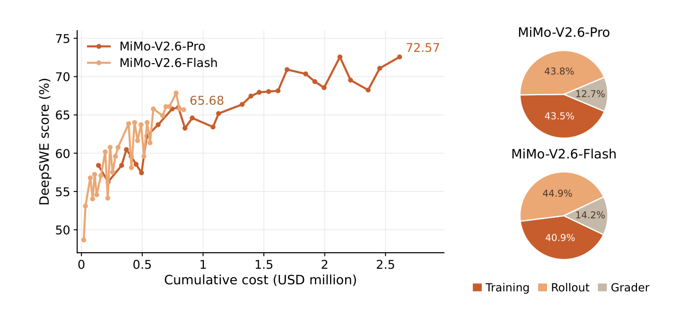
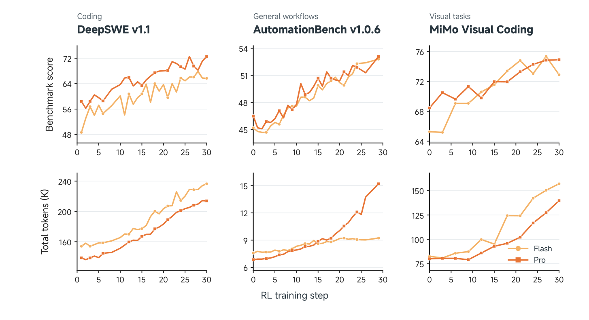
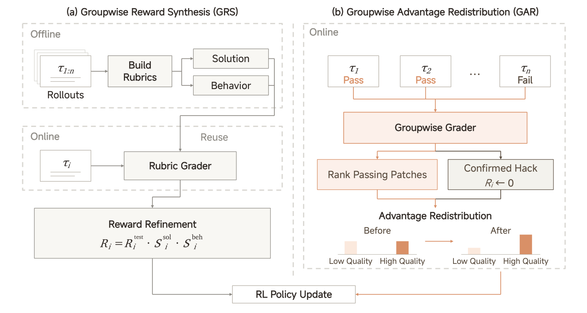
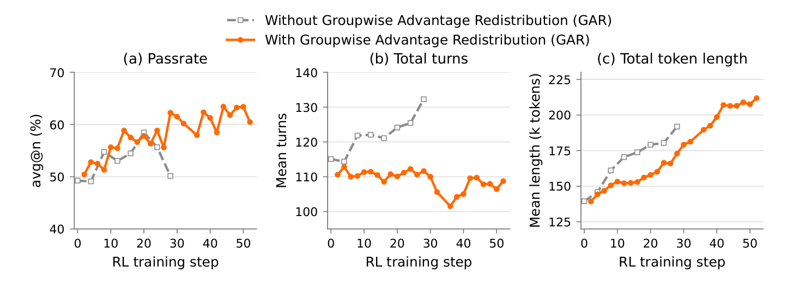
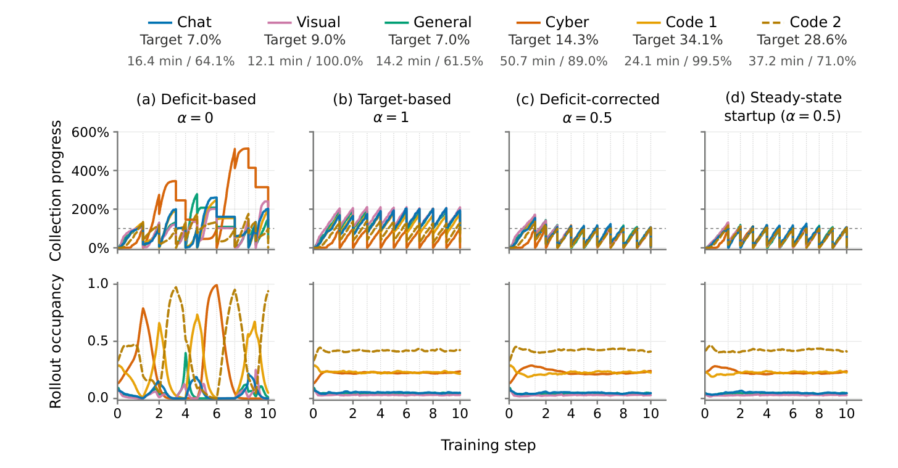
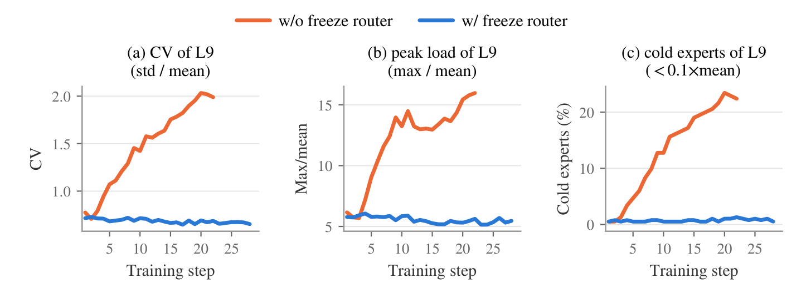
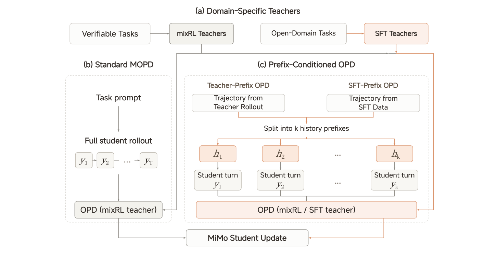

# MiMo V2.6 解读：大规模 RL 如何把探索转成有效学习

> [!IMPORTANT]
>
> **MiMo RL 的核心思路是：用大 batch 扩大探索，再用更好的评分和训练系统，把更多尝试转成能力提升。**
>
> 它让模型同时尝试大量编程、工具操作和网页设计任务，不仅判断是否做对，还比较哪种做法更值得学习 （更多的算力转向评分计算）。
>
> 大 batch 是规模化的抓手，评分与系统是让它有效的条件；论文验证了这套组合的效果，但尚未单独证明同等预算下大 batch 更优。

## Take Home Message

* **大 batch 要配合更细的评分。** MiMo 每步处理 **1,568 道题 × 16 次尝试**；生成与评分合占 Pro / Flash 本轮强化学习（Reinforcement Learning，RL）成本的 **56.5% / 59.1%**。同题的这些尝试需要被准确评出差别，模型才有明确的学习方向。

* **做对以后，还能比较实现质量。** **Groupwise Reward Synthesis（组内奖励合成，GRS）** 在全过测组中继续评价实现和行为；**Groupwise Advantage Redistribution（组内优势重分配，GAR）** 把成败混合组中更多正向学习权重分给优质成功解。可维护性等要求也因此成为训练目标的一部分。

* **过滤和调度会改变真正参与训练的数据。** 数据源平均耗时相差 **66 倍**；先完成先训练会偏向快题，过滤无差异组会偏向当前能区分成败的题。即使各来源数量配齐，内部难度分布和更新权重仍可能不同。

* **训练和生成的概率要按同一方式计算。** 量化、专家路由和截断采样都会改变实际概率。MiMo 重放生成路径和候选集，以免策略没变，更新权重却因引擎差异而改变。router 还会影响负载：恢复实验中，负载恶化没有带来可见的成绩提升。

* **前缀蒸馏练习单轮决策，完整轨迹练习从头完成任务。** **Multi-Prefix Multi-Teacher On-Policy Distillation（多前缀、多教师在线策略蒸馏，MOPD2）** 让学生从教师或示范的中途自行续写，教师更容易可靠地指导这些历史。完整学生轨迹则保留从头规划和连续纠错的训练。

* **成绩提高了，还需在相同预算下比较。** DeepSWE 三次成绩平均值从 Pro 的 **58.4 升至 72.6**、Flash 的 **48.7 升至 65.7**，解题 token 也增加。报告未提供完整等预算对照，也没有展示模型自行改进任务、评分器和训练配方的过程。

## 1. 大 batch 的生成、评分与训练成本

单条 agent 轨迹包含读文件、调用工具、修改、测试和纠错。同题生成更多轨迹以后，还要逐条执行、评分，再用其中的差异更新模型。MiMo 因此同时扩展了生成、评分和训练系统。

### 1.1 生成与评分占了超过一半的 RL 成本

来源：[技术报告](https://huggingface.co/XiaomiMiMo/MiMo-V2.6-Pro-RL/resolve/main/MiMo_V2_6_technical_report.pdf) §3–4.1、§5.1、Figures 3、9。

<p align="center">
  <a href="assets/mimo-v2.6/figure-03-rl-cost-and-gains.png"></a>
</p>

*Figure 3，p.8。左图显示本次运行随投入增长的成绩，右图显示预算分配；不是不同 batch 的等成本对照。*

<div align="center">

| 本轮 RL 成本 | Pro | Flash |
| :---: | :---: | :---: |
| 生成 / 评分 / 参数更新 | 43.8% / 12.7% / 43.5% | 44.9% / 14.2% / 40.9% |
| 总成本 | 约 \$2.6M | 约 \$0.9M |

</div>

每步训练使用 25,088 条轨迹，动态过滤意味着实际生成量可能更多。2.7B–3.7B training tokens 包含上下文，不能当成新生成量；成本也不包含预训练和全部研发投入。

> **关键 insight：原始 token 不是最终的学习资源，可用的比较信号才是。** 同题尝试若奖励完全相同，组内相对更新就缺少方向。扩展评分，是把更多探索转成可用差异；成本占比本身不能证明预算分配最优。

DeepSWE 指标为 **average@3：三次成绩的平均**，不是三次中至少一次成功的 pass@3。Figure 9 中，成绩提高的同时，评测 total tokens 总体也在增长。模型可能学到了更好的策略，也可能增加了检查和重试；要分清这些收益，还需比较**固定解题预算下的成功率，或达到同一成功率所需的 token 与时间**。

<p align="center">
  <a href="assets/mimo-v2.6/figure-09-scores-and-token-growth.png"></a>
</p>

*Figure 9，p.22。上排是成绩，下排是评测 total tokens，单位为千；深橙为 Pro，浅橙为 Flash。下排不是训练 token，也不能直接读成纯思考 token。*

### 1.2 从预训练到 RL 的训练流程

训练顺序是 **预训练 → Mid-training → 短期监督微调（Supervised Fine-Tuning，SFT）→ 混合任务 RL（MixRL）→ MOPD2**。

预训练先学习文本和多模态知识。Mid-training 加入 agent 轨迹，将上下文扩至 1M，并适配 MXFP4 低精度与 Muown 优化器。短期 SFT 得到 RL 的初始策略；MixRL 再根据任务执行结果训练，最后由 MOPD2 汇集领域教师的能力，并向更多任务扩展。

RL 继承 SFT 的 FP32 主权重和 Muown 行状态。短期 SFT 的详细配方未披露，优化器配置见第 5.5 节。

预训练先文本、后多模态：Flash 为 26T + 22T tokens，Pro 为 27T + 3T。较小模型看过更多数据，不能只按参数量比较。上下文在预训练从 32K 扩至 256K，再由 Mid-training 扩至 1M。（来源：§2–3。）

### 1.3 架构如何降低长轨迹的成本

长轨迹需要反复读取历史，同题又采样 16 次，单次生成的成本会被放大。MoE（Mixture of Experts，混合专家）减少每 token 激活的参数；多数层使用 SWA（Sliding Window Attention，滑动窗口注意力），只读取局部历史；少数 GA（Global Attention，全局注意力）层负责连接远处的信息。（来源：§2、Table 1、§6.4。）

<div align="center">

| 配置 | Flash | Pro |
| :---: | :---: | :---: |
| 总参数 / 每 token 激活参数 | 310B / 15B | 1.02T / 42B |
| 主干层数：局部 / 全局 | 39 / 9 | 60 / 10 |
| Hidden size | 4096 | 6144 |
| SWA heads：Q / KV | 64 / 8 | 128 / 8 |
| GA heads：Q / KV | 64 / 4 | 128 / 8 |
| QK / V head dimension | 192 / 128 | 192 / 128 |
| 专家总数 / 每 token 选择数 | 256 / 8 | 384 / 8 |
| 局部窗口 / 最终上下文长度 | 128 tokens / 1M | 128 tokens / 1M |

</div>

首个 block 为 GA 与 dense FFN，其余用稀疏 MoE，无共享专家；层数不含多 token 预测（Multi-Token Prediction，MTP）模块。序列分片时，SWA 仅交换窗口可达的 key / value，全局层仍处理全段上下文。激活参数量不等于同规模 dense 模型的实际成本。

多模态输入的编码方式也会影响上下文长度。681M 参数的 MiMo-ViT 有 24 层局部、4 层全局注意力，局部窗口交替按行、按列组织，再全局汇总。它与小语言模型联合用理解任务训练，处理超过 4T image tokens，无额外对比学习目标。

音频每秒 25 帧，每帧 20 个残差向量量化（Residual Vector Quantization，RVQ）码的 embedding 先相加，再将 4 帧合成一个主干输入，得到每秒 6.25 个位置。按此估算，60 秒音频约占 375 个主干位置；每帧的 20 个码并不各占一个位置。这个估算只涉及主干输入长度，整条编码链路未必等比例省算力。

> **关键 insight：降低单次生成的成本，可以给更多尝试和评分留出预算。** 输入编码也要保留任务所需的信息，奖励无法补回模型没有观察到的内容。报告没有单独测量这些设计带来的 RL 增益。

## 2. 通过测试以后，继续比较解法质量

MiMo 使用 GRPO（Group Relative Policy Optimization，组相对策略优化），比较同题各次尝试的奖励。当所有尝试都通过测试，二元奖励完全相同，组内就没有可供更新的差异。GRS 和 GAR 在不同条件下引入质量评价，让模型继续学习更好的做法。

来源：§4.3、Eqs. (2)–(5)、Figures 7–8。

### 2.1 GRS 为成功解补充质量评分

<p align="center">
  <a href="assets/mimo-v2.6/figure-07-groupwise-grading.png"></a>
</p>

*Figure 7，p.17。左侧改变奖励，右侧改变优势；用于不同代码子集，不是固定串行步骤。*

<div align="center">

| 机制 | 如何产生差异 | 适用范围 |
| :---: | :---: | :---: |
| **GRS** | 离线联合检查尝试、需求和仓库，形成实现与行为标准；在线逐条打分 | 部分高通过率任务，全过测组也可能继续学习 |
| **GAR** | 在线比较成败混合组，把更多正向权重分给更好的成功补丁 | 其余代码任务中的成败混合组 |

</div>

GRS 的奖励为：

```math
R_i=R_i^{\mathrm{test}}\,S_i^{\mathrm{sol}}\,S_i^{\mathrm{beh}}.
```

$`R_i^{\mathrm{test}}`$ 为二元测试分，$`S_i^{\mathrm{sol}}`$、$`S_i^{\mathrm{beh}}`$ 为实现和行为质量分。测试失败时奖励为零；通过以后，再比较边界处理、修改范围、仓库惯例和验证行为。

### 2.2 GAR 重新分配成功解的学习权重

例如两条成功轨迹原本各 +0.5，可调整为 +0.8、+0.2（未限幅示例）。精确做法是先按质量缩小部分权重，再在成功解之间重新分配。

来源：§4.3.2 Eq. (3)。设 hack 修正后的二元奖励为 $`R_i`$，组均值为 $`\bar R`$，初始优势为 $`A_i=R_i-\bar R`$，成功集合为 $`\mathcal P=\{i:R_i=1\}`$。质量因子 $`f_i\in(0,1]`$ 先降低较差成功解的权重，再以共同系数分配移出的正优势：

```math
\lambda=\frac{\sum_{j\in\mathcal P}A_j}
{\sum_{j\in\mathcal P}f_jA_j},
\qquad
A_i'=\begin{cases}
\lambda f_iA_i,&i\in\mathcal P,\\[0pt]
A_i,&i\notin\mathcal P.
\end{cases}
```

未限幅时保留成功轨迹的正优势总量及质量带来的相对权重。实际实现限制共同缩放系数，再从成功、失败轨迹的优势中都减去全组均值，使最终组均值为零；因此守恒不一定保留。不可用的 grader 输出退回原优势。该表达式适用于成败混合组，不能用于全成功零优势组制造新差异。

> **关键 insight：加入质量评分以后，模型学的内容也变了。** 报告观察到，没有在线评分时，更易出现吞异常、放宽验证和不必要的兼容分支。要求代码可维护，就是在“通过测试”之外增加训练目标，而不只是减少测试奖励的噪声。

> **关键 insight：GRS 复用评价标准，GAR 比较当前解法。** 这提示了两种评分计算的用法：标准稳定的重复任务可以复用离线分析，新出现的方案则需要在线检查。两者的等成本效果和标准失效率，报告都没有测量。

### 2.3 GAR 对照实验中的成绩与长度变化

Flash 纯代码、batch 128、token-mean 实验中，有 GAR 的成绩改善持续到第 52 步，轮数大体稳定，但总长度仍约从 140K 增至 210K。

<p align="center">
  <a href="assets/mimo-v2.6/figure-08-gar-ablation.png"></a>
</p>

*Figure 8，p.19。灰线无 GAR，橙线有 GAR；实验设置不同于最终混合任务 RL。三栏应一起读，不能由轮数稳定推出总长度不增长。*

### 2.4 长度约束以同题成功解为参照

MiMo 只在成功样本足够多时施加长度惩罚，用同题成功轨迹的生成长度分位数作参照。困难组保留原奖励，因此不会拿快速失败的轨迹作为长度标准。

来源：§4.3.3 Eq. (4)。设成功集合为 $`\mathcal P_q`$，当通过率 $`\lvert\mathcal P_q\rvert/G\gt a_{\min}`$ 时，取成功生成长度的指定分位数：

```math
\ell_q^\star=\mathop{\mathrm{Quantile}}\nolimits_{B/100}
\{\ell_j:j\in\mathcal P_q\}.
```

```math
\widetilde R_i=R_i-\mathbf{1}[i\in\mathcal P_q]X
\left[
\mathop{\mathrm{clip}}\nolimits\left(
\frac{\ell_i/\ell_q^\star-1-\delta}{s-\delta},0,1
\right)
\right]^\gamma.
```

$`\ell_i`$ 为生成 token 数；$`B`$ 决定分位数；$`X`$ 为最大扣分；$`\delta`$ 是允许超出参考长度的比例；$`s`$ 决定何时扣满；$`\gamma`$ 控制曲线。其中 $`s\gt\delta\geq0`$、$`X\geq0`$、$`\gamma\geq1`$。本文将原文通过率阈值 $`A`$ 改记为 $`a_{\min}`$，避免与优势混淆。其他组保留原奖励，调整后的奖励用于计算优势。

示例（非报告配置）：参考 10,000 tokens，容忍 20%，超过 12,000 开始扣分；若 $`s=1`$，20,000 时扣满 $`X`$。报告未披露完整超参数。

### 2.5 对错误片段调整 token 优势

一条最终成功的轨迹，中途也可能有错误工具调用。对规则标记的 token，MiMo 在正优势时取消鼓励，在负优势时放大负权重，再补偿未标记的 token。规则没有标记的片段仍可能有错。

来源：§4.3.3 Eq. (5)。令 $`h_{i,t}=1`$ 表示被规则标记，否则为 0：

```math
\widetilde A_{i,t}=\begin{cases}
\alpha(1-h_{i,t})A_i,&A_i\gt0,\\[0pt]
[\beta(1-h_{i,t})+\kappa h_{i,t}]A_i,&A_i\lt0,\\[0pt]
0,&A_i=0,
\end{cases}
\qquad \kappa\gt1.
```

$`\kappa`$ 放大错误片段的负权重；$`\alpha`$ 补偿未标记的正优势 token；$`\beta`$ 减轻未标记的负优势 token。分支依据是优势正负，而非测试成败；质量或长度调整后，成功轨迹也未必具有正优势。

系数统计范围为**整个 training batch 中参与 loss 的 token**。设 $`H_+,H_-`$ 为正、负优势中命中规则的 token 集合，$`C_+,C_-`$ 为未命中的集合：

```math
\alpha=\min\left(\alpha_{\max},
1+\frac{\sum_{(i,t)\in H_+}A_i}{\sum_{(i,t)\in C_+}A_i}\right),
\qquad
\beta=\max\left(\beta_{\min},
1-\frac{(\kappa-1)\sum_{(i,t)\in H_-}\lvert A_i\rvert}
{\sum_{(i,t)\in C_-}\lvert A_i\rvert}\right).
```

$`\alpha_{\max}\geq1`$ 限制正向放大，$`0\lt\beta_{\min}\leq1`$ 限制负权重减轻的程度。分母为零时相应系数设为 1。只有分母非零、未触发限制时，正负两侧的优势总量分别守恒；不保证最终梯度或策略熵不变。

> **关键 insight：选出更好的轨迹以后，还要处理其中的错误动作。** GAR 仍把优势分配给整条轨迹，局部规则只调整能识别的错误片段。它还没有回答每一步对成功贡献了多少；正优势轨迹中的错误只是取消鼓励，也未必得到负奖励。

## 3. 验证器的准确性与稳定性

验证器要挡住作弊解，也要接受正确的替代实现。测试过严、强制匹配参考补丁的细节，同样会给模型错误的反馈。

来源：§4.2、Table 2、Figures 4–6。

<div align="center">

| 任务 | 核心验证方式 | 要避免的误判 |
| :---: | :---: | :---: |
| 代码 | 需求—测试对齐；每题 4 次尝试联合审计；有参考补丁时要求修复前后测试 8 次重跑稳定 | 强制参考实现的偶然细节，或漏掉需求 |
| 通用工作流 | 可重置 sandbox；代码查确定性状态，模型评审开放交付物 | 回复声称完成，实际文件或数据库不正确 |
| 视觉设计 | 开放设计逐件检查后同题比较；按图复刻主要查相似度 | 混用开放创作与明确参考的评价标准 |
| 漏洞复现 | 题面与验证来自同一错误报告，匹配漏洞类型和项目栈帧位置 | 将任意崩溃当成指定漏洞 |

</div>

代码的 F2P（fail-to-pass，修复前失败、修复后通过）检查修复效果，P2P（pass-to-pass，前后均通过）检查回归；审计则一起检查需求、补丁和执行记录。重复执行能检验稳定性，正确性还要靠需求审计和反例。稳定地误判，同样会反复强化错误行为。通用任务也用重复评审、不同 judge 和对抗解修订标准，训练时由 MiMo-V2.6-SFT 评分。

> **关键 insight：误拒正确解，会削弱探索的收益。** 新的有效解法如果总被判失败，模型就可能继续学习与参考解接近的做法。审计正确替代解因此有助于保留探索的价值；这是机制上的推论，报告没有单独测量其收益。

报告记录了模型从新版包、上游仓库或 issue / PR 获取现成补丁的行为，而历史版本修复任务不允许使用这些信息。防御措施包括纠错示范、环境与缓存清理、网络隔离、训练前 hack agent 检查，以及训练中的持续审计。确认违规后，奖励归零，再重算组统计。

报告的“低于 2%”是检测出的违规占比，缺少漏检率，不能当成全部违规率。

> **关键 insight：模型变强以后，旧评分器也要重新检查。** 模型可能尝试过去没出现过的做法，或找到新的作弊途径。审计需要核对执行状态、补充针对性测试，并用对抗解检查漏洞；反复调用同一个 judge，未必能发现这些问题。

## 4. 采样、过滤与训练权重

数据配比要分开看三个数：计划采样多少，过滤后保留多少，更新时占多少权重。各来源数量配齐以后，题目难度和轨迹长度仍会影响训练。

来源：§4.1、§5.1、§6.2–6.3、Figures 15–16。

### 4.1 过滤会改变参与训练的题目

简化推导：同题 16 次独立尝试、单次成功率均为 $`p`$，只保留成败混合组，则：

```math
P_{\mathrm{keep}}(p)=1-p^{16}-(1-p)^{16}.
```

成功率为 1% 或 99% 时，约 **14.9%** 的组被保留；50% 时约 **99.997%**。这不是 MiMo 实测：真实轨迹可能相关，奖励也可能连续。

> **关键 insight：题库没变，模型实际训练的题目也会变。** 随着能力提高，一道题可能先是全失败，再有部分成功，最后全成功。过滤主要保留中间这类有奖励差异的组；GRS 让部分全过测组继续比较质量，全失败的题则可能需要先补充示范或提高初始能力。调度能补齐来源数量，却无法自动恢复被过滤掉的难度分布。

### 4.2 按耗时和保留率分配并发

25 个来源的平均生成 token 数相差 90 倍、平均耗时相差 66 倍。Sample Mixer 根据目标保留组数、过滤接受率、耗时和当前缺额调整并发。它也为后续 batch 收集数据，避免某来源收齐当前 batch 后完全停止生成。

固定收集速率下，并发需求大致随 **目标组数 × 耗时 ÷ 接受率** 增长。接受率是通过训练过滤的比例，不是任务成功率。例如两源各需 100 组，一源接受率 0.5、耗时 10 分钟，另一源为 1、1 分钟，则并发需求约 **20:1**（解释性示例）。

<p align="center">
  <a href="assets/mimo-v2.6/figure-16-sample-mixer.png"></a>
</p>

*Figure 16，p.31。上排为收集进度，下排为占用份额。只按当前缺额调度容易频繁切换，只按长期目标调度则容易拉开收集进度；组合策略更平稳。模拟未包含训练、评分延迟、过期淘汰和回放，只比较调度效果。实际仅在启动 / 恢复首个收集步回放合格完整组。*

### 4.3 Prompt-mean 先在组内平均，再按题平均

**Prompt-mean** 先在同题轨迹组内平均 token 项，再在题目之间平均。例如，两题组长分别为 1 万、10 万 token，按 token 平均时权重约为 1:10，按题平均后外层名义权重为 1:1。组内各轨迹仍按 token 聚合，最终权重还受优势、概率比和 mask 影响；长度惩罚另行计算。

来源：§4.1 Eq. (1)、§5.1。

```math
\mathcal{L}(\theta)
= -\mathbb{E}_{q\sim\bigcup_d\mathcal D_d,\;\{o_i\}_{i=1}^{G}\sim\mu_{\theta_{\mathrm{old}}}(\cdot\mid q)}
\left[
\frac{1}{\sum_{i=1}^{G}\lvert o_i\rvert}
\sum_{i=1}^{G}\sum_{t=1}^{\lvert o_i\rvert}
r_{i,t}M_{i,t}A_i
\log\pi_\theta(o_{i,t}\mid q,o_{i,\lt t})
\right].
```

内层以同题组的总长度归一化，外层对题目与采样取平均。

<div align="center">

| 符号 | 含义 |
| :---: | :---: |
| $`q`$、$`G`$ | 题目及每题轨迹数，本次 $`G=16`$ |
| $`o_{i,t}`$、$`o_{i,\lt t}`$ | 第 $`i`$ 条轨迹当前 token 及其之前的历史 |
| $`\pi_\theta`$、$`\mu_{\theta_{\mathrm{old}}}`$ | 当前训练策略、实际生成数据的策略 |
| $`A_i`$ | 轨迹优势；局部行为调整后替换为相应的逐 token 优势 |
| $`r_{i,t}`$ | 重要性采样权重 |
| $`M_{i,t}`$ | token mask，需结合模型输出的训练范围和行为规则理解 |

</div>

报告列出代码 68%、通用工具 12%、视觉 13%、上下文遵循 3%、安全 4%；统计分母未说明，无法据此换算 token 或算力份额。

> **关键 insight：题库比例不足以说明模型真正学了什么。** 调度补齐来源数量，过滤筛掉部分题组，prompt-mean 再调整题目间的名义权重。分析训练收益时，还需要记录各来源的保留率、轨迹长度和有效更新权重。

### 4.4 组内固定 harness，组间更换配置

Harness 包括提示、工具接口、上下文管理和执行循环。MiMo 的 mini-harness 在**同题组内保持配置相同，不同组之间更换配置**。这样比较同组轨迹时，可以减少接口差异的干扰。在训练时未使用的 Codex、Claude Code、mini-swe-agent 这些 harness 上，DeepSWE 平均 Pass@1 约从 50% 升至 66%。这支持跨接口迁移，但报告没有等预算的单框架对照（§4.2.5、Figure 10）。

> **关键 insight：只奖励任务完成，模型可能忽略流程要求。** 作者指出，生产 harness 的保护规则和流程要求未必计入奖励。需要模型遵守的规则，应进入监督或由执行系统保证；benchmark 成绩提高，并没有验证这些规则已经学会。

## 5. 概率计算、专家负载与训练配置

即使权重相同，不同引擎也可能选择不同的专家路径，算出不同的采样概率。若直接拿这些概率做重要性采样，更新权重里就会混入引擎差异。

来源：§4.1、§5.1、§5.4–5.5、§6.4、Figure 11。

### 5.1 保存生成时的概率，重放采样条件

MiMo 按 token 用当前训练概率除以生成当时保存的概率。Partial rollout 的不同片段可能来自不同版本，不能事后用一个旧版本统一补算分母。

```math
r_{i,t}
=\mathop{\mathrm{sg}}\nolimits\left[
\frac{\pi_\theta(o_{i,t}\mid q,o_{i,\lt t})}
{\mu_{\theta_{\mathrm{old}}}(o_{i,t}\mid q,o_{i,\lt t})}
\right].
```

$`\mathop{\mathrm{sg}}\nolimits`$ 表示停止梯度：ratio 仅作权重，梯度经 log-probability 项传播。

生成侧 SGLang 与训练侧 Megatron-LM 还需三层对齐：

<div align="center">

| 层次 | 处理 | 对齐对象 |
| :---: | :---: | :---: |
| 权重 | QDQ（quantize–dequantize，量化再反量化）遵循 MXFP4 生成内核 | 实际数值 |
| 专家路径 | R3（Rollout Routing Replay，生成路由重放） | 生成时的专家选择 |
| 截断采样 | 重放 top-k / top-p 候选集并在其中归一化 | 实际采样分布 |

</div>

例如全词表概率为 0.2、保留候选集总概率为 0.8，实际采样概率为 0.25；训练侧直接以 0.2 / 0.25 得到 0.8，**策略没变，ratio 却变了**（示例）。只保存被选 token 的概率也不足以重建训练归一化分母。

来源：§6.4。下式是对报告归一化机制的数学表达。生成时保留候选集为 $`S_t`$，训练用同一集合归一化：

```math
\pi_\theta^{S_t}(y\mid h_t)=
\frac{\pi_\theta(y\mid h_t)}{\sum_{v\in S_t}\pi_\theta(v\mid h_t)},
\qquad y\in S_t.
```

$`h_t`$ 为当前历史，$`y`$ 为采样 token。实现先用全词表固定形状位图从 GPU 传到 CPU，避免变长同步或候选集截断，后续使用稀疏存储；报告中典型 top-p=0.97 时平均候选数小于 5。

> **关键 insight：引擎之间先算得一致，才能比较新旧策略。** 专家路径和候选集重放排除了部分执行差异。不过，逐 token ratio 只校正当前历史下的动作概率，没有校正到达这段历史的概率；旧数据的偏差仍可能保留。

### 5.2 正、负优势分别控制概率比范围

来源：§5.1。

正、负优势分别设置概率比上下界：

```math
M_{i,t}^{\mathrm{clip}}=
\mathbf{1}\left[
(A_i\geq0\land\epsilon_+^{l}\leq r_{i,t}\leq\epsilon_+^{h})
\lor
(A_i\lt0\land\epsilon_-^{l}\leq r_{i,t}\leq\epsilon_-^{h})
\right].
```

两组初始区间均为 **[0.2, 5.0]**。越界 token 直接被屏蔽。例如 ratio 为 6 时，该 token 不参与这项更新，而不是把 ratio 截成 5；这与标准 PPO 的 `min(unclipped, clipped)` 目标不同。

熵过低时，放宽正区间、收窄负区间；熵过高时反向调节，并分别监控屏蔽比例。完整控制器未披露。该目标也未写出参考模型 KL 惩罚或默认优势标准差归一化，复现时不能直接套用常见的 GRPO 配方。

### 5.3 冻结 router 的负载与性能对照

<p align="center">
  <a href="assets/mimo-v2.6/figure-11-router-freezing.png"></a>
</p>

*Figure 11，p.24。三栏为负载变异系数、最大值 / 均值、冷专家占比；越高越不均衡。橙线可训练，蓝线冻结。*

Pro 第 9 层的 384 个专家，在 router 可训练的前 20 步，负载变异系数由 0.78 增至 2.0，峰值负载由均值的 6 倍增至 16 倍，冷专家占比由 0.5% 增至 22%；冻结时基本稳定。

作者做了一个恢复实验：**保留第 20 步其他参数，只恢复初始 router，负载接近恢复，评测性能基本不变。** 在这段训练中，router 漂移增加了系统负担，却没有带来可见的能力收益，因而有理由尝试冻结它。其他 MoE 是否也适用，仍需实验；而且冻结 router 参数后，上游表示还在变化，专家选择也可能随之改变。

### 5.4 轨迹增长时的容量与推测解码配置

Partial rollout 在收齐一批后暂停长任务，更新模型再恢复任务，减少等待长轨迹的时间。但恢复时需要 re-prefill，重新计算历史 KV，这部分计算没有生成新的尝试。同一版本内可复用 KV，等待工具时也可将状态移至主机内存；这些开销都要纳入 batch、并发和续跑配置。

运行中还遇到了几个容易低估负载的情况：先完成的短轨迹使长度估计偏低；同源不同 harness 的长度相差超过两倍；全 batch 负载均衡时，局部专家 rank 仍可能接收均值 30 倍以上的 token。Flash 后期轨迹增长曾导致单节点打包内存耗尽。

DFlash 用小模型提出候选 token，再由主干并行验证。它先在 SFT 策略上训练，再用匹配 RL 任务配比的早期轨迹适配；RL 默认 block-6。（来源：§6.4。）

<div align="center">

| 比较 | 报告结果 |
| :---: | :---: |
| block-6 相比原 MTP 配置 | 平均接受长度高 31.3% |
| 混合 RL 中 block-6 相比 block-8 | 全局平均吞吐高约 6%，接受长度变化很小 |
| 所测长上下文负载下，RL 适配的 FP8 DFlash 相比基线 | 每节点吞吐高约 10.3% |

</div>

候选变多也增加主干验证工作，所以接受长度不等于吞吐。三项基线不同，不能相加。

> **关键 insight：训练中的轨迹变长以后，原来的容量估计可能失效。** 要把未完成的长任务和局部专家峰值算进去。推测解码也要看端到端吞吐：接受更多候选 token 会增加验证工作，单看接受率或平均负载容易选错配置。

### 5.5 Muown 与 RL 初始化

报告观察到，AdamW 随混合 RL batch 增大而优化效率递减，因此提前在 Mid-training 切换了优化器。隐藏权重矩阵使用 Muown，Embedding、输出层和 router 继续用 AdamW。

Muown 是 Muon 的变体，用显式行范数控制减轻谱范数漂移和对权重衰减的敏感性。作者记录的这次切换没有损失突增（§3.2；[Muown 论文](https://arxiv.org/abs/2605.10797)）。

来源：§5.1。

<div align="center">

| 项目 | 报告配置 |
| :---: | :---: |
| 优化器 | Muown |
| Learning rate | $`3\times10^{-6}`$ |
| Weight decay / LR warmup | 均不使用 |
| Gradient clipping | 1.0 |
| Muon momentum | 0.95，启用 Nesterov |
| Newton–Schulz iterations | 10 |
| 额外 update scaling | 0.5 |
| Adam 部分 | $`\beta_1=\beta_2=0.95`$，$`\epsilon=10^{-8}`$ |
| RL 初始化 | 继承 SFT 的 FP32 master weights 与 Muown row state |
| MoE router | 冻结 |

</div>

> **关键 insight：复现 RL 还需要优化器状态。** 报告从 SFT 继承 FP32 主权重和 Muown 行状态，并沿用低精度执行方式。只加载部署权重，会遗漏这些训练条件。

## 6. MOPD2 的完整轨迹与前缀蒸馏

学生自行执行多轮以后，可能积累教师没有见过的错误和历史。即使教师擅长完成原任务，也未必能可靠地指导这些后续决策；通过示范训练的教师尤其可能遇到这个问题。前缀蒸馏让学生从教师或示范中的历史继续生成，减少这种偏移。

来源：§5.6、Figure 13、§6.2。

<p align="center">
  <a href="assets/mimo-v2.6/figure-13-mopd2.png"></a>
</p>

*Figure 13，p.25。顶部是教师来源，左右是学生生成路径；SFT 数据在右侧提供历史上下文，续写由学生生成。*

<div align="center">

| 路径 | 学生从哪里生成 | 监督来源 |
| :---: | :---: | :---: |
| Standard MOPD | 从任务起点自主完成整条轨迹 | 可验证任务上的 RL 领域教师 |
| Teacher-Prefix OPD | 教师轨迹某轮前的完整历史，续写一轮 | RL 领域教师逐 token 指导 |
| SFT-Prefix OPD | 示范某轮前的完整历史，续写一轮 | 高质量合成示范训练的 SFT 教师逐 token 指导 |

</div>

含 $`k`$ 个 assistant turns 的源轨迹可拆成 $`k`$ 个前缀。预先分配的教师基于同一历史与学生已生成 token 提供监督，不要求照抄固定续写。

例如，学生从“已读完仓库、准备修改”的前缀开始，练习的是接下来如何修改，并没有练习前面的仓库阅读过程（示例）。**这里的 on-policy 只覆盖新续写，前缀历史来自外部。**

> **关键 insight：前缀让教师更容易指导，完整 rollout 则训练学生自己走到这些状态。** 复用可靠历史可以减少重复执行和教师失准，但学生仍需要从头规划、连续纠错的练习。因此，单轮指导的效果和完整任务的自主完成能力要分开评测。

前缀路径没有独立消融，教师名单、学生初始化和损失配置也未完整披露。报告尝试向游戏开发、科研、具身智能等难验证领域扩展，但任务、评分器和教师仍由外部建设。模型在这些评价下进步，尚未展示它能自行改进任务、评价和训练流程。

## 7. 最终成绩与开源实验

最终成绩来自前述整套训练流程。开源的小模型实验可以进一步研究部分机制，但复现时还需要配齐任务环境、评分标准、执行框架和初始策略。

来源：§5.6、Table 3；§7、Tables 4–7。

### 7.1 最终模型成绩

以下是最终模型的部分成绩，经过多阶段训练；不能将相对旧版本的全部收益归因于 RL 或某个评分机制。

<div align="center">

| Benchmark | V2.6 Pro | V2.6 Flash | V2.5 Pro | Claude Opus 5 | GPT-5.6 Sol |
| :---: | :---: | :---: | :---: | :---: | :---: |
| DeepSWE v1.1 | 71.9 | 67.9 | 19.0 | 74.0 | 73.0 |
| ProgramBench | 26.5 | 26.0 | 12.5 | 37.0 | 25.0 |
| MiMo Code Bench | 63.2 | 61.2 | 40.4 | 68.6 | 59.3 |
| AutomationBench v1.0.6 | 53.1 | 52.3 | 16.0 | 50.3 | 45.8 |
| Toolathlon-Verified | 76.9 | 73.6 | 49.1 | 80.6 | 74.9 |
| Terminal Bench 4.0 | 34.9 | 28.8 | 1.5 | 49.0 | 39.9 |
| OSWorld-Verified | 82.0 | 80.8 | — | 83.4 | 83.0 |
| CyberGym（作者修正环境） | 94.0 | 95.1 | 40.0 | — | — |
| ExploitGym | 17.8 | 6.0 | 0.2 | 22.1 | 30.3 |
| MiMo Visual Coding | 72.3 | 71.5 | — | 70.0 | 73.4 |

</div>

Pro 在 AutomationBench 领先表中基线，但 Terminal Bench 4.0 仍有明显差距；漏洞复现接近 95%，也不能外推到漏洞利用。可配置推理强度的基线均使用最高档位，不等于成本相同，也缺少统一预算与统计不确定性。

最终 DeepSWE 71.9 / 67.9 与 RL 曲线终点 72.6 / 65.7 不是受控蒸馏对照，不能相减估算 MOPD2 收益。

### 7.2 小模型的 SFT 与 RL 增益

MiMo-V2.6-Distill-Qwen-9B 在 MiMo 数据上对 Qwen3.5-9B 做 SFT，使用 77.4B total tokens、27.2B loss tokens；不能直接等同于 MOPD2。

<div align="center">

| Benchmark | Qwen3.5-9B | Distill SFT | 后续领域 RL |
| :---: | :---: | :---: | :---: |
| SWE-bench Pro，avg@3 | 32.0 | 44.6 | 47.6 |
| MiMo Cyber Bench mini，avg@3 | 5.7 | 31.3 | 47.0 |
| AutomationBench，avg@1 | 5.0 | 30.3 | 33.1 |
| Terminal Bench 2.1，avg@1 | 27.0 | 37.1 | 52.8 |

</div>

RL 列是分别训练的领域检查点。AutomationBench 主要增益发生在 SFT，Terminal Bench 仍有较大 RL 增量。

> **关键 insight：先看模型缺什么，再分配示范和交互预算。** 这些任务的差异提示，示范可以先教会有效的行动，交互反馈再改善选择和纠错。但各列采用的是不同训练阶段的检查点，并没有比较先 SFT / 先 RL 两种顺序。

### 7.3 开源数据中的评分标准与环境信息

[官方开源数据](https://huggingface.co/datasets/XiaomiMiMo/MiMo-V2.6-RL-oss)有 **7,780 条任务**，并提供[训练代码](https://github.com/XiaomiMiMo/verl/tree/mimo-oss)和[环境镜像](https://hub.docker.com/r/xiaomimimo/mimo-v2.6-rl-oss)。本仓库固定版本分析发现：

* 925 条通用工作任务中，**94.4% 的评分正文比题面长，长度比中位数为 2.33 倍**。标准保存了排除失效记录、合并别名、处理资料冲突等领域判断；长度不保证质量，答案材料须与 agent 输入隔离。
* 5,125 个评分条目中，4,437 项标为模型评审，顶层却统一为 `rule`。**可验证不等于确定性程序评分**，复现还依赖 judge 版本和证据读取方式。
* 1,000 条安全记录对应 693 种题面、1,000 个镜像名。文本去重会漏掉环境差异；镜像不同也不能证明漏洞独立。

> **关键 insight：复现一条任务，需要同时固定题目、环境和评分方式。** 评分标准可能包含题面没写出的领域判断，环境则决定哪些操作能执行、哪些证据能读取。只按题面去重，或仅凭 `rule` 字段选择评分器，都可能改掉原来的训练条件。

这是开源数据审计，不是内部训练统计：版本 `639865f`，长度按字符计算、排除 JSON 与验证代码，见[结果](data/MiMoV2.6-RL-oss-summary.json)和[脚本](../../scripts/analyze-mimo-rl.py)。开源代码对应小模型实验，默认 batch 64、每题 16 条、256K 上限、工具错误惩罚关闭，不能当成 Pro / Flash 内部配方（[固定版本脚本](https://github.com/XiaomiMiMo/verl/blob/a2ad9f6160b03ff2d47e59832bfb6b289f37c917/scripts/code/train.sh)，2026-09-29 核对）。

> **关键 insight：继续研究这套方法，可以先补三组对照。** 固定训练预算，比较探索与评分各增加了多少有效学习信号；固定解题预算，检查质量提升是否仍然存在；分别在学生自主生成的历史和可靠前缀上，评测教师的指导效果。这些比较能帮助分清收益来源，报告尚未完整给出。

图表均截取自原报告，保留原始曲线与标签；PDF 页码、裁剪范围和来源文件 SHA-256 记录见[图片来源](assets/mimo-v2.6/source.json)。
